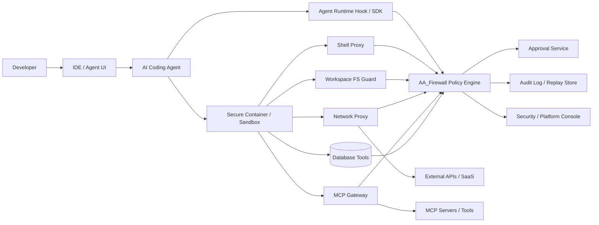
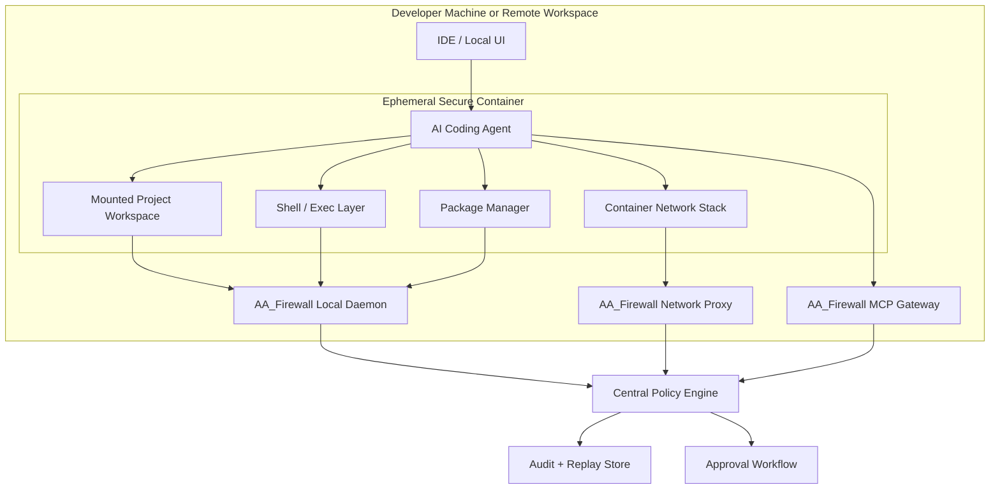
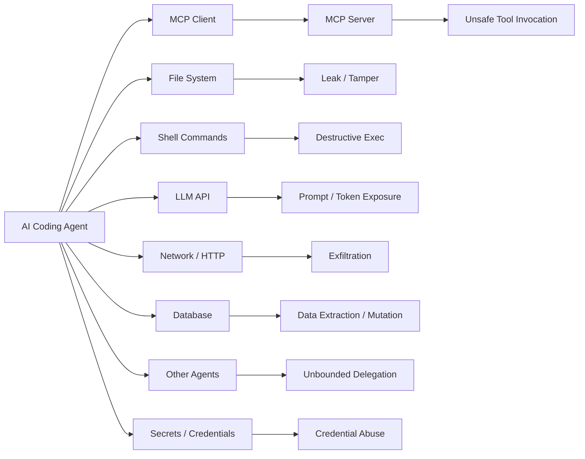
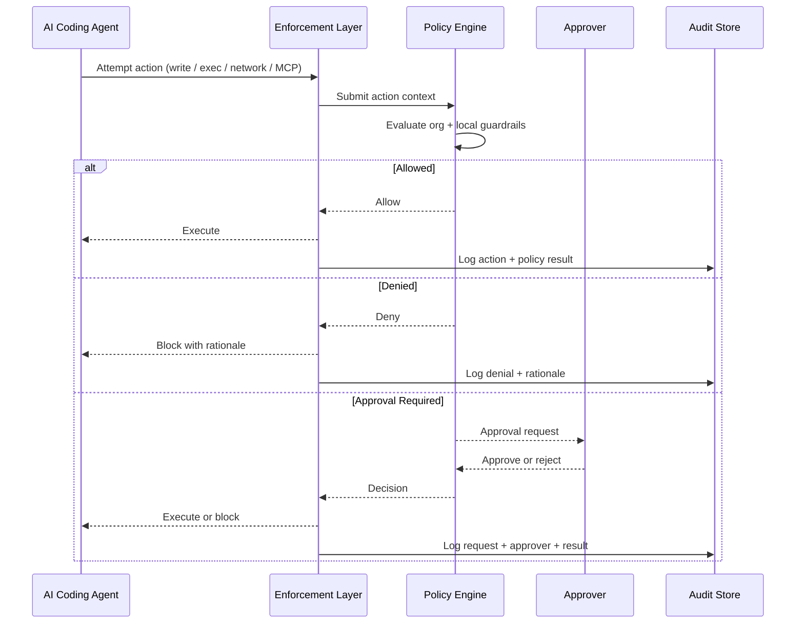

> Author: Deepankar Das

# AA_Firewall PRD Final

## Executive Summary: Product and Implementation Overview

### Product Vision

AA Firewall is a mandatory governance and security control plane purpose-built for AI coding agents operating in developer environments. It sits between AI agents (Claude Code, Cursor, Copilot agents, MCP-driven workflows) and the systems those agents can affect -- intercepting every sensitive action, evaluating it against organizational policy, and enforcing a deterministic outcome (allow, deny, or require approval) before the action executes. The product is designed for security engineering leads and platform engineering leads at mid-market and enterprise software organizations who need to move AI coding agent adoption from constrained pilots to governed production use. AA Firewall is the trust boundary that converts agent productivity from an unmanaged experiment into an approvable operating model.

### Market Context

AI coding agents have shifted from passive code completion to autonomous task execution across terminals, codebases, package managers, network APIs, credentials, databases, and MCP tool ecosystems. This expansion increases both productivity upside and governance risk. Enterprise security controls built for human developers -- endpoint agents, secrets managers, CI policy gates -- do not natively understand agent intent, tool invocation context, MCP traffic, or the action chains between a prompt, a tool call, a file mutation, and a network request. Organizations face a deadlock: engineering leaders want agent leverage, but security leaders cannot approve broad rollout without a trust boundary purpose-built for this operating model. The governance gap is now the primary blocker to enterprise-scale AI coding agent adoption.

### Architecture Summary

AA Firewall uses a Hub + Sentinel architecture with 5 defense layers:

- **Layer 1 -- Runtime Hook / SDK Wrapper.** Intent-aware interception before action execution. The hook handler binary (`aafirewall-hook`) reads JSON from stdin, evaluates policy via the local daemon, and returns allow/deny/approval decisions via exit codes (0 = allow, 2 = deny). Tool mappings cover 8 system-affecting tools (Read, Edit, Write, Bash, WebFetch, WebSearch, Glob, Grep) and 17 internal orchestration tools.
- **Layer 2 -- Managed Hooks.** Hooks are installed by the Sentinel agent running as root (via sudo or MDM) into Claude Code's settings, ensuring developers cannot remove or bypass enforcement.
- **Layer 3 -- Privileged Daemon.** The local daemon (`aafirewall-daemon`) runs on localhost:9100, performs policy lookup, decision caching, audit buffering, RBAC, and serves the Sentinel Console. It persists all audit events to PostgreSQL (append-only, no UPDATE or DELETE).
- **Layer 4 -- OS Kernel Enforcer (planned).** eBPF (Linux) / ESF (macOS) intercepts at the syscall level for file.open, execve, and connect -- catching raw terminal bypass outside the agent runtime.
- **Layer 5 -- Management Hub.** The central server (`aafirewall-central`) uses mTLS on ports 9200 (client) and 9201 (admin) for policy distribution, audit aggregation, signed bundles, Sentinel heartbeat monitoring, and the Hub Console for security admins. All Hub state (policies, clients, enforcement toggles) is persisted in PostgreSQL.

The Sentinel agent (`aafirewall-client`) handles registration with the Hub, policy sync with hash-based change detection, heartbeat reporting, and audit event forwarding -- all over mTLS.

### Key Capabilities

**Six enforcement surfaces.** The policy engine evaluates actions across file system reads/writes, shell command execution, network egress, package installations, credential/secret access, and MCP tool invocations. The command classifier recognizes 15 destructive patterns (rm, chmod, git push --force, etc.), 13 network tool patterns (curl, wget, ssh, etc.), and 9 package manager patterns (npm install, pip install, cargo install, etc.).

**Policy engine.** Versioned YAML policy bundles with hierarchical inheritance (org, team, project, local). The engine evaluates subject (agent type, user), action type, and resource conditions to return allow, deny, or require-approval decisions with machine-readable reason codes and human-readable explanations. Policies support path-based rules (writes outside project root), pattern-based rules (command and file patterns), host allowlists with separate warning lists, and wildcard matching. Policy bundles can be cryptographically signed (Ed25519) with monotonic version enforcement.

**Approval workflow.** Non-blocking approval flow with three scope types: single-use (consumed after one action), time-bounded (expires after a configurable window), and session-scoped (persists for the session). Approvals support pattern matching against action types and resource values. The system includes break-glass emergency overrides that bypass normal flow but record full audit context. Approval metrics track created, approved, denied, and expired counts.

**Audit trail.** PostgreSQL-backed, append-only audit store. Every intercepted action produces a structured event recording actor identity, session, agent type, action type, resource, policy evaluated, decision returned, reason code, and timestamp. Events are linked by session ID for chain-of-action reconstruction. The Hub aggregates audit events from all connected Sentinels into a central PostgreSQL instance.

**Secret detection and redaction.** The secret detector scans file paths against 20 sensitive file patterns (SSH keys, AWS credentials, Kubernetes configs, PEM keys, .env files, etc.) and commands against 12 sensitive command patterns (printenv, aws configure, vault access, macOS Keychain, etc.). The redaction engine uses 18 compiled regex patterns covering AWS keys, GitHub tokens, Slack tokens, Stripe keys, JWTs, private keys, database URLs, SSNs, credit cards, bearer tokens, generic API keys, and passwords. Redaction modes include mask, tokenize (reversible via token map), and summarize.

**Analytics and anomaly detection.** The analytics engine computes stack-ranked blocked operations, approval bottlenecks, per-developer enforcement impact, and developer group classifications (PowerUser, NewJoiner, BoundaryTester, Compliant). The recommender generates data-driven policy recommendations: auto-approve patterns for frequently approved actions, allowlist additions for commonly blocked hosts, evasion alerts for boundary testers, and onboarding assistance for new joiners. The anomaly detector maintains per-session event windows and evaluates sequence-based patterns for suspicious behavior.

### Current Implementation Status

The Go port is complete and produces 5 statically compiled binaries with zero runtime dependencies (`CGO_ENABLED=0`):

| Binary | Role |
|--------|------|
| `aafirewall-daemon` | Local enforcement daemon (localhost:9100) |
| `aafirewall-hook` | Hook handler for Claude Code PreToolUse/PostToolUse |
| `aafirewall-central` | Management Hub with mTLS (ports 9200/9201) |
| `aafirewall-client` | Sentinel agent (registration, policy sync, heartbeat, audit forwarding) |
| `aafirewall-authseed` | Authentication seed utility |

The codebase comprises 83 Go source files with 283 test functions across 18,000+ lines of Go. The console is built with Next.js 15 (App Router), React, shadcn/ui, and Tailwind CSS across 36 TypeScript source files, compiled to static HTML/JS/CSS and embedded in the Go daemon via `go:embed`. Console pages include: dashboard, sessions list, session detail, approvals, policies, analytics, developer detail, search, export, and login. Policy enforcement ships with 8 built-in policy packs containing 15 rules across 6 categories (source code protection, supply chain security, secrets hardening, infrastructure safety, network egress control, compliance/audit, developer best practices, and MCP governance). The project includes 20 shell scripts for build, deploy, test, demo, certificate generation, database setup, service installation, and release integrity verification.

### Deployment Model

The Hub (`aafirewall-central`) runs on the security team's server with PostgreSQL for state persistence and audit aggregation. It exposes two mTLS ports: 9200 for Sentinel client communication and 9201 for admin access and the Hub Console. The Sentinel (`aafirewall-client`) runs on each developer machine, managed via sudo or MDM, and handles local enforcement through the daemon and hook handler. The Sentinel registers with the Hub, syncs policies (with hash-based change detection to minimize bandwidth), forwards audit events, and sends heartbeats. The Hub tracks Sentinel status (online, stale, offline) and can push policy updates and enforcement state changes to all connected Sentinels. Certificates for mTLS are generated via the `generate-certs.sh` script. Deployment scripts support single-machine (Hub + Sentinel collocated), separate Hub deployment, and separate Sentinel deployment.

### Differentiation

AA Firewall differs from existing security tools in several concrete ways. Unlike AI gateways and LLM firewalls that inspect prompts at the model layer, AA Firewall governs the actual machine actions agents execute -- file writes, shell commands, network calls, package installs. Unlike endpoint security tools that monitor process behavior, AA Firewall understands agent intent and maps tool invocations to policy decisions before execution, not after. Unlike secrets managers that govern credential lifecycle, AA Firewall governs the full action chain from prompt to tool call to system effect. The system enforces mandatory mediation (not passive logging), preserves policy rationale for every decision, supports non-blocking approval workflows that maintain developer flow, and produces forensic-grade audit trails linking actor, intent, policy, and outcome. The combination of runtime interception, protocol-aware governance (MCP tool mappings), hierarchical policy with signed bundles, approval orchestration with scoped permissions, and replayable audit context in a single coordinated control plane is the product's structural advantage.

---

## AIFund Submission Summary

### AIFund Submission Two-Page Summary

AA_Firewall is a mandatory governance and security control plane for AI coding agents. It is designed for organizations that have already seen the productivity upside of agentic development but cannot responsibly scale deployment without enforceable safeguards, review workflows, and post-incident evidence. The product sits between the agent and the systems that agent can influence, evaluates every sensitive action against policy, and returns deterministic outcomes: allow, deny, or require approval.[cite:1]

The core market problem is not awareness that risk exists; it is execution risk at machine speed. Modern coding agents can read and write source code, execute shell commands, install dependencies, call external APIs, use MCP tools, and potentially access secrets or production-adjacent assets. Enterprise controls built for human developers and occasional misuse are not sufficient for autonomous or semi-autonomous systems that can chain high-impact operations in seconds. Teams therefore face a deadlock: they want agent leverage, but security and platform leaders cannot approve broad rollout without a trust boundary purpose-built for this new operating model.[cite:1]

AA_Firewall’s wedge is to become that trust boundary. The first product commitment is mandatory mediation over high-risk action surfaces, not passive telemetry. This means the system must intercept action intent, evaluate policy context, and enforce decisions before execution where possible. Audit follows enforcement, not the other way around. The product is intentionally framed as a rollout enabler for enterprises, not as a generic dashboard. If a security team cannot use the product to assert "this action path is governed and reviewable," the product has failed its primary job.[cite:1]

The buyer map reflects this: the primary buyer is the security engineering or security platform owner responsible for enterprise AI tooling governance; technical champions typically come from platform engineering; economic sponsorship comes from CISO-level leadership; and engineering leadership plus developer-experience teams are key stakeholders because adoption velocity depends on low-friction controls. Product strategy is therefore dual-axis: deliver enough policy power and evidence quality for security approval, while preserving developer productivity through explainable policy outcomes and scoped approval workflows.[cite:1]

The initial product scope focuses on the minimum control set required to move organizations from pilot fear to governed production confidence:

- Real-time mediation across file operations, command execution, network egress, package/dependency actions, secret access, and selected MCP tool paths.[cite:1]
- Hierarchical policy model (org, team, project, local constraints) with explicit action/resource/condition semantics and explainable decisions.[cite:1]
- Human-in-the-loop approvals for high-risk but sometimes necessary actions (for example destructive commands or dependency changes).[cite:1]
- Structured audit trail that links actor, intent, policy decision, and observed effect into a usable forensic record.[cite:1]

Positioning for AIFund submission is straightforward: AA_Firewall is the "enterprise control gap" layer for agentic software development, analogous to how endpoint security, API gateways, and CI policy engines matured around earlier software lifecycle shifts. AI coding agents introduce a new execution surface. AA_Firewall is the policy and evidence substrate that lets enterprises adopt those agents without accepting unmanaged blast radius.

Commercially, the near-term GTM motion is a security-led wedge in organizations actively piloting coding agents with 100 to 5,000 developers. Typical entry points are regulated teams, platform groups standardizing IDE/agent tooling, or security programs needing documented controls before broader rollout. Land strategy is one team or one business unit with clearly enforced policy and measurable friction reduction over manual review. Expand strategy is org-wide policy distribution, richer analytics, and broader protocol/domain coverage (MCP ecosystems, remote workspaces, database tools, and model-context protection). The business model hypothesis is seat- or active-developer-based pricing with control-plane value premiums for advanced policy packs, analytics, and compliance evidence exports.[cite:1]

The product’s technical differentiation is not any single mechanism but the combination of several: runtime mediation, protocol-aware governance, approval orchestration, and replayable forensic context. Many tools can log process behavior; fewer can map prompt-driven intent to tool invocation to effect with policy rationale preserved. Fewer still can enforce policy in-line while maintaining developer flow and producing evidence packages useful to both security review and incident response. AA_Firewall is designed to unify those needs.

The product roadmap follows a staged risk-reduction strategy:

- Phase 1: controlled enforcement wedge with high-confidence controls and clear approvals over the most common risky actions.[cite:1]
- Phase 2: protocol-aware expansion (deeper MCP governance, context-aware redaction, richer anomaly detection).[cite:1]
- Phase 3: enterprise control plane maturity (policy distribution at scale, stronger remote-workspace posture, broader integrations, compliance-oriented evidence lifecycle).[cite:1]

Key success metrics must reflect both security confidence and developer adoption:

- Security efficacy: reduction in unapproved high-risk actions, policy coverage depth, response time for approval/denial paths, incident reconstruction completeness.[cite:1]
- Adoption viability: percentage of active developers governed, policy false-positive rates, median developer interruption time, approval throughput latency.[cite:1]
- Business traction: pilot-to-production conversion, expansion within enterprise accounts, retention of high-governance customers, control-plane usage depth by role.[cite:1]

Main risks are explicit and manageable: overblocking can hurt adoption; under-enforcement can erode trust; bypass surfaces outside controlled runtimes can reduce guarantees; and integration sprawl can slow time-to-value. Mitigation strategy is defense-in-depth architecture, phased rollout modes (audit, enforce, scoped approvals), explicit "mandatory where promised" positioning, and high-quality policy explainability to keep operators confident and developers productive.[cite:1]

In summary, AA_Firewall is positioned as enterprise infrastructure for governed AI software execution: a practical and defensible layer that converts agent productivity from a risky experiment into an approvable operating model. For AIFund evaluation, the thesis is clear: as coding agents become standard, the winning enterprise stack requires a dedicated governance control plane, and AA_Firewall is built to be that layer.

## Product Vision

AA_Firewall’s vision is to become the default trust boundary for agentic software development: the layer every enterprise inserts between AI coding agents and the environments, tools, protocols, and data those agents touch.[cite:1] Over time, it should evolve from a point solution for coding-agent safety into the control plane for agentic execution across local developer machines, secure containers, MCP ecosystems, network egress, secrets, data stores, and model-context pathways.[cite:1]

The long-term product promise is simple: every sensitive action an AI coding agent attempts should be attributable, policy-evaluable, replayable, and, when needed, blockable in real time.[cite:1]

## Problem Statement

AI coding agents such as Claude Code, Cursor agents, Copilot agents, and MCP-driven workflows now have unprecedented access to developer environments and, in some cases, production-adjacent systems.[cite:1] They can read and write files, run shell commands, install packages, call APIs, use secrets, and coordinate with tools at machine speed, which creates a risk model materially different from ordinary human developer activity.[cite:1]

Existing security products were largely built for humans. They can log process activity, monitor endpoints, protect secrets, or govern cloud infrastructure, but they do not natively understand agent intent, tool invocation context, MCP traffic, or the action chain between a prompt, a tool call, a file mutation, and a network request.[cite:1] As a result, organizations often lack both the preventive controls and the evidentiary logs required to approve enterprise-scale use of AI coding agents.[cite:1]

This problem is broader than file access. The risk surface includes file system reads and writes, shell execution, package installation, credential access, network egress, database reads and writes, MCP client-server communication, agent-to-agent delegation, and sensitive data or token exposure into LLM context.[cite:1]

## Why Now

AI coding agents have shifted from passive assistance toward autonomous or semi-autonomous task execution across terminals, codebases, packages, network APIs, and external tools.[cite:1] That shift increases both the upside of adoption and the downside of weak governance.[cite:1]

At the same time, enterprise demand is rising because engineering leaders see material productivity potential in code generation, debugging, testing, refactoring, and integration automation.[cite:1] Adoption is no longer blocked by lack of interest; it is blocked by lack of trusted security controls and acceptable governance evidence.[cite:1]

The market is now at the point where the right control layer can become a standard part of the stack. MCP, containerized workspaces, agent orchestration, and enterprise AI platform governance all create concrete integration points for AA_Firewall to become that layer.[cite:1]

## Users and Buyers

The primary ideal customer profile is a mid-market or enterprise software organization actively piloting or scaling AI coding agents and needing a way to move from experimentation to governed production use.[cite:1]

### Buyer map

| Role | Motivation | Core concern | Buying role |
|---|---|---|---|
| Security engineering lead | Reduce risk and enforce guardrails | Mandatory control, bypass risk, auditability | Primary buyer [cite:1] |
| Platform engineering lead | Standardize safe rollout of AI tooling | Deployment friction, policy manageability | Technical champion [cite:1] |
| CISO / VP Security | Governance and accountability | Incident response, compliance, enterprise exposure | Economic sponsor [cite:1] |
| Engineering leader | Preserve productivity while reducing risk | False positives, developer friction | Key stakeholder [cite:1] |
| AI tooling owner / DX lead | Operationalize agent usage | Integration sprawl, UX, policy consistency | Internal operator [cite:1] |

## Design Principles

- Mandatory where promised; do not market observability as enforcement.[cite:1]
- Cover action chains, not isolated events.[cite:1]
- Be protocol-aware, especially for MCP and model-context flows.[cite:1]
- Combine enterprise policy with developer-local guardrails.[cite:1]
- Make every policy outcome explainable to both developers and security reviewers.[cite:1]
- Use secure containers as a strong containment layer, but not as the sole answer for full governance.[cite:1]

## Core Use Cases

AA_Firewall should support a focused set of enterprise-critical use cases:

- Block writes outside the project directory or approved workspace root.[cite:1]
- Deny shell commands with destructive or exfiltration potential unless explicitly approved.[cite:1]
- Restrict network calls to allowlisted hosts and sanctioned package registries.[cite:1]
- Require approval for package installation or dependency mutation.[cite:1]
- Prevent access to high-risk secrets and production credentials without explicit policy approval.[cite:1]
- Govern MCP communication, including which tools, methods, and payloads the agent can invoke.[cite:1]
- Detect and stop sensitive data flowing from code, databases, or credentials into LLM prompts or external tools.[cite:1]
- Produce a structured audit trail of attempted actions, policy outcomes, approvals, and final observed effects.[cite:1]

## Product Scope

The first version of AA_Firewall is a mandatory interception and enforcement product for AI coding agents in developer environments, not a generic AI observability or compliance dashboard.[cite:1] The product must mediate actions in real time, enforce configurable policies, and produce logs that a security reviewer can use meaningfully during both approvals and investigations.[cite:1]

### In scope for MVP

- Interception across at least two of the following: file system, shell execution, network calls, package installs, credential or secret access.[cite:1]
- Configurable policy decisions: allow, deny, require approval.[cite:1]
- Structured audit logs meaningful to security reviewers.[cite:1]
- One depth area such as approval UX, anomaly detection, secrets or PII redaction, multi-agent isolation, or org-level policy distribution.[cite:1]
- Clear architecture stance on where the interception layer sits: sandbox, proxy, runtime hook, MCP wrapper, or hybrid.[cite:1]

### Out of scope for MVP

- Broad cloud posture management across all infrastructure.[cite:1]
- Generic endpoint monitoring unrelated to coding agents.[cite:1]
- Full support for every agent vendor, IDE, model, and operating system on day one.[cite:1]

## Functional Requirements

### Interception surfaces

The platform must be designed to intercept, inspect, or govern over time:

- File reads and writes.[cite:1]
- Shell and terminal commands.[cite:1]
- Network traffic and HTTP requests.[cite:1]
- Package installation and dependency changes.[cite:1]
- Secret and credential access.[cite:1]
- MCP communication.[cite:1]
- Agent-to-agent communication.[cite:1]
- Database reads and writes where the agent can issue queries directly or indirectly.[cite:1]
- LLM context submission paths where sensitive data or tokens may be exposed.[cite:1]

### Policy engine requirements

The policy engine must:

- Support hierarchical policy inheritance: org, team, project, and developer-local layers.[cite:1]
- Evaluate context including actor, session, agent type, project, command, path, host, data classification, and approval state.[cite:1]
- Return decisions such as allow, deny, require approval, redact, quarantine, or simulate.[cite:1]
- Emit both machine-readable and human-readable explanations for each decision.[cite:1]

### Audit and review requirements

The system must preserve:

- Agent identity and session identity.[cite:1]
- Requested action and translated system action.[cite:1]
- Target resource or destination.[cite:1]
- Policy evaluated and decision returned.[cite:1]
- Approver and rationale when approval is involved.[cite:1]
- Final observed system effect where possible.[cite:1]

## Non-Functional Requirements

- Mandatory enforcement for covered surfaces.[cite:1]
- Low enough latency for interactive developer workflows.[cite:1]
- Tamper resistance and detection of bypass attempts.[cite:1]
- Privacy-aware logging and redaction.[cite:1]
- Clear user messaging and explainability.[cite:1]
- Deployment options that support both controlled workspaces and more incremental enterprise rollout.[cite:1]

## Policy and Governance Model

AA_Firewall should use a hierarchical policy model. Organization-level policies define non-negotiable controls such as blocked hosts, forbidden file paths, protected credential classes, database restrictions, and required approvals.[cite:1] Team, repository, and developer-local guardrails may only tighten these controls, not weaken organization baselines.[cite:1]

A policy object should include subject, action, resource, conditions, effect, logging mode, and approval mode so the same engine can govern file access, shell execution, network egress, MCP calls, model routes, and secret handling.[cite:1]

## Architecture Overview

The recommended architecture is hybrid because no single enforcement point fully governs all relevant surfaces.[cite:1] Runtime hooks provide rich agent intent, containers and local daemons provide strong execution boundaries, network proxies govern egress, and MCP wrappers provide protocol-aware controls over tool invocation.[cite:1]

This architecture emphasizes that AA_Firewall is not a single endpoint agent or a single proxy. It is a coordinated policy plane joining intent, execution, communication, approval, and audit.[cite:1]

## Secure Container Role

Containers are a strong part of AA_Firewall’s enforcement design because they can constrain filesystem visibility, process scope, installed software paths, and network reachability within an isolated workspace. In practice, they are most valuable for limiting blast radius and making policy enforcement more deterministic for AI coding agents that can otherwise act directly on a host machine.[cite:1]

However, containers are not sufficient alone for full enterprise governance. They do not automatically govern MCP traffic outside the controlled runtime, remote agent-to-agent flows, prompt assembly outside the container, or secret access mediated by external identity systems.[cite:1] The product should therefore position secure containers as an important substrate within a broader defense-in-depth control architecture.[cite:1]

### Containerized enforcement model

This model makes containers useful for isolation and containment, while keeping policy, approvals, and protocol-aware enforcement outside the container so governance remains consistent and centrally manageable.[cite:1]

## Data Flows and Threat Surfaces

The product must explicitly govern not only direct machine actions but also data movement between components.

AA_Firewall’s differentiation depends on controlling these flows as one chain of behavior rather than as unrelated security events.[cite:1]

### Threat-surface matrix

| Asset / flow | Example risk | Needed control | Preferred enforcement point |
|---|---|---|---|
| Repo files | Writes outside project or reads from sensitive host paths | Path policy, content inspection, approval | Container + FS guard [cite:1] |
| Shell | Destructive or exfiltrative commands | Command policy, allow/deny/approval | Shell proxy + daemon [cite:1] |
| Network egress | Source code or PII exfiltration | Host allowlist, request logging, approval | Network proxy [cite:1] |
| Package registry | Malicious install or dependency change | Registry policy, approval, logging | Package hook + network proxy [cite:1] |
| Secrets | Token theft or misuse | Secret mediation, masking, approvals | Secret broker + policy engine [cite:1] |
| MCP traffic | Unsafe tool invocation or payload leakage | Tool and method controls, payload policy | MCP gateway [cite:1] |
| Database | Extraction or mutation of sensitive data | Query-class policy, approval, masking | DB proxy / tool wrapper [cite:1] |
| LLM context | Sensitive code or token exposure | Redaction, route policy, context DLP | Agent middleware + model gateway [cite:1] |
| Agent-to-agent | Hidden delegation chain | Identity, isolation, lineage logging | Orchestrator + policy layer [cite:1] |

## Approval and Audit Flow

The approval and audit experience is central to the product wedge because enterprises need both preventive control and evidentiary reviewability.[cite:1]

This flow shows why the product needs to preserve both agent intent and final system effect. Security teams care not just that a process ran, but that an agent attempted a risky action, a policy was evaluated, and a specific human or rule permitted or denied it.[cite:1]

## MVP Definition

The MVP should optimize for depth over breadth, consistent with the venture brief.[cite:1] The recommended MVP is:

1. Intercept file access, shell commands, and network egress in a controlled developer environment.[cite:1]
2. Enforce allow, deny, and require-approval policies with organization-level policy plus developer-local guardrails.[cite:1]
3. Produce structured audit logs that a security reviewer can meaningfully inspect.[cite:1]
4. Implement one depth area, preferably approval UX or MCP governance.[cite:1]
5. Support a secure-container deployment mode for higher-assurance pilots and controlled workspaces.[cite:1]

### MVP priority table

| Priority | Feature | Why it matters |
|---|---|---|
| P0 | File, shell, and network interception | Covers the clearest enterprise risk surface [cite:1] |
| P0 | Policy engine with allow/deny/approval | Establishes mandatory control [cite:1] |
| P0 | Audit trail and reviewer console | Makes the product credible to security teams [cite:1] |
| P1 | Secure-container mode | Improves containment and deterministic rollout [cite:1] |
| P1 | Approval UX | Enables controlled deployment without hard blocking everything [cite:1] |
| P1 | MCP governance | Creates protocol-aware differentiation [cite:1] |
| P2 | Secrets / PII redaction | Expands trust and compliance posture [cite:1] |
| P2 | Multi-agent isolation / anomaly detection | Strengthens long-term platform moat [cite:1] |

## Phased Roadmap

### Phase 1: Controlled enforcement wedge

- Support one or two major coding-agent environments.[cite:1]
- Deliver mandatory control over file, shell, and network actions.[cite:1]
- Ship audit console and approval workflow.[cite:1]
- Validate secure-container deployment in high-assurance pilots.[cite:1]

### Phase 2: Protocol-aware expansion

- Add MCP method-level governance and payload-aware controls.[cite:1]
- Add secrets mediation and prompt/context redaction.[cite:1]
- Expand policy distribution, repository scoping, and SIEM integrations.[cite:1]

### Phase 3: Enterprise control plane

- Support agent-to-agent lineage and multi-agent isolation.[cite:1]
- Add database-aware controls and model-routing policy.[cite:1]
- Expand to remote workspaces, CI agents, and regulated environments.[cite:1]
- Build replay, simulation, and incident response workflows.[cite:1]

## Market Appetite

Market appetite is driven by the tension between strong executive and engineering interest in AI coding agents and deep security discomfort about granting those agents broad access to code, terminals, credentials, networks, and internal systems.[cite:1] AA_Firewall solves a budget-justifiable blocking problem because it helps organizations move from constrained pilots to approved deployment.[cite:1]

### Positioning statement

AA_Firewall is the mandatory enforcement and governance layer for AI coding agents, giving enterprises real-time control over what agents can read, write, execute, call, and disclose across developer environments, secure containers, MCP tools, networks, and model workflows.[cite:1]

### Wedge GTM motion

- Land with platform engineering and security on a single coding-agent pilot.[cite:1]
- Prove mandatory guardrails on shell, network, package, and workspace governance.[cite:1]
- Expand to organization-wide policy distribution and audit reporting.[cite:1]
- Upsell into MCP governance, secrets protection, and multi-agent control.[cite:1]

## TAM / SAM / SOM

The market should be modeled bottom-up around governed developer or agent seats in organizations adopting coding agents.

- TAM assumption: 10 million long-term governed seats globally at $500 annual value per seat implies about $5.0 billion annual TAM.[cite:1]
- SAM assumption: 1.5 million reachable seats in security-conscious North American and European mid-market and enterprise organizations at $500 annual value per seat implies about $750 million annual SAM.[cite:1]
- SOM assumption: 40,000 to 80,000 seats captured in the first several years at $500 annual value per seat implies about $20 million to $40 million in ARR potential.[cite:1]

These are scenario-planning figures rather than precise forecasts, but they support the thesis that even modest penetration of enterprise coding-agent rollouts can create a meaningful security infrastructure company.[cite:1]

## Competitive Landscape

AA_Firewall competes across direct, adjacent, and future-platform categories.

| Category | What they do well | Weakness relative to AA_Firewall | Threat type |
|---|---|---|---|
| AI gateway / LLM firewall vendors | Prompt inspection and model gateway controls | Limited machine-action governance | Adjacent [cite:1] |
| Endpoint / developer security tools | Strong device and process visibility | Not built for agent intent or MCP semantics | Substitute / adjacent [cite:1] |
| Secrets management vendors | Secret lifecycle and access control | Do not govern the full agent action chain | Adjacent [cite:1] |
| CNAPP / DSPM / DLP vendors | Broad cloud and data governance | Too broad and not execution-path native | Adjacent [cite:1] |
| IDE / agent platform vendors | Native workflow and UX | Limited neutrality and cross-platform enforcement | Future platform threat [cite:1] |
| Sandbox / remote workspace vendors | Strong environment isolation | Usually not a policy-centric agent governance platform | Adjacent / partner [cite:1] |
| Open-source policy tooling | Flexible primitives | High integration burden, weak enterprise UX | Substitute [cite:1] |

The defensible position is not “another AI security dashboard,” but “the control plane where agent intent meets mandatory enterprise policy.”[cite:1]

## Differentiation and Best-in-Class Strategy

### Table stakes

- File, shell, and network interception.[cite:1]
- Policy engine with allow, deny, and approval outcomes.[cite:1]
- Security-grade audit logs.[cite:1]
- Admin and reviewer workflows.[cite:1]

### Differentiators

- MCP-native governance and payload-aware control.[cite:1]
- Unified policy over agent actions, data flows, and model-context exposure.[cite:1]
- Enterprise baselines plus developer-local guardrails.[cite:1]
- Full-chain replay from agent intent to system effect.[cite:1]
- Hybrid enforcement architecture spanning runtime, container, proxy, and protocol layers.[cite:1]

### Durable moats

- Deep integrations across agent runtimes, MCP ecosystems, and secure workspaces.[cite:1]
- A high-quality action-risk ontology and policy corpus for agent workflows.[cite:1]
- Embedded audit and forensics workflows used by security and platform teams.[cite:1]

## Pricing and Packaging Hypotheses

A seat-based pricing model with platform minimums is the most natural starting point because value will map to protected developers, sanctioned agent sessions, and policy-governed rollout.[cite:1]

- Team: core local enforcement and audit logs.[cite:1]
- Business: centralized policy distribution, approval workflows, and integrations.[cite:1]
- Enterprise: MCP governance, secrets/context controls, advanced forensics, remote workspace support, and compliance mapping.[cite:1]

## Key Risks and Open Questions

- Can mandatory coverage remain strong on unmanaged laptops, or is the best wedge controlled workspaces and containerized environments?[cite:1]
- Which initial differentiated area creates the strongest market pull: MCP governance, approval UX, or secrets/context protection?[cite:1]
- How much policy friction will developers tolerate before attempting bypasses?[cite:1]
- How quickly will major IDE or agent vendors embed native controls that compress this category?[cite:1]

## Success Metrics

### Product metrics

- Percentage of covered agent actions mediated by policy.[cite:1]
- Mean policy decision latency.[cite:1]
- Number of blocked, approved, and logged-only actions by class.[cite:1]
- Coverage of MCP tools, hosts, and shell/network actions under governance.[cite:1]

### Business metrics

- Pilot-to-production conversion rate.[cite:1]
- Number of protected developer seats per customer.[cite:1]
- Expansion from one team to organization-wide rollout.[cite:1]
- Reduction in security-review cycle time for coding-agent deployment.[cite:1]

### Trust metrics

- Audit completeness rate for mediated actions.[cite:1]
- False-positive and false-block rates.[cite:1]
- Number of bypass attempts detected.[cite:1]
- Time to investigate a policy incident using logs and replay artifacts.[cite:1]

## Appendix: Assumptions

- AI coding-agent adoption will continue rising in mid-market and enterprise engineering organizations.[cite:1]
- Security and governance blockers are one of the primary constraints on broader rollout.[cite:1]
- A hybrid architecture is necessary because no single proxy, container, plugin, or hook governs all relevant actions and data flows.[cite:1]
- The strongest initial product wedge is enabling safe rollout of coding agents by satisfying security review requirements with mandatory control and reviewable evidence.[cite:1]
