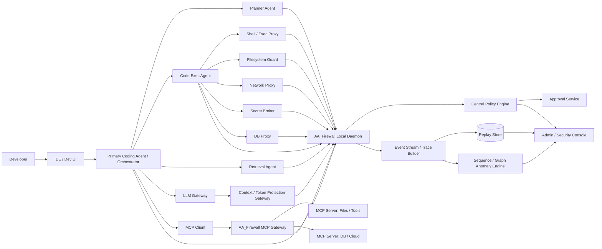
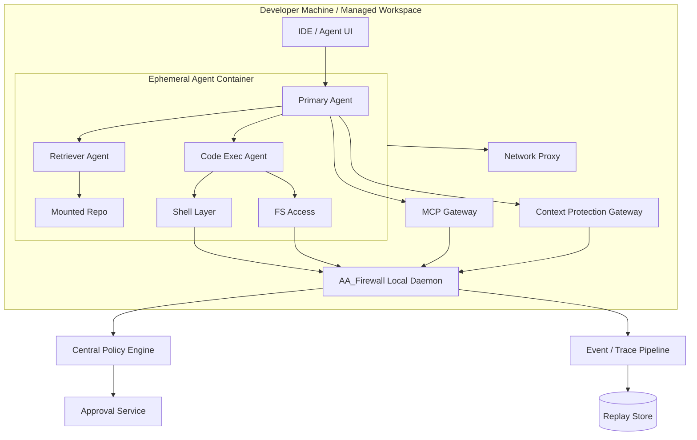
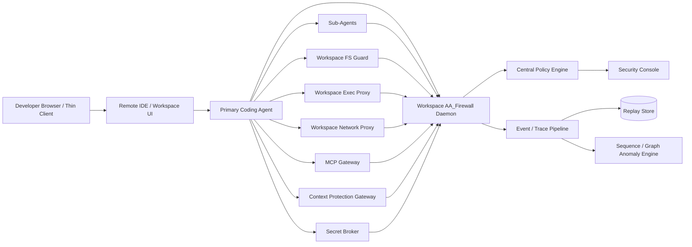
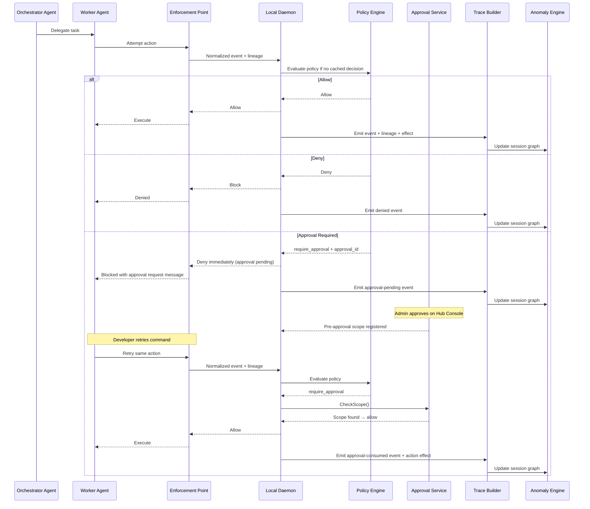
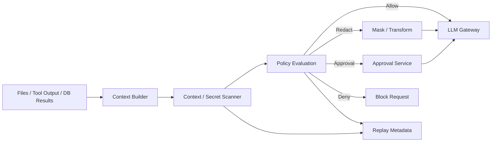
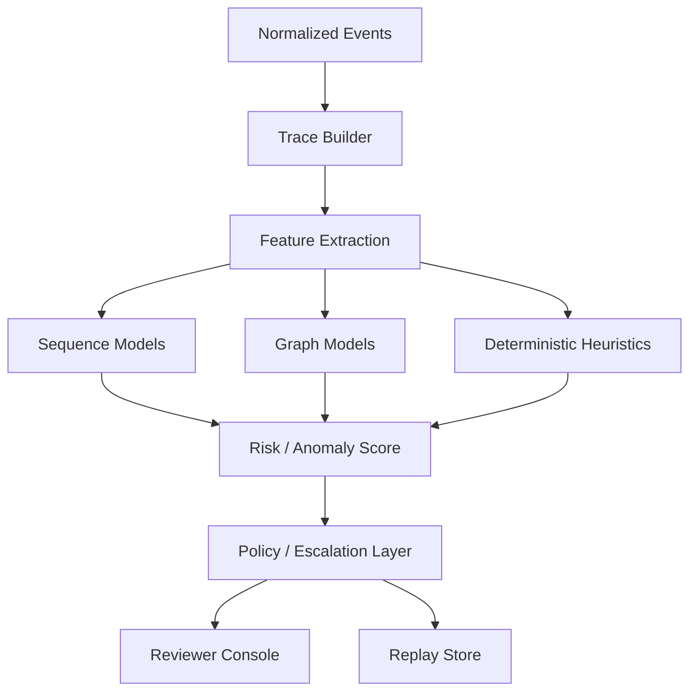

> Author: Deepankar Das

# AA_Firewall Technical Design Document Final

---

## Technical Executive Summary

### System Architecture

AA Firewall is a Hub + Sentinel hybrid governance system for AI coding agents. Each developer workstation runs a **Sentinel daemon** (`aafirewall-daemon`, port 9100) that evaluates policy locally and enforces decisions in-path, while a centralized **Management Hub** (`aafirewall-central`) distributes policies, aggregates audit events, and serves admin workflows. The Hub exposes two network interfaces: an mTLS client-facing channel on **port 9200** for Sentinel registration, policy pull, heartbeat, audit push, and approval synchronization, and an admin HTTP interface on **port 9201** for the Hub Console, RBAC-protected API, and approval resolution. All Hub-to-Sentinel communication is authenticated via mutual TLS with certificates loaded from a configurable `CERT_DIR` (default `/etc/aafirewall/certs`). Both the Hub audit store and Hub state store (policy revisions, client snapshots, enforcement state) are backed by **PostgreSQL** via `pgx/v5` connection pools. The system produces four statically compiled Go binaries (`CGO_ENABLED=0`): `aafirewall-daemon`, `aafirewall-hook`, `aafirewall-central`, and `aafirewall-client`. Zero runtime dependencies beyond PostgreSQL.

### Enforcement Model

The architecture defines 5 defense layers, of which Layers 1-3 and 5 are implemented:

1. **Runtime hooks** (Layer 1) -- The hook handler binary (`go/cmd/hookhandler/main.go`) registers Claude Code `PreToolUse` and `PostToolUse` hooks via `.claude/settings.json` (project-level) or managed-settings.json (enterprise MDM with `allowManagedHooksOnly=true`). The hook reads tool input from stdin, maps it through `enforcement.GetEnforcementPoint()` to an `ActionRequest`, and POSTs to the daemon's `/v1/evaluate` endpoint. Exit code 0 = allow, exit code 2 = block.
2. **Managed hooks** (Layer 2) -- Enterprise deployments use root-owned `/Library/Application Support/ClaudeCode/managed-settings.json` to prevent developers from removing hooks.
3. **Privileged daemon** (Layer 3) -- The Sentinel daemon (`go/internal/daemon/server.go`) runs as root via LaunchDaemon. It owns policy evaluation, approval lifecycle, audit buffering, and enforcement state. The daemon supports strict mode (`AA_STRICT_MODE=1`): unknown tools, unreachable daemon, and unparseable input all block instead of allowing.
4. **Kernel enforcer** (Layer 4) -- Stub; eBPF (Linux) / ESF (macOS) planned for Phase 2+.
5. **Management Hub** (Layer 5) -- `go/internal/central/server.go` implements `CentralServer` with PostgreSQL-backed `stateStore` and `auditStore`, in-memory approval registry, and RBAC middleware.

The system governs 6 enforcement surfaces: **filesystem** (path boundary enforcement, sensitive path blocking), **shell** (command classification, destructive pattern detection via `enforcement.ClassifyCommand()`), **network** (host allowlist/warning list via `policy/allowlist.go`), **package** (install detection via `enforcement.DetectPackageInstall()`), **credential** (secret command access via `enforcement.DetectSecretCommandAccess()`, sensitive file paths via `enforcement.DetectSensitiveFilePath()`), and **MCP** (tool invocation governance via `enforcement/mcpgateway.go`).

### Policy Engine

The policy engine (`go/internal/policy/engine.go`) evaluates rules in strict hierarchical order: **deny rules first, then require_approval, then allow, then default deny**. The function `ruleMatchesAction()` checks rule enablement, action type, subject (agent type + user), and resource conditions (path boundaries, command patterns, host allowlists, sensitive paths). The hierarchy module (`go/internal/policy/hierarchy.go`) enforces that child scopes (team, project, local) can only **tighten** parent policy -- `IsValidTightening()` compares `DecisionSeverity` values (allow=0 < simulate=1 < require_approval=2 < redact=3 < quarantine=4 < deny=5). `MergeHierarchy()` merges org -> team -> repo -> local bundles.

The default policy bundle (`policies/default.yaml`, version `v2026.04.29.1`) ships **13 rules** across 4 tiers: 6 deny rules (`org.block_non_project_writes`, `org.block_shell_deletes_outside_project`, `org.block_shell_moves_outside_project`, `org.block_sensitive_reads`, `org.block_non_allowlisted_hosts`, `org.deny_credential_access`), 4 require_approval rules (`org.approve_destructive_commands`, `org.approve_unknown_network`, `org.approve_package_installs`, `org.mcp_require_approval_untrusted`), and 3 allow rules (`org.allow_internal_tools`, `org.allow_project_files`, `org.allow_safe_commands`).

**8 canned policy packs** (`go/internal/policy/packs.go`) are available: source-code-protection, supply-chain-security, secrets-hardening, infrastructure-safety, network-egress-control, compliance-audit, dev-best-practices, and mcp-governance. Packs are applied via `ApplyPack()`, which skips rules whose `policy_id` already exists in the bundle.

Policy bundles are cryptographically signed using **Ed25519** (`go/internal/policy/signing.go`). `PolicySigner.Sign()` hashes the raw YAML with SHA-256, signs the hash, and attaches a `PolicySignature` with bundle hash, hex-encoded signature, timestamp, signer ID, and version. `VerifyAndCheckMonotonicity()` enforces **version monotonicity** -- a bundle version must be lexicographically >= the last accepted version, preventing rollback attacks.

### Approval Workflow

The approval flow is **non-blocking by design**. When policy evaluates to `require_approval`, the daemon's `ApprovalService` (`go/internal/approval/service.go`) creates a `PendingEntry` keyed by `approval_id`. The hook handler immediately exits with code 2 and a structured message containing the approval ID. The developer is not frozen.

The **Sentinel client agent** (`go/internal/client/agent.go`) runs on a 3-second sync cadence. Each cycle it queries `GET /v1/approvals/pending` on the local daemon and pushes pending requests to the Hub via `POST /api/v1/approvals/push` over the mTLS channel. The Hub stores approvals in memory. An admin resolves via `POST /api/v1/approvals/{id}/resolve` on the Hub Console (port 9201). The resolved decision piggybacks on the next client sync response. When approved, the local daemon registers a **single-use pre-approval scope** in the scope store.

On developer retry, the policy engine matches `require_approval` again, but `ApprovalService.CheckScope()` finds the matching scope via `MatchesScope()` (`go/internal/approval/scope.go`) and returns `allow`. Three scope types are supported: `single` (consumed after one use), `session` (persists for the session), and `time_bounded` (expires at a configured time). Unresolved approvals auto-deny after 300 seconds (configurable, `TimeoutDeny` behavior).

### Audit Pipeline

All audit events flow through an **append-only PostgreSQL store** (`go/internal/audit/pgstore.go`). The `PostgresStore.StoreEvent()` method validates every event through `ValidateAuditEvent()` (`go/internal/audit/validate.go`), which enforces 6 minimum gate fields: **who** (actor compound), **what** (action type + attempted action), **when** (timestamp), **policy** (policy_id@version), **decision**, and **result**. Events failing validation are rejected and counted (`totalRejected`). The INSERT uses `ON CONFLICT DO NOTHING` and the store exposes no UPDATE or DELETE operations -- append-only by construction.

A **SHA-256 hash chain** (`go/internal/audit/chain.go`) links events into a tamper-evident sequence. `AuditChain` maintains a `lastHash` (initialized to `"genesis"`), and each `ChainedEvent` includes `previous_hash`, `event_hash` (SHA-256 of event JSON + previous hash), and a monotonic `chain_index`. The chain supports `SignedExport` packages with Ed25519 signatures for forensic evidence export.

Decision values are normalized to a canonical set: `allow`, `deny`, `require_approval`, `simulate`, `redact`, `quarantine`, `allow_degraded`. The `SiemExporter` (`go/internal/audit/siem.go`) supports three transport modes -- **webhook** (HTTP POST), **syslog** (UDP/TCP), and **file** -- with configurable batch size and flush interval.

### Console Architecture

Two static Next.js builds are embedded in the Go binaries via `go:embed` (`go/internal/console/embed.go`):

- **Hub Console** (`out-hub`), served on port 9201 by `HubHandler()`, for security admins -- policy management, approval resolution, audit search, analytics dashboards, client fleet overview.
- **Sentinel Console** (`out-sentinel`), served on port 9100 by `SentinelHandler()`, for local developer visibility -- enforcement status, recent decisions, session detail.

The Hub enforces **three RBAC roles**: `admin` (policy CRUD, enforcement toggle, pack apply), `reviewer` (approve/deny approval requests), and `operator` (read-only access to audit, analytics, sessions, policies, clients, approvals). Auth tokens are loaded from environment variables (`AA_ADMIN_TOKEN`, `AA_REVIEWER_TOKEN`, `AA_OPERATOR_TOKEN`), files (`/etc/aafirewall/.*_token`), or encrypted database storage (`authsecrets.LoadTokens()`). The Sentinel daemon enforces `governed_user` filtering so a developer only sees their own audit events. Console navigation supports clickable drill-downs from Analytics dashboards to Search results to Session detail views.

### Security Boundaries

The Hub RBAC middleware (`go/internal/central/auth.go`) gates every admin API route (except `GET /api/v1/health`) by role. Policy CRUD and enforcement toggling require `admin`. Approval resolution requires `reviewer+`. All read endpoints require `operator+`. The Sentinel daemon (`go/internal/daemon/auth.go`) enforces its own route-level RBAC. The developer (governed user) has no access to policy editing, credential files, or daemon configuration. Token files at `/etc/aafirewall/` are root-owned. When `AA_ALLOW_LOCAL_POLICY_EDITS` is unset or false, the Sentinel daemon returns HTTP 403 on all policy mutation endpoints.

### Hook Handler

The hook handler (`go/cmd/hookhandler/main.go`) is invoked by Claude Code's `PreToolUse` and `PostToolUse` hooks. It reads JSON tool input from stdin, maps the tool name through `enforcement.GetEnforcementPoint()` to an `ActionRequest`, and POSTs to `http://127.0.0.1:9100/v1/evaluate`. Project root detection walks up from `cwd` looking for `.git/` or `.claude/` directory markers (`findProjectRoot()`), falling back to `cwd` or the `AA_WORKSPACE` environment variable. All hook invocations log to both stderr (visible to Claude Code) and `~/.aafirewall/hook.log` with UTC timestamps. Auth tokens are resolved from `AA_OPERATOR_TOKEN`, `AA_ADMIN_TOKEN`, or `/etc/aafirewall/.*_token` files. Internal orchestration tools (Agent, TodoWrite, Skill) are mapped to `internal.orchestration` action type and governed by `org.allow_internal_tools`.

### Key Technical Decisions

| Decision | Rationale |
|----------|-----------|
| **Go compiled binaries** (zero runtime deps) | Eliminates Node.js/Python runtime on developer machines; single binary deployment; `CGO_ENABLED=0` for static linking |
| **PostgreSQL over SQLite** | Append-only audit requires server-grade persistence; Hub aggregates events from multiple Sentinels; SQLite cannot handle concurrent writers across network |
| **Non-blocking approval over blocking** | Hook handler exits immediately (code 2) instead of polling; developer continues working; retry-on-approval via pre-approval scopes avoids freezing the coding agent |
| **Project-level hooks over managed-settings.json** | Lower friction for development and pilots; enterprise MDM path available for production lockdown with `allowManagedHooksOnly=true` |
| **Ed25519 over RSA/ECDSA** for policy signing | Smaller keys (32 bytes public), faster signing, no parameter choice complexity |
| **Embedded static console via `go:embed`** | Single binary serves both API and UI; no separate web server deployment; dual builds (Hub + Sentinel) from same Next.js codebase |
| **3-second client agent sync cadence** | Balances approval latency (admin decision reaches developer within ~6 seconds) against Hub load; configurable via `AA_SYNC_INTERVAL` |
| **SHA-256 hash chain for audit** | Tamper-evident without requiring blockchain infrastructure; genesis anchor; monotonic chain index enables gap detection |

---

## Overview

AA_Firewall is a security and policy layer that sits between AI coding agents and the systems they touch, with the purpose of intercepting, inspecting, and governing agent actions in developer environments.[cite:1] The attached venture brief requires the product to monitor actions in real time, enforce permission policies, produce security-usable audit trails, and make broad enterprise rollout of coding agents safe enough to pass security review.[cite:1]

This final TDD extends the earlier design into a more complete multi-agent Agentic AI architecture. It adds deeper protocol-aware coverage, stronger secure-container and remote-workspace support, richer session replay, stronger secrets and model-context protection, and more comprehensive anomaly detection across action sequences, while preserving the original product goal of mandatory governance over coding-agent activity.[cite:1]

## Document Goals

- Specify an implementable architecture for AA_Firewall as a multi-agent Agentic AI application.[cite:1]
- Define where interception and enforcement sit across runtime, filesystem, shell, network, MCP, secrets, database, and model-context surfaces.[cite:1]
- Provide a practical policy model, audit schema, replay model, and anomaly-detection design for engineering implementation.[cite:1]
- Explain how secure containers and remote workspaces are first-class deployment modes rather than afterthoughts.[cite:1]
- Identify trade-offs, incremental implementation phases, and areas to deepen over time.[cite:1]

## System Objectives

AA_Firewall should provide mandatory governance, not passive observability, for AI coding agents acting across developer environments.[cite:1] It must preserve three core properties at all times: action mediation before execution where possible, policy-evaluable context across the entire action chain, and forensically useful auditability after the fact.[cite:1]

The system should also model AI-assisted development as an inherently multi-agent environment. A single “coding agent” often delegates to tool agents, MCP servers, retrieval agents, CI agents, database tools, and remote model providers; therefore AA_Firewall must govern not only direct actions but delegated actions and inter-agent communication as well.[cite:1]

## Non-Goals

- Replacing all endpoint security controls across a workforce.[cite:1]
- Replacing SIEM, CNAPP, DLP, or secrets platforms in their entirety.[cite:1]
- Full support for every operating system, IDE, and agent framework in the first release.[cite:1]

## Architecture Principles

- Hybrid enforcement is mandatory because no single hook, proxy, or container can govern every relevant surface.[cite:1]
- Agent intent and system effect must be linked in a single traceable execution graph.[cite:1]
- Protocol-aware mediation is strategic, especially for MCP and agent-to-agent communication.[cite:1]
- Secure-container and remote-workspace deployments should be first-class because they improve determinism and reduce bypass risk.[cite:1]
- Secrets and model context require separate protection paths because they can leak through non-filesystem channels.[cite:1]
- Anomaly detection should operate over action sequences and delegation graphs rather than isolated events.[cite:1]

## Multi-Agent Reference Architecture

AA_Firewall should treat the protected environment as an agentic system composed of collaborating actors rather than a single monolith. The primary coding agent may call MCP tools, sub-agents, retrieval tools, database tools, external APIs, and remote models, and each of those interactions should be mediated and logged.[cite:1]



This architecture models AA_Firewall as a multi-agent governance system as well as a security product. The protected application itself is agentic, and the firewall must therefore reason about agent identity, delegated tool use, and cross-agent action lineage rather than only about individual shell or file events.[cite:1]

## Core Components

### 1. Agent Runtime Integration Layer

The runtime integration layer hooks into supported coding agents, orchestrators, or SDKs before actions are executed. This layer captures semantic intent such as “write file,” “spawn sub-agent,” “call MCP tool,” “submit prompt with context,” or “retrieve secret.”[cite:1]

**Responsibilities**
- Normalize agent actions into canonical event types.[cite:1]
- Attach actor metadata: developer ID, org, session, repo, branch, agent type, sub-agent lineage.[cite:1]
- Provide sync decision points for in-path policy enforcement.[cite:1]
- Emit delegation metadata for agent-to-agent communication.[cite:1]

### 2. Local Daemon / Workspace Control Plane

The local daemon remains the primary in-environment enforcement coordinator. It receives requests from runtime integrations and proxies, evaluates cached policy, requests approvals when required, emits audit events, and acts as the local source of truth for session state.[cite:1]

**Responsibilities**
- Maintain active session graph and action trace state.[cite:1]
- Evaluate local policy bundles without requiring a central round trip for every event.[cite:1]
- Provide local scope store for pre-approval scopes and short-lived policy decisions.[cite:1]
- Emit signed event envelopes to the central event pipeline.[cite:1]
- Detect local posture drift, including unsupported container or remote-workspace runtime settings.[cite:1]

#### Approval Request Lifecycle

When a policy rule evaluates to `require_approval`, the daemon coordinates a non-blocking approval workflow that spans the local Sentinel daemon, the Sentinel client agent, and the Management Hub. The hook handler does not block or poll; it exits immediately, and the developer retries the command after the admin approves.

1. **Creation.** The daemon's approval service creates a pending approval record keyed by a unique `approval_id`. The evaluation response to the hook handler includes this `approval_id` along with a `require_approval` decision.

2. **Immediate exit.** The hook handler (invoked by the Claude Code `PreToolUse` hook) exits immediately with code 2 and a user-facing message: `"[AA Firewall] APPROVAL REQUIRED: <rationale>. Policy: <rule_id>. Request ID: <approval_id>. An approval request has been sent to your security admin. Re-run this command after the admin approves it."` The developer is not frozen -- they can continue working on other tasks in Claude Code while the approval is pending.

3. **Push to Hub.** The Sentinel client agent, running on a 3-second sync cadence (faster than the normal policy sync interval), collects all pending approvals from the local daemon via `GET /v1/approvals/pending` and pushes them to the Management Hub via `POST /api/v1/approvals/push` over the mTLS client channel. The Hub stores these approval requests in memory, keyed by `approval_id`.

4. **Admin resolution.** A security admin views pending approvals on the Hub Console's Approvals page. The admin clicks Approve or Deny, which triggers `POST /api/v1/approvals/{id}/resolve` on the Hub's admin HTTP interface with a decision of `"approve"` or `"deny"`.

5. **Decision propagation.** On the next client agent sync cycle (within 3 seconds), the Sentinel client agent picks up the resolved decision from the Hub and applies it locally by calling `POST /v1/approvals/{id}/resolve` on the local daemon's approval service. When the decision is `"approve"`, the daemon's approval service registers a single-use pre-approval scope in the local scope store, keyed by the action signature (command, actor, session).

6. **Developer retry.** The developer re-runs the same command. The hook handler fires again and sends `POST /v1/evaluate` to the daemon. The daemon's policy engine matches `require_approval`, but before creating a new approval record, the approval service calls `CheckScope()` to look for a matching pre-approval scope. If a scope is found, the daemon returns `allow` and the hook handler exits with code 0. The command executes. If the original request was denied, no scope exists, and the daemon returns `deny` with exit code 2.

7. **Scope consumption.** Pre-approval scopes are single-use by default: once `CheckScope()` matches a scope, it is consumed and cannot be reused for a second identical action. The daemon supports three scope types: `single` (one retry, then consumed), `session` (all similar actions in this session), and `time_bounded` (all similar actions until a configurable expiry). The scope type is determined by the admin's approval parameters on the Hub Console.

8. **Timeout behavior.** If the admin does not respond before the daemon's approval timeout expires (default 300 seconds, configurable), the daemon's approval service auto-denies the request (TimeoutDeny behavior) and no pre-approval scope is registered. This is a safety default: unattended approval requests fail closed. If the developer retries the command after a timeout denial, a new approval request is created.

### 3. Filesystem Guard

The filesystem guard mediates file reads, writes, deletes, renames, and bulk operations. For the MVP it should strongly enforce project-boundary and sensitive-path rules; over time it should add content-aware classification and lineage tagging.[cite:1]

**Responsibilities**
- Normalize file operations into policy events.[cite:1]
- Enforce workspace path policy and read/write classification.[cite:1]
- Tag affected files for replay and impact analysis.[cite:1]
- Detect suspicious file sequences such as mass deletion, recursive encryption-like changes, or broad cross-repo reads.[cite:1]

### 4. Shell / Process Execution Proxy

The execution proxy mediates shell commands, script launches, compilers, package managers, and subprocess chains. It is one of the highest-value enforcement points because shell execution is a common path to filesystem mutation, network access, and persistence.[cite:1]

**Responsibilities**
- Capture command string, cwd, environment scope, process ancestry, and resulting subprocess tree.[cite:1]
- Evaluate risky command patterns and execution context.[cite:1]
- Link downstream file and network effects back to the initiating command.[cite:1]

### 5. Network Policy Proxy

The network proxy mediates outbound traffic from agents, sub-agents, MCP servers where feasible, and secure-container or remote-workspace runtimes. It is used for allowlisting, exfiltration prevention, package source restriction, and traffic classification.[cite:1]

**Responsibilities**
- Enforce host, port, protocol, route, and package-registry policies.[cite:1]
- Classify outbound payloads at metadata or sampled-content level where allowed.[cite:1]
- Correlate egress traffic with upstream agent intent and session state.[cite:1]
- Support blocking, approval, or redaction behavior for sensitive outbound flows.[cite:1]

### 6. MCP Gateway

The MCP gateway is the strategic protocol-aware component. It should understand client identity, server identity, method name, tool schema, request metadata, payload classification, and response linkage.[cite:1]

**Responsibilities**
- Intercept all MCP traffic routed through managed clients.[cite:1]
- Apply server allowlists, method-level policy, payload guards, and approval flows.[cite:1]
- Tag each MCP interaction with session, agent, and sub-agent lineage.[cite:1]
- Correlate MCP calls with downstream file, database, and network side effects when possible.[cite:1]

### 7. Database Proxy / Tool Wrapper

The database proxy governs reads and writes when agents access structured data stores directly or through tools. This component is especially relevant for organizations concerned about data extraction or mutation by AI agents.[cite:1]

**Responsibilities**
- Classify query intent by operation type, data sensitivity, and estimated row scope.[cite:1]
- Apply read, write, export, and approval policies.[cite:1]
- Mask sensitive results before delivery to the agent or LLM when required.[cite:1]
- Emit query lineage and affected-object metadata into the replay graph.[cite:1]

### 8. Secret Broker

The secret broker should replace ambient secret exposure with scoped retrieval and use-time mediation.[cite:1]

**Responsibilities**
- Return only secrets permitted for the current agent, session, and action.[cite:1]
- Distinguish between low-risk development credentials and high-risk production credentials.[cite:1]
- Prevent secret values from appearing in logs, approvals, and model context.[cite:1]
- Generate one-time or short-lived scoped credentials where supported.[cite:1]

### 9. Context and Token Protection Gateway

This component governs what is allowed to flow into model context and out to external model providers. It is distinct from the network proxy because the problem is not just destination control, but data-shape and data-sensitivity control.[cite:1]

**Responsibilities**
- Inspect prompt context, retrieved files, tool outputs, and conversation history before model submission.[cite:1]
- Detect secrets, PII, source-code sensitivity classes, and restricted project data.[cite:1]
- Redact, mask, deny, or require approval depending on policy.[cite:1]
- Emit context-diff metadata so replay systems can show what was withheld, masked, or approved.[cite:1]

### 10. Replay Store and Trace Builder

The replay system should move beyond flat audit logs and build session-centric execution graphs. The product brief requires structured audit logs meaningful to security reviewers, and the best long-term implementation of that requirement is a graph-based replay system linking agent intent to downstream effects.[cite:1]

**Responsibilities**
- Build a session graph of actors, actions, resources, approvals, and effects.[cite:1]
- Support time-ordered and graph-ordered replay views.[cite:1]
- Preserve delegation lineage between primary agents and sub-agents.[cite:1]
- Power incident investigation, anomaly review, and compliance evidence export.[cite:1]

### 11. Sequence / Graph Anomaly Detection Engine

The anomaly engine should analyze action sequences and graph patterns, not just individual events. The attached requirements explicitly call out anomaly detection over agent action sequences as a meaningful depth area.[cite:1]

**Responsibilities**
- Detect unusual command chains, tool-call bursts, exfiltration-like network sequences, unusual delegation fan-out, and anomalous secret access patterns.[cite:1]
- Compare current sessions against per-org, per-team, and per-agent baselines.[cite:1]
- Generate anomaly scores and supporting evidence for inline blocking, approval escalation, or post-facto alerting.[cite:1]
- Feed anomaly metadata into replay and the reviewer console.[cite:1]

## Deployment Models

### Local Host Deployment

This is the lowest-friction mode and is suited for pilots, developer laptops, and incremental rollout. It relies more heavily on runtime hooks, local daemon enforcement, proxies, and wrappers because the host is not fully isolated.[cite:1]

### Secure-Container Deployment

This is the higher-assurance mode for teams that can adopt controlled workspaces. It reduces blast radius by limiting workspace mounts, process scope, filesystem persistence, and egress behavior while keeping AA_Firewall policy and audit systems external to the container for consistency.[cite:1]



### Remote-Workspace Deployment

Remote workspaces should be treated as a first-class enterprise mode rather than a special case. This model centralizes execution in a managed environment, improves tamper resistance, and simplifies network and storage control.[cite:1]



This model should be preferred for regulated organizations, stronger containment requirements, and customers who want higher confidence in mandatory enforcement.[cite:1]

## Protocol-Aware Coverage Model

AA_Firewall should represent all important interactions as protocol events, not only system calls. This expands coverage beyond traditional endpoint security and makes the product more resilient as agent ecosystems become more service-based.[cite:1]

### Protocol classes to support

- MCP request and response flows.[cite:1]
- Agent-to-agent task dispatch and delegation.[cite:1]
- LLM request, response, and tool-call metadata.[cite:1]
- Database protocol or wrapped-query operations.[cite:1]
- Package-registry and artifact-fetch protocols.[cite:1]
- Secret retrieval and token exchange events.[cite:1]

### Canonical protocol event envelope

```json
{
  "event_type": "protocol.mcp.request",
  "session_id": "sess_123",
  "trace_id": "trace_abc",
  "span_id": "span_001",
  "actor": {
    "developer_id": "dev_1",
    "agent_id": "agent_primary",
    "sub_agent_id": "agent_worker_2"
  },
  "protocol": {
    "name": "mcp",
    "server_id": "db_tool_server",
    "method": "query.run"
  },
  "resource": {
    "kind": "tool",
    "name": "query.run"
  },
  "classification": ["database_read", "sensitive_data_possible"],
  "policy_context": {
    "org": "org_1",
    "project": "repo_a",
    "environment": "remote_workspace"
  }
}
```

## Data and Policy Flow



This design ensures that every decision and every effect is folded into the same session graph. That graph becomes the shared substrate for replay, approvals, and anomaly analysis.[cite:1]

### Approval Flow -- Detailed Narrative

The "Approval Required" branch in the sequence diagram above represents the most complex enforcement path. In the implemented system, the approval flow is non-blocking: the hook handler exits immediately, the developer continues working, and the developer retries the command after the admin approves. The flow involves four cooperating components across two trust boundaries (developer workstation and Management Hub). The following narrative traces a concrete example end-to-end.

**Trigger.** A developer using Claude Code issues a destructive command such as `rm -rf node_modules`. Claude Code's `PreToolUse` hook fires, invoking the AA Firewall hook handler binary (`aafirewall-hook`). The hook handler sends `POST /v1/evaluate` to the local Sentinel daemon with the normalized action event.

**Policy evaluation.** The daemon's policy engine matches the action against `org.approve_destructive_commands` and returns a `require_approval` decision. The daemon's approval service creates a pending approval record and returns the `approval_id` to the hook handler.

**Immediate exit (non-blocking).** The hook handler does not block or poll. It exits immediately with code 2 and outputs a structured message to the developer:

```
[AA Firewall] APPROVAL REQUIRED: Destructive command requires approval.
Policy: org.approve_destructive_commands
Request ID: apr_xxx
An approval request has been sent to your security admin.
Re-run this command after the admin approves it.
```

The developer is not frozen. They can continue working on other tasks in Claude Code while the approval request is processed asynchronously.

**Hub synchronization.** The Sentinel client agent runs independently on a 3-second cadence. Each cycle it queries the local daemon for pending approvals (`GET /v1/approvals/pending`) and pushes any new ones to the Management Hub via `POST /api/v1/approvals/push` over the mTLS client channel. The Hub stores approval requests in memory, keyed by `approval_id`, and exposes them on the Hub Console's Approvals page.

**Admin decision.** A security admin reviews the pending approval on the Hub Console. The console displays the action details (command, actor, session, policy rule that triggered the approval). The admin clicks Approve or Deny, which sends `POST /api/v1/approvals/{id}/resolve` to the Hub's admin HTTP interface with a `decision` of `"approve"` or `"deny"`. When approving, the admin selects a scope type: `single` (one retry), `session` (all similar actions in this session), or `time_bounded` (all similar actions until a configurable expiry).

**Decision propagation and scope registration.** On the next Sentinel client agent sync cycle (within 3 seconds), the agent picks up the resolved decision from the Hub. It applies the decision locally by calling `POST /v1/approvals/{id}/resolve` on the Sentinel daemon. When the decision is `"approve"`, the daemon's approval service registers a pre-approval scope in the local scope store, keyed by the action signature (command pattern, actor, session). When the decision is `"deny"`, no scope is registered.

**Developer retry and scope check.** The developer re-runs the same command (`rm -rf node_modules`). The hook handler fires again and sends `POST /v1/evaluate` to the daemon. The daemon's policy engine matches `require_approval` again, but before creating a new approval record, the approval service calls `CheckScope()` to look for a matching pre-approval scope. The scope store matches the action signature against registered scopes. If a matching scope is found, the daemon returns `allow` and the hook handler exits with code 0 -- the command executes. If no matching scope exists (because the request was denied or timed out), the daemon returns `deny` and the hook handler exits with code 2.

**Scope consumption.** After `CheckScope()` matches a `single`-type scope, the scope is consumed (deleted from the scope store) and cannot be reused for a second identical action. `session`-type scopes persist until the session ends. `time_bounded` scopes persist until their configured expiry time. This mechanism ensures that a single approval does not grant indefinite permission for repeated actions unless the admin explicitly grants a broader scope.

**Timeout safety net.** If no admin responds within the daemon's approval timeout (default 300 seconds), the approval service auto-denies the request (TimeoutDeny) and no pre-approval scope is registered. This is a safety default: unattended approval requests fail closed. If the developer retries the command after a timeout denial, a new approval request is created and the flow begins again from step 1.

**Policy file permissions.** When the Hub distributes policy bundles to Sentinel agents via the policy pull mechanism, it includes `file_permissions` metadata (mode, owner, group) with each policy file. The Sentinel client agent applies these permissions (default: `0644 root:wheel`) to ensure policy files on the developer workstation are owned by root and cannot be tampered with by unprivileged users.

### Hook Configuration

Claude Code hooks can be configured at two levels:

- **Project-level (development):** `.claude/settings.json` in the project root. This is the standard configuration for development and is installed by `install-hooks.sh`. Developers can inspect and modify these hooks.
- **Enterprise MDM (production):** `/Library/Application Support/ClaudeCode/managed-settings.json`. This is for enterprise deployment via MDM tools. The file is owned by root and includes `allowManagedHooksOnly=true`, which prevents the developer from removing or modifying hooks. Managed settings take precedence over project-level settings.

Both configurations register `PreToolUse` and `PostToolUse` hooks that invoke the `aafirewall-hook` binary.

### Hook Handler Logging

The hook handler writes to both stderr (visible to Claude Code) and a persistent log file at `~/.aafirewall/hook.log`. This log file is developer-readable and does not require root access. Each log line includes a UTC timestamp. The log is useful for debugging hook invocations, verifying that the daemon is reachable, and reviewing policy decisions outside of the audit trail.

### Hook Handler Workspace Detection

The hook handler determines the project root by walking up from the current working directory (`cwd`) and looking for `.git/` or `.claude/` directory markers. This is necessary because Claude Code may change the shell `cwd` to a subdirectory (e.g., `go/`), which would cause files in sibling directories to appear outside the project boundary and trigger false denials. If no marker is found, the original `cwd` is used as the workspace path. The workspace can also be set explicitly via the `AA_WORKSPACE` environment variable.

## Policy Model

The policy engine should support hierarchical composition and multi-agent context. Organization-level baselines remain authoritative, while team, project, and developer-local rules can only tighten policy.[cite:1]

### Policy object model

```yaml
policy_id: org.require_approval.pkg_install
version: 1
scope:
  level: organization
subjects:
  agent_types: [coding_agent, tool_agent]
  environments: [local, container, remote_workspace]
actions:
  - shell.exec
  - package.install
resources:
  command_patterns:
    - "npm install*"
    - "pip install*"
conditions:
  project_tags: ["default"]
  approval_missing: true
effect:
  decision: require_approval
  rationale: Package installation requires review.
logging:
  mode: full
replay:
  retain_payload_summary: true
anomaly:
  update_baseline: true
```

### Evaluation order

1. Organization deny rules.[cite:1]
2. Organization approval rules.[cite:1]
3. Team and project deny or approval overlays.[cite:1]
4. Developer-local tightening rules.[cite:1]
5. Allow rules.[cite:1]
6. Default posture by environment and action type.[cite:1]

### Model-aware and protocol-aware policy attributes

Policies should be able to reference:

- Agent role and sub-agent role.[cite:1]
- Delegation depth and agent lineage.[cite:1]
- MCP server identity and tool method.[cite:1]
- LLM model route and context classification.[cite:1]
- Secret class and environment tier.[cite:1]
- Workspace type: host, secure container, remote workspace.[cite:1]

## Secrets and Context Protection Design

Secrets and context protection require explicit handling because leakage often occurs through prompts, tool payloads, copied files, environment variables, or model responses rather than through traditional filesystem access alone.[cite:1]

### Secret protection controls

- Replace ambient credentials with brokered, scoped retrieval.[cite:1]
- Classify secrets by environment and blast radius.[cite:1]
- Use one-time or short-lived tokens where possible.[cite:1]
- Redact secret values from logs, approvals, trace payloads, and anomaly features.[cite:1]

### Context protection controls

- Scan outbound prompt context for secrets, PII, restricted code, and customer data.[cite:1]
- Apply redact, deny, or approval-required actions before model submission.[cite:1]
- Preserve masked payload digests or structured summaries for replay without retaining raw sensitive content.[cite:1]
- Correlate model-context decisions with the originating files, database results, or tool outputs that fed the prompt.[cite:1]



## Session Replay Design

The replay system should support forensic investigation at the level of sessions, sub-sessions, agent delegations, tool invocations, approvals, and downstream effects. Flat log search is not enough for AI-agent incidents because a single unsafe outcome often results from multiple chained actions.[cite:1]

### Replay data model

- **Session**: top-level developer-initiated or system-initiated unit of work.[cite:1]
- **Actor**: developer, primary agent, sub-agent, MCP server, approval actor.[cite:1]
- **Action node**: file op, shell exec, network request, MCP call, DB action, model submission.[cite:1]
- **Resource node**: file, host, secret class, database object, model endpoint, tool server.[cite:1]
- **Decision edge**: allow, deny, approval required, redacted.[cite:1]
- **Effect edge**: wrote file, opened connection, executed command, returned result.[cite:1]

### Replay views

- Timeline view by timestamp.[cite:1]
- Graph view by delegation and causal chain.[cite:1]
- Impact view by changed resources.[cite:1]
- Approval view by human intervention points.[cite:1]
- Exfiltration view by outbound sensitive-data path.[cite:1]

## Anomaly Detection Design

The anomaly engine should consume the same graph and event stream used for replay. This avoids a brittle split between policy and detection systems and allows reviewers to understand why an anomaly was raised in the context of the exact session trace.[cite:1]

### Detection categories

- **Sequence anomalies**: unusual command order, rapid host fan-out, sudden package install followed by network exfiltration.[cite:1]
- **Delegation anomalies**: unusual number of spawned sub-agents, abnormal delegation depth, new tool combinations.[cite:1]
- **Context anomalies**: abrupt increase in sensitive content routed to models, repeated attempts to submit blocked content.[cite:1]
- **Secret anomalies**: unusual secret retrieval frequency, access to new secret classes, repeated denied accesses.[cite:1]
- **Filesystem anomalies**: broad read sweep across repos, large-scale delete or rename, encrypted-file patterns.[cite:1]
- **MCP anomalies**: novel server-method pairs, bursty tool invocation, tool-chain sequences inconsistent with historical norms.[cite:1]

### Detection pipeline

1. Ingest normalized action events with lineage and classification.[cite:1]
2. Build or update session graph.[cite:1]
3. Compute features at event, sequence, and graph levels.[cite:1]
4. Compare against baseline profiles by org, team, repo, and agent role.[cite:1]
5. Produce anomaly score and explanatory factors.[cite:1]
6. Route anomaly to block, approval-escalate, or alert depending on policy posture.[cite:1]



## Audit and Storage Model

AA_Firewall should use three logically separate but connected data stores:

- **Raw event log** for append-only ingestion.[cite:1]
- **Operational query store** for fast UI and API access.[cite:1]
- **Replay graph store** for session and lineage reconstruction.[cite:1]

### Canonical audit event schema

```json
{
  "event_id": "uuid",
  "trace_id": "trace_123",
  "span_id": "span_456",
  "parent_span_id": "span_455",
  "timestamp": "2026-04-26T16:00:00Z",
  "session_id": "sess_001",
  "org_id": "org_001",
  "project_id": "repo_001",
  "workspace_mode": "remote_workspace",
  "actor": {
    "developer_id": "dev_123",
    "agent_id": "agent_primary",
    "sub_agent_id": "agent_exec_1",
    "role": "code_exec_agent"
  },
  "action": {
    "type": "protocol.mcp.request",
    "summary": "query.run on db-tool",
    "classification": ["database_read", "sensitive_data_possible"]
  },
  "resource": {
    "kind": "mcp_tool",
    "server": "db-tool",
    "method": "query.run"
  },
  "policy": {
    "matched_rule_id": "org.db.read.approval",
    "decision": "require_approval",
    "reason": "Sensitive DB reads require approval"
  },
  "approval": {
    "status": "pending",
    "approver_id": null
  },
  "effect": {
    "observed_effect": "pending_approval",
    "result_summary": null
  },
  "security": {
    "secret_redaction_applied": true,
    "context_redaction_applied": false,
    "anomaly_score": 0.72
  }
}
```

The `observed_effect` field records the outcome of the policy decision on the action. Valid values are: `"executed"` (action was allowed and executed), `"blocked"` (action was denied), and `"pending_approval"` (action requires human approval before execution). The field is set by the daemon at decision time based on the policy evaluation result.

## API and Service Contracts

### Decision evaluation API

```http
POST /v1/decision/evaluate
```

Request body should include session, actor, action, resource, lineage, workspace mode, data classification, and protocol metadata.[cite:1]

### Approval APIs

Approval endpoints are split across three interfaces: the Sentinel daemon (localhost), the Hub's mTLS client-facing channel, and the Hub's admin HTTP interface.

#### Sentinel Daemon (localhost:9100)

**GET /v1/approvals/{id}/status** -- Query approval status. Used by the Sentinel client agent during sync cycles and by administrative tooling to check the current state of an approval request.

```http
GET /v1/approvals/{id}/status
```

Response:
```json
{
  "approval_id": "apr_abc123",
  "status": "pending",
  "action": "shell.exec",
  "command": "rm -rf node_modules",
  "policy_rule": "org.approve_destructive_commands",
  "created_at": "2026-04-29T10:00:00Z"
}
```

The `status` field is one of: `"pending"`, `"approved"`, `"denied"`, `"timeout_denied"`. When resolved, the response includes additional fields:

```json
{
  "approval_id": "apr_abc123",
  "status": "approved",
  "action": "shell.exec",
  "command": "rm -rf node_modules",
  "policy_rule": "org.approve_destructive_commands",
  "created_at": "2026-04-29T10:00:00Z",
  "resolved_at": "2026-04-29T10:01:30Z",
  "resolved_by": "admin@example.com",
  "decision": "approve",
  "scope_type": "single",
  "scope_consumed": false
}
```

**GET /v1/approvals/pending** -- List all pending approvals. Used by the Sentinel client agent on each sync cycle to collect approvals for Hub push.

```http
GET /v1/approvals/pending
```

Response:
```json
{
  "approvals": [
    {
      "approval_id": "apr_abc123",
      "status": "pending",
      "action": "shell.exec",
      "command": "rm -rf node_modules",
      "policy_rule": "org.approve_destructive_commands",
      "actor": "developer@example.com",
      "session_id": "sess_xyz789",
      "created_at": "2026-04-29T10:00:00Z"
    }
  ]
}
```

**POST /v1/approvals/{id}/resolve** -- Resolve a pending approval locally and register a pre-approval scope if approved. Called by the Sentinel client agent after receiving a decision from the Hub. When the decision is `"approve"`, the daemon registers a pre-approval scope in the local scope store so that the developer's retry of the same command is allowed via `CheckScope()`.

```http
POST /v1/approvals/{id}/resolve
Content-Type: application/json

{
  "decision": "approve",
  "resolved_by": "admin@example.com",
  "scope_type": "single"
}
```

The `scope_type` field is included when the decision is `"approve"` and determines the lifetime of the pre-approval scope: `"single"` (consumed after one use), `"session"` (valid for all similar actions in this session), or `"time_bounded"` (valid until a configured expiry). Defaults to `"single"` if omitted.

Response:
```json
{
  "approval_id": "apr_abc123",
  "status": "approved",
  "resolved_at": "2026-04-29T10:01:30Z",
  "scope_registered": true,
  "scope_type": "single"
}
```

The `decision` field accepts `"approve"` or `"deny"`. Returns 404 if the approval ID does not exist, 409 if the approval has already been resolved. When the decision is `"deny"`, no scope is registered and `scope_registered` is `false`.

#### Management Hub -- Client-Facing mTLS (port 9200)

**POST /api/v1/approvals/push** -- Push pending approvals from a Sentinel agent to the Hub. Called by the Sentinel client agent on a 3-second cadence over the mTLS channel. The Hub stores approval requests in memory keyed by `approval_id`.

```http
POST /api/v1/approvals/push
Content-Type: application/json

{
  "client_id": "sentinel_host_001",
  "approvals": [
    {
      "approval_id": "apr_abc123",
      "action": "shell.exec",
      "command": "rm -rf node_modules",
      "policy_rule": "org.approve_destructive_commands",
      "actor": "developer@example.com",
      "session_id": "sess_xyz789",
      "created_at": "2026-04-29T10:00:00Z"
    }
  ]
}
```

Response:
```json
{
  "received": 1,
  "resolved": [
    {
      "approval_id": "apr_older456",
      "decision": "deny",
      "resolved_by": "admin@example.com",
      "resolved_at": "2026-04-29T09:58:00Z",
      "scope_type": null
    }
  ]
}
```

The `resolved` array in the response contains any approvals from this client that have been resolved by an admin since the last push. This piggyback mechanism allows the client agent to pick up decisions and register pre-approval scopes locally without a separate endpoint. The `scope_type` field is non-null only when `decision` is `"approve"` and indicates the scope lifetime to register (`"single"`, `"session"`, or `"time_bounded"`).

#### Management Hub -- Admin HTTP (port 9201)

The Hub admin API enforces role-based access control (RBAC) on all endpoints. Every request except the health probe must include a valid bearer token corresponding to one of three roles:

| Access level | Minimum role | Endpoints |
|---|---|---|
| Health probe | No auth | `GET /api/v1/health` (load balancer probes) |
| Read (audit, analytics, sessions, policies, clients, approvals list) | operator+ | `GET /api/v1/audit/*`, `GET /api/v1/analytics/*`, `GET /api/v1/clients`, `GET /api/v1/policy/*`, `GET /api/v1/approvals`, `GET /api/v1/enforcement` |
| Approve/deny approval requests | reviewer+ | `POST /api/v1/approvals/{id}/resolve` |
| Policy CRUD, enforcement toggle, pack apply | admin only | `POST/PUT/DELETE /api/v1/policy/*`, `POST /api/v1/enforcement/toggle`, `POST /api/v1/policy/packs/*/apply` |

**GET /api/v1/approvals** -- List all pending approvals across all connected Sentinel agents. Used by the Hub Console's Approvals page.

```http
GET /api/v1/approvals
```

Response:
```json
{
  "approvals": [
    {
      "approval_id": "apr_abc123",
      "client_id": "sentinel_host_001",
      "status": "pending",
      "action": "shell.exec",
      "command": "rm -rf node_modules",
      "policy_rule": "org.approve_destructive_commands",
      "actor": "developer@example.com",
      "session_id": "sess_xyz789",
      "created_at": "2026-04-29T10:00:00Z"
    }
  ]
}
```

**POST /api/v1/approvals/{id}/resolve** -- Resolve a pending approval. Called when an admin clicks Approve or Deny on the Hub Console. When approving, the admin selects a scope type that determines the lifetime of the pre-approval scope granted to the developer.

```http
POST /api/v1/approvals/{id}/resolve
Content-Type: application/json

{
  "decision": "approve",
  "resolved_by": "admin@example.com",
  "scope_type": "single"
}
```

The `scope_type` field is included when the decision is `"approve"`: `"single"` (one retry, then consumed), `"session"` (all similar actions in this session), or `"time_bounded"` (all similar actions until expiry). Defaults to `"single"` if omitted.

Response:
```json
{
  "approval_id": "apr_abc123",
  "status": "approved",
  "resolved_at": "2026-04-29T10:01:30Z",
  "resolved_by": "admin@example.com",
  "scope_type": "single"
}
```

The `decision` field accepts `"approve"` or `"deny"`. Returns 404 if the approval ID is not found, 409 if already resolved.

### Event ingest API

```http
POST /v1/events/ingest
```

### Replay query APIs

```http
GET /v1/replay/sessions/{session_id}
GET /v1/replay/sessions/{session_id}/graph
GET /v1/replay/sessions/{session_id}/timeline
```

### Anomaly APIs

```http
GET /v1/anomalies
GET /v1/anomalies/{id}
POST /v1/anomalies/{id}/resolve
```

## Security Model and Trust Boundaries

- Agent runtimes, sub-agents, MCP servers, external APIs, and model providers are untrusted or partially trusted actors.[cite:1]
- Local daemons and managed workspace daemons are trusted enforcement agents but must be hardened and authenticated.[cite:1]
- Central policy, approval, replay, and anomaly services are trusted control-plane components.[cite:1]
- Secret values should never be fully exposed to components that do not require them, and should never be stored in raw replay views.[cite:1]
- Replay stores should preserve enough information for forensics while minimizing raw sensitive payload retention.[cite:1]

## Performance and Reliability Trade-Offs

### Latency

Most policy decisions must remain local-first to avoid degrading interactive coding sessions.[cite:1] Central round trips should be reserved for approvals, policy synchronization, replay indexing, and anomaly-model updates.[cite:1]

### Coverage vs deployability

Remote workspaces and secure containers offer stronger enforcement and lower bypass risk, but they also increase deployment effort and can introduce developer-environment compatibility challenges.[cite:1] Host-based rollout is easier to adopt but weaker against local bypasses and ambient credential exposure.[cite:1]

### Replay richness vs privacy

Richer session replay improves security investigations, but retaining too much raw payload data increases privacy and compliance risk.[cite:1] The recommended posture is metadata-first replay with selective payload retention, redaction, and short-lived sensitive buffers.[cite:1]

### Deterministic policy vs anomaly-driven decisions

Deterministic policy should remain primary for hard enforcement.[cite:1] Anomaly detection should initially drive escalation, approval, or alerting, and only later participate directly in blocking for narrow high-confidence cases.[cite:1]

## Implementation Plan

### Phase 1: Foundation

- Implement runtime integration for one primary coding-agent surface.[cite:1]
- Implement local daemon, shell proxy, network proxy, and baseline filesystem guard.[cite:1]
- Implement org policy bundle distribution and local evaluation.[cite:1]
- Implement structured audit events and a basic reviewer console.[cite:1]
- Implement approval workflow and three canonical rules: project-boundary writes, network allowlist, package-install approval.[cite:1]
- Implement `org.allow_internal_tools` rule to allow internal orchestration tools (Agent, TodoWrite, Skill, etc.) while governing their child actions separately.
- Implement `org.block_shell_moves_outside_project` rule to block mv/cp/rename operations that move files outside the project directory via shell commands.

### Phase 2: Protocol-aware expansion

- Implement MCP gateway with server and method policy.[cite:1]
- Implement secret broker and model-context protection gateway.[cite:1]
- Add replay graph and session timeline views.[cite:1]
- Add secure-container deployment mode.[cite:1]
- Add anomaly detection over high-value action sequences.[cite:1]

### Phase 3: Multi-agent enterprise platform

- Add sub-agent lineage and delegation graph support across orchestrated flows.[cite:1]
- Add database proxy and structured-data controls.[cite:1]
- Add remote-workspace managed deployment.[cite:1]
- Add graph-based anomaly detection and advanced policy simulation.[cite:1]
- Add richer incident response and export workflows.[cite:1]

## Open Technical Questions

- Which integration target should be first: CLI coding agents, IDE-integrated agents, or remote-workspace agents?[cite:1]
- How deep should MCP normalization go in the first release: server and method only, or payload schema awareness as well?[cite:1]
- Which replay storage model is best for scale and forensic usability: relational plus object storage, or graph-native storage from day one?[cite:1]
- What minimum viable context-protection pipeline is acceptable before model-context leakage becomes a blocker for enterprise buyers?[cite:1]
- Which anomaly classes are accurate enough to influence approval routing in the first production release?[cite:1]

## What to Change With More Time

With more time, the architecture should move toward deeper protocol-level mediation, broader remote-workspace standardization, more robust graph-native replay, stronger scoped-secret issuance, more precise context-sensitive redaction, and anomaly models tuned by customer environment and agent role.[cite:1] The main architectural direction should remain unchanged: AA_Firewall should be built as a multi-agent governance and security platform that joins policy, execution mediation, replay, and anomaly detection into one coherent enterprise control plane.[cite:1]
