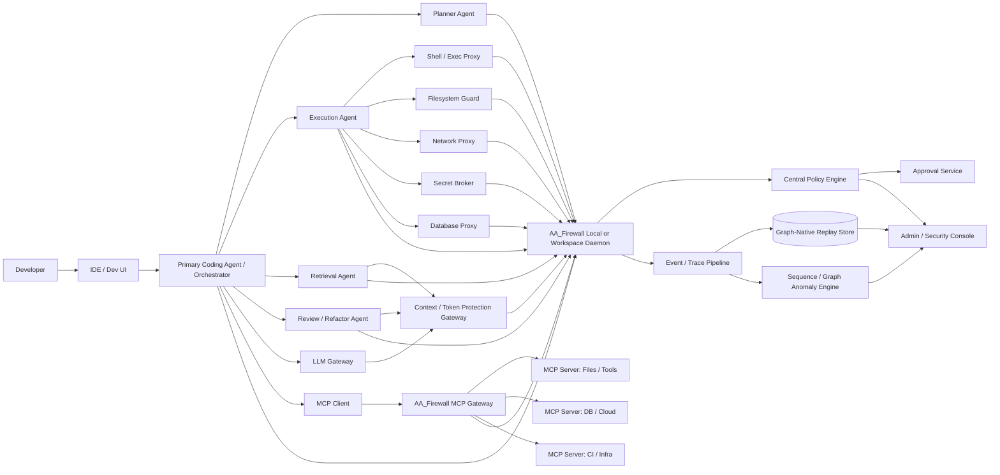
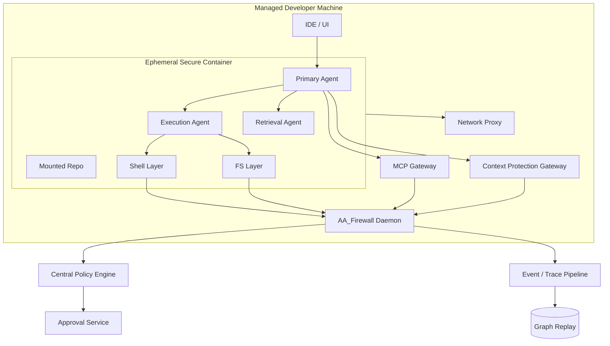
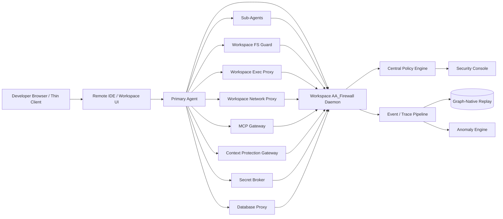
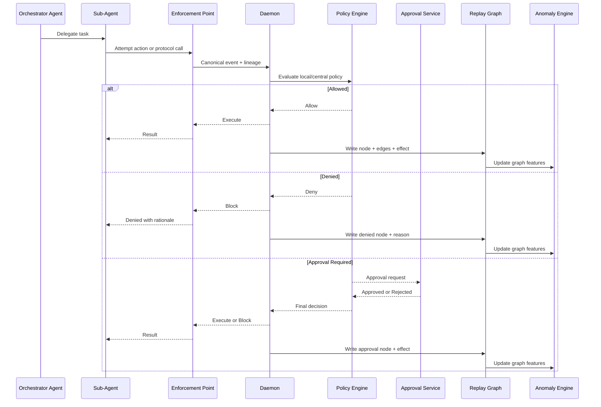
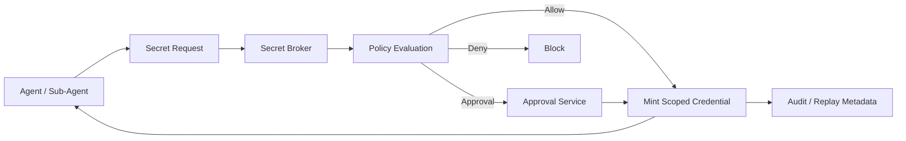
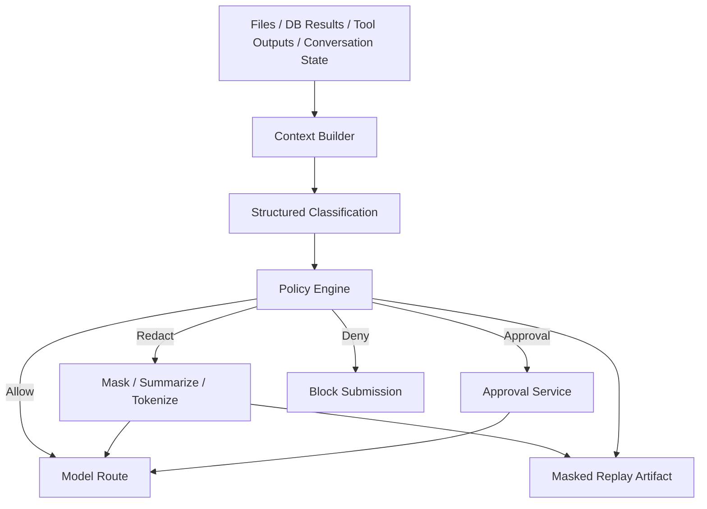

> Author: Deepankar Das

# AA_Firewall Technical Design Document Final 3

## Executive Technical Summary (AIFund Two-Page Submission)

AA_Firewall is designed as an enterprise-grade governance and security layer for AI coding agents. The technical thesis is that no single control point can reliably govern modern agent behavior across file operations, shell execution, network egress, package/dependency mutation, secret access, MCP tool invocation, model-context construction, and agent-to-agent delegation. A production architecture must therefore combine multiple enforcement and observability surfaces into one coherent control plane with deterministic policy outcomes and replayable evidence.[cite:1]

The design goal is mandatory governance where promises are made. In practice this means that "monitor only" is insufficient for core risk paths. The system must intercept action intent before execution where feasible, evaluate policy with contextual attributes (actor, session, project, resource, action type, risk class, approval state), and return allow/deny/require-approval outcomes with human-readable rationale. This technical requirement drives the architecture toward a hybrid model: runtime hooks for high-fidelity intent capture, local/workspace daemon coordination for policy and state, protocol-aware gateways for external tools and network control, and centralized policy/audit services for cross-fleet governance.[cite:1]

The control-plane architecture is intentionally layered:

- Runtime integration layer emits structured action envelopes from managed agent workflows.[cite:1]
- Enforcement layer mediates execution surfaces (shell, filesystem, network, package, MCP, DB, context).[cite:1]
- Local/workspace daemon maintains session state, applies local policy bundles, and brokers approvals.[cite:1]
- Central policy plane distributes authoritative policy and aggregates decisions/events.[cite:1]
- Evidence and intelligence plane provides graph-native replay, anomaly detection, and reviewer workflows.[cite:1]

This layered approach addresses a key enterprise requirement: trace continuity from intent to effect. Security reviewers do not just need raw event streams; they need causality. The TDD therefore emphasizes linked action chains where each event captures actor identity, tool/action intent, policy rule evaluated, decision code, enforcement result, and resulting effect signals where available. This enables incident reconstruction and policy tuning without requiring manual stitching across disconnected systems.

Deployment strategy is also explicit. The architecture supports three topologies with increasing assurance:

- Host-based pilot mode for low-friction adoption and policy tuning.[cite:1]
- Secure-container standardized mode for stronger local containment and reduced bypass surface.[cite:1]
- Remote-workspace standardized mode for enterprise-scale control, attestation, and central posture enforcement.[cite:1]

The technical migration path matters for adoption. Enterprises rarely start with maximum control on day one. By designing a consistent policy model and event contract across these topologies, teams can start with pilot instrumentation and move toward stronger containment without reworking policy semantics or audit pipelines. This reduces deployment risk and accelerates time-to-value.

A central technical differentiator is protocol-aware governance. Traditional endpoint controls can observe process and network activity, but they do not natively understand agent tooling semantics, MCP method surfaces, or model-context leakage pathways. AA_Firewall’s TDD treats MCP and context submission as first-class governed channels, not secondary artifacts. That allows the system to enforce constraints such as trusted MCP server allowlists, method-level restrictions, argument inspection policies, and data redaction requirements before sensitive payloads reach models or external tools.[cite:1]

The approval model is engineered for developer flow and operational accountability. High-risk actions can be blocked pending approval, but the workflow avoids global workflow deadlock by issuing scoped approvals tied to actor, session, action class, and time constraints. Once approved, execution can proceed with explicit one-time or bounded-use semantics. Every decision transition is auditable, including approver identity, rationale, and expiry behavior. This is critical for compliance contexts where "who approved what and why" must be queryable and exportable.

Secret and context protection are treated as independent control planes. The TDD assumes that many sensitive exposures occur before network egress, during context assembly or tool chaining. As a result, policy includes secret classes, source lineage, and context-routing controls that can redact, deny, or require approval prior to model submission. This shifts the design from simple perimeter controls toward data-aware execution governance, which is necessary for agentic systems that continuously move information between local files, APIs, prompts, and tool outputs.

Evidence architecture is graph-native by design. Flat logs are insufficient for autonomous action chains. The system stores linked events and derived relationships (for example: prompt -> tool call -> file read -> secret detection -> network request -> deny). This enables deterministic replay, anomaly sequence detection, and higher-quality reviewer UX. It also supports analytics needed for policy improvement and enterprise reporting, including recurring blocked-pattern identification, high-friction policy hotspots, and developer-group behavior segmentation.[cite:1]

Performance and reliability constraints are built into the architecture:

- Low-latency decision path for synchronous policy checks on interactive workflows.[cite:1]
- Fail-safe behavior defined per surface (fail-closed for critical paths, bounded fallback for non-critical observability paths).[cite:1]
- Idempotent service startup/deploy behavior, resilient event buffering, and eventual consistency for non-blocking analytics enrichment.[cite:1]
- Tamper-resistance posture through managed hooks, privileged service modes, central policy authority, and integrity-focused audit handling.[cite:1]

For AIFund evaluation, the technical narrative is that AA_Firewall is not a feature bundle but a systems architecture that closes a specific enterprise gap: governed execution for AI software agents. The implementation plan is tractable because each major capability maps to explicit components, contracts, and rollout phases. The differentiation is defensible because protocol-aware enforcement, scoped approval orchestration, and graph-native replay create compound value that is hard to replicate with point controls.

The near-term engineering objective is production hardening of the current architecture with strict API contracts, deployment automation, policy-pack governance, and operational SLO instrumentation. The medium-term objective is expansion of protocol coverage, stronger remote-workspace standardization, and deeper analytics-assisted policy optimization. The long-term objective is to establish AA_Firewall as the default control plane inserted between enterprise AI agents and execution environments.

## Purpose

AA_Firewall is a security and policy layer that sits between AI coding agents and the systems they touch, with the goal of monitoring actions in real time, enforcing permission policies, and producing audit trails security teams can use to safely expand agent adoption across mid-market and enterprise development organizations.[cite:1] This document formalizes the architecture for implementing AA_Firewall as a multi-agent governance and security platform that joins policy, execution mediation, replay, and anomaly detection into one coherent enterprise control plane.[cite:1]

This version preserves the architectural direction of the earlier TDD and extends it into a more complete formal design. It adds deeper protocol-level mediation, broader remote-workspace standardization, more robust graph-native replay, stronger scoped-secret issuance, more precise context-sensitive redaction, and anomaly models tuned by customer environment and agent role, while maintaining the product thesis that mandatory governance over coding-agent actions is the core requirement.[cite:1]

## Scope

This TDD is intended for an engineering team implementing the first production-oriented version of AA_Firewall and planning its evolution into an enterprise-grade platform.[cite:1] It covers system architecture, deployment models, component responsibilities, trust boundaries, policy model, protocol mediation, secrets and context protection, session replay, anomaly detection, data model, service contracts, performance trade-offs, rollout plan, and future hardening directions.[cite:1]

## Product Context

The attached venture brief defines the problem clearly: AI coding agents are gaining access to developer machines and production-adjacent environments, but teams have no purpose-built policy layer, limited visibility, and weak auditability for autonomous actions.[cite:1] The brief also defines the expected technical deliverables: interception across multiple action surfaces, allow/deny/approval policy enforcement, structured audit logs, and architectural choices around sandboxing, proxies, runtime hooks, and MCP wrappers.[cite:1]

The main design implication is that AA_Firewall cannot be implemented as a single plug-in or log collector. It must be a coordinated enforcement and governance system spanning local or remote execution environments, protocol-aware gateways, approval workflows, and post-execution analytics.[cite:1]

## System Goals

- Provide mandatory governance over AI coding-agent activity in developer environments.[cite:1]
- Intercept and evaluate actions across filesystem, shell, network, package management, credentials, MCP communication, database access, model-context submission, and agent-to-agent delegation surfaces.[cite:1]
- Produce structured audit trails meaningful to security reviewers.[cite:1]
- Support one or more depth areas identified in the venture brief, especially anomaly detection over action sequences, secrets or PII redaction in agent context, multi-agent policy isolation, and org-level policy distribution.[cite:1]
- Support deployment modes that allow organizations to start with pilots and evolve toward more controlled secure-container and remote-workspace operation.[cite:1]

## Non-Goals

- Replacing general endpoint security, SIEM, DLP, CNAPP, or secrets-management platforms across all human and machine activity.[cite:1]
- Supporting every IDE, agent runtime, operating system, and enterprise environment in the first release.[cite:1]
- Delivering perfect full-system mediation in uncontrolled environments on day one.[cite:1]

## Architectural Principles

- Mandatory enforcement is primary; passive visibility is insufficient.[cite:1]
- Agent intent and system effect must be linked in a single traceable execution graph.[cite:1]
- The architecture must be hybrid because no single control point fully governs the required surfaces.[cite:1]
- Protocol-aware mediation is a strategic capability, especially for MCP, LLM context, agent delegation, and structured tool protocols.[cite:1]
- Secure containers and remote workspaces are first-class enforcement environments because they reduce bypass risk and improve determinism.[cite:1]
- Replay and anomaly detection should operate on graph-linked action chains rather than isolated flat events.[cite:1]
- Secrets and context must be governed as separate data planes, not as a byproduct of filesystem or network controls alone.[cite:1]

## Reference Architecture

AA_Firewall should be modeled as a multi-agent Agentic AI application where a primary coding agent orchestrates sub-agents and tool interactions, while AA_Firewall provides a parallel governance fabric that mediates, records, and analyzes those interactions.[cite:1]



This architecture keeps the main architectural direction unchanged: AA_Firewall is a multi-agent governance and security platform joining policy, execution mediation, replay, and anomaly detection into one enterprise control plane.[cite:1]

## Logical Layers

### Experience Layer

This layer includes IDE integrations, CLI integrations, approval UIs, reviewer console workflows, and developer-facing policy rationale surfaces.[cite:1]

### Agent Runtime Layer

This layer includes the primary orchestrator, sub-agents, runtime hooks, MCP clients, and model-routing integrations.[cite:1]

### Enforcement Layer

This layer includes shell proxies, filesystem guards, network proxies, MCP gateways, database proxies, secret brokers, and context-protection gateways.[cite:1]

### Control Plane Layer

This layer includes the local daemon, central policy engine, approval service, policy distribution service, admin console, and posture validation services.[cite:1]

### Observability and Intelligence Layer

This layer includes event ingestion, graph-native replay, anomaly detection, policy simulation, alert routing, and export pipelines.[cite:1]

## Deployment Topologies

AA_Firewall should support three standard deployment topologies with a common logical model and differing enforcement strengths.[cite:1]

### Topology A: Host-Based Pilot Deployment

Use for initial pilots and lower-friction adoption. Runtime hooks, local daemon, and local proxies provide most mediation, with more limited containment guarantees.[cite:1]

### Topology B: Secure-Container Standardized Deployment

Use for controlled developer environments where the project workspace, process execution, and egress can be constrained in an ephemeral sandbox. This should be the recommended high-assurance local-development topology.[cite:1]



### Topology C: Remote-Workspace Standardized Deployment

Use for enterprise-managed workspaces, regulated customers, and stronger tamper resistance. This should become the preferred standardized enterprise topology because execution, storage, proxying, and identity can all be more centrally controlled.[cite:1]



### Remote-Workspace Standardization Requirements

To make remote-workspace support operationally consistent, AA_Firewall should standardize:

- Workspace bootstrap and agent-sidecar injection model.[cite:1]
- Default proxy routing for network, MCP, model, and secret retrieval paths.[cite:1]
- Workspace identity issuance and attestation.[cite:1]
- Policy bundle bootstrap and secure refresh process.[cite:1]
- Persistent trace and replay export format across workspace vendors.[cite:1]
- Posture validation checks for workspace image, agent runtime, and daemon integrity.[cite:1]

## Core Component Specification

### 1. Runtime Integration Layer

The runtime integration layer should hook managed agent runtimes before execution. It must emit semantic intent events for actions including file ops, shell exec, tool invocation, model submission, secret retrieval, and sub-agent delegation.[cite:1]

**Key interfaces**
- `beginAction(actionEnvelope)` for synchronous policy-mediated actions.[cite:1]
- `delegateTask(delegationEnvelope)` for sub-agent spawn and handoff.[cite:1]
- `submitContext(contextEnvelope)` for model-context review.[cite:1]
- `completeAction(resultEnvelope)` for downstream effect correlation.[cite:1]

### 2. Local / Workspace Daemon

The daemon is the local enforcement coordinator and session-state manager.

**Responsibilities**
- Maintain active trace context and session graph caches.[cite:1]
- Evaluate local policy bundles and forward approval requests.[cite:1]
- Enforce posture checks and environment-mode constraints.[cite:1]
- Batch or stream audit envelopes with integrity metadata.[cite:1]
- Expose internal health and readiness APIs.[cite:1]

### 3. Filesystem Guard

The filesystem guard should support both wrapper-mode and deeper enforcement mode depending on deployment.

**MVP capabilities**
- Path-scope deny and allow rules.[cite:1]
- Write-outside-project denial.[cite:1]
- Sensitive read path restrictions.[cite:1]

**Extended capabilities**
- File lineage tagging for prompt and exfil correlation.[cite:1]
- Bulk operation detection.[cite:1]
- Content-classification plug-ins.[cite:1]

### 4. Shell / Exec Proxy

The exec proxy governs direct and indirect command execution.

**MVP capabilities**
- Command classification, blocklists, allowlists, approval rules.[cite:1]
- Process ancestry capture and exit status logging.[cite:1]

**Extended capabilities**
- Subprocess tree tracing.[cite:1]
- Command-pattern anomaly feature extraction.[cite:1]
- Package-manager semantic classification.[cite:1]

### 5. Network Proxy

The network proxy is responsible for host allowlisting, route control, exfiltration guardrails, and protocol metadata generation.

**MVP capabilities**
- Host allowlist enforcement.[cite:1]
- Registry-specific rules for package installation.[cite:1]
- Request metadata logging.[cite:1]

**Extended capabilities**
- Payload sensitivity classification.[cite:1]
- Sequence-aware egress anomaly detection features.[cite:1]
- Customer-specific route patterns per environment.[cite:1]

### 6. MCP Gateway

The MCP gateway should evolve from simple routing mediation into a protocol-aware policy engine.

**MVP capabilities**
- Server identity allowlist.[cite:1]
- Method allow and deny rules.[cite:1]
- Request and response metadata logging.[cite:1]

**Extended protocol-level mediation**
- Schema-aware payload classification.[cite:1]
- Tool capability negotiation policy.[cite:1]
- Input and output transformation policies for masking or truncation.[cite:1]
- Delegation-aware MCP context tagging so calls can be attributed to the responsible sub-agent and parent session.[cite:1]
- Side-effect contracts to record expected downstream file, DB, or network actions for comparison against observed behavior.[cite:1]

### 7. Database Proxy

The database proxy governs structured-data access.

**MVP capabilities**
- Query operation classification by read/write/export.[cite:1]
- Sensitive-target approval requirements.[cite:1]

**Extended capabilities**
- Row-count and scope estimation.[cite:1]
- Result masking and field-level redaction.[cite:1]
- Query lineage linking to prompts and downstream network flows.[cite:1]

### 8. Secret Broker

The secret broker should move AA_Firewall from ambient secrets toward scoped-secret issuance.

**MVP capabilities**
- Secret retrieval mediation by session and environment.[cite:1]
- Secret-class deny and approval rules.[cite:1]

**Extended stronger scoped-secret issuance**
- Issue action-scoped or task-scoped short-lived credentials where supported.[cite:1]
- Bind issued credentials to agent role, workspace identity, destination service, and TTL.[cite:1]
- Mark derived secret material for downstream redaction in replay and model-context pipelines.[cite:1]
- Support one-time-use credentials for high-risk operations.[cite:1]

### 9. Context and Token Protection Gateway

This component is responsible for precise context-sensitive redaction rather than coarse keyword filtering.[cite:1]

**MVP capabilities**
- Secret and PII scanning before model submission.[cite:1]
- Redact, deny, or require-approval policy outcomes.[cite:1]

**Extended precise context-sensitive redaction**
- Redact based on structured classification of files, code regions, schema fields, and retrieved records rather than raw text matching alone.[cite:1]
- Support policy logic such as “allow stack traces but redact embedded tokens,” “allow code summary but block full proprietary file content,” or “allow DB query intent but mask result values.”[cite:1]
- Preserve masked diffs and semantic summaries in replay rather than raw sensitive content.[cite:1]
- Distinguish between internal model routes, third-party model providers, and high-risk external endpoints.[cite:1]

### 10. Replay Platform

Replay should be graph-native rather than log-only. A graph model is better suited for multi-agent systems because it captures delegation, causality, approvals, tool chains, and effects as relationships rather than forcing analysts to reconstruct them from flat logs.[cite:1]

**Graph entities**
- Session
- Actor
- Agent
- Sub-agent
- Tool / MCP server
- Action
- Resource
- Policy decision
- Approval
- Effect
- Anomaly

**Graph edges**
- `delegated_to`
- `requested`
- `evaluated_by`
- `approved_by`
- `affected`
- `triggered`
- `derived_from`
- `exfiltrated_to`
- `masked_by`

**Replay requirements**
- Timeline replay.[cite:1]
- Causal graph replay.[cite:1]
- Diff and impact replay for files and resources.[cite:1]
- Approval timeline replay.[cite:1]
- Context-submission replay with masked artifacts.[cite:1]
- Exportable incident bundle for external review.[cite:1]

### 11. Anomaly Engine

The anomaly engine should use multiple model families and tune baselines by customer environment and agent role.[cite:1]

**Baseline dimensions**
- Organization.[cite:1]
- Team.[cite:1]
- Repository / project.[cite:1]
- Environment type: host, secure container, remote workspace.[cite:1]
- Agent role: orchestrator, execution agent, retrieval agent, review agent, MCP tool agent.[cite:1]
- Time window and deployment phase.[cite:1]

**Model families**
- Deterministic heuristics for known-danger patterns.[cite:1]
- Sequence models for command, tool, and egress ordering.[cite:1]
- Graph-pattern models for delegation, fan-out, and anomalous relationships.[cite:1]
- Environment-conditioned anomaly scoring so the same action can be scored differently in a pilot laptop environment versus a regulated remote workspace.[cite:1]
- Role-conditioned anomaly scoring so retrieval agents and execution agents have different expected behavior envelopes.[cite:1]

**Operational outcomes**
- Alert only.[cite:1]
- Require approval.[cite:1]
- Raise policy severity.[cite:1]
- Block when a deterministic or high-confidence combination threshold is met.[cite:1]

## Data Model

AA_Firewall should use a common canonical envelope for actions, decisions, effects, and anomalies so every component can interoperate predictably.[cite:1]

### Canonical action envelope

```json
{
  "event_id": "uuid",
  "trace_id": "trace_001",
  "span_id": "span_001",
  "parent_span_id": "span_root",
  "timestamp": "2026-04-26T16:00:00Z",
  "org_id": "org_001",
  "project_id": "proj_001",
  "session_id": "sess_001",
  "workspace_mode": "secure_container",
  "actor": {
    "developer_id": "dev_001",
    "agent_id": "agent_primary",
    "sub_agent_id": "agent_exec_1",
    "role": "execution_agent"
  },
  "action": {
    "type": "shell.exec",
    "summary": "npm install express",
    "classification": ["package_install"]
  },
  "resource": {
    "kind": "command",
    "value": "npm install express"
  },
  "protocol": {
    "name": "local_exec",
    "server_id": null,
    "method": null
  },
  "policy": {
    "matched_rule_id": "org.pkg.install.approval",
    "decision": "require_approval",
    "reason": "Package installation requires approval"
  },
  "approval": {
    "status": "approved",
    "approver_id": "sec_001",
    "approved_at": "2026-04-26T16:00:10Z"
  },
  "effect": {
    "executed": true,
    "exit_code": 0,
    "changed_resources": ["package-lock.json", "node_modules/"]
  },
  "security": {
    "secret_redaction_applied": false,
    "context_redaction_applied": false,
    "anomaly_score": 0.12
  }
}
```

### Canonical protocol envelope

```json
{
  "event_type": "protocol.mcp.request",
  "trace_id": "trace_009",
  "session_id": "sess_001",
  "actor": {
    "agent_id": "agent_primary",
    "sub_agent_id": "agent_retrieval_1",
    "role": "retrieval_agent"
  },
  "protocol": {
    "name": "mcp",
    "server_id": "db_tool_server",
    "method": "query.run",
    "schema_version": "1"
  },
  "resource": {
    "kind": "tool",
    "name": "query.run"
  },
  "classification": ["database_read", "sensitive_data_possible"],
  "policy_context": {
    "workspace_mode": "remote_workspace",
    "environment_tier": "regulated",
    "delegation_depth": 1
  }
}
```

## Policy Architecture

The policy engine should support hierarchical composition and environment-aware, agent-aware evaluation.

### Policy hierarchy

1. Organization baseline.[cite:1]
2. Environment baseline by deployment mode.[cite:1]
3. Team and project overlays.[cite:1]
4. Developer-local guardrails that can only tighten policy.[cite:1]
5. Temporary approval-derived exceptions with bounded scope and TTL.[cite:1]

### Policy dimensions

Policies should be able to reference:

- Action type.[cite:1]
- Protocol type.[cite:1]
- Resource identity and classification.[cite:1]
- Agent role and delegation depth.[cite:1]
- Workspace mode and environment tier.[cite:1]
- Secret class and model route.[cite:1]
- Customer-specific baselines or risk profiles.[cite:1]

### Example policy

```yaml
policy_id: regulated.remote.block_external_model_raw_db
version: 3
scope:
  level: environment
  workspace_modes: [remote_workspace]
  environment_tiers: [regulated]
subjects:
  roles: [retrieval_agent, review_agent]
actions:
  - context.submit
resources:
  model_routes: [external_vendor]
conditions:
  classifications_any:
    - sensitive_database_result
    - production_secret_adjacent
effect:
  decision: deny
  rationale: Raw sensitive DB outputs cannot be sent to external models.
logging:
  mode: full
replay:
  retain_masked_summary: true
anomaly:
  severity_boost: high
```

## Decision Flow



## Replay Architecture

Replay should be implemented as a graph-native subsystem rather than an overlay on flat logs.[cite:1] A graph-native approach allows the platform to represent multi-agent delegation, causal chains, side effects, and approvals directly in the storage model.[cite:1]

### Recommended replay services

- Trace ingest service.[cite:1]
- Graph builder service.[cite:1]
- Timeline materializer.[cite:1]
- Impact-diff materializer.[cite:1]
- Incident export service.[cite:1]

### Replay query modes

- `timeline(session_id)` for chronological review.[cite:1]
- `graph(session_id)` for causal investigation.[cite:1]
- `impact(session_id)` for affected resources.[cite:1]
- `delegation(session_id)` for sub-agent relationships.[cite:1]
- `exfiltration(session_id)` for outbound data path review.[cite:1]

## Secrets and Context Protection Architecture

The strongest design is to treat secrets issuance and model-context review as explicit mediated workflows rather than as optional scanners.[cite:1]

### Scoped-secret issuance flow



### Context-sensitive redaction flow



## Protocol-Level Mediation Strategy

Broader protocol-level mediation should be implemented as a common abstraction across MCP, LLM requests, database tools, secret exchanges, package fetches, and inter-agent messages.[cite:1] This allows the policy engine to reason consistently about communication and tool-use patterns even when underlying transport differs.[cite:1]

### Protocol mediation stages

1. Normalize transport-specific request into canonical protocol event.[cite:1]
2. Attach actor, lineage, workspace, classification, and expected side-effect metadata.[cite:1]
3. Evaluate policy using protocol-aware rules.[cite:1]
4. Optionally transform request or response through redaction, truncation, masking, or schema filtering.[cite:1]
5. Emit trace node and effect edges.[cite:1]

### Examples of deeper mediation

- Block MCP methods that imply write capability in read-only projects.[cite:1]
- Require approval for package fetches from non-sanctioned registries.[cite:1]
- Redact sensitive result fields in database tool responses before they are reused in prompts.[cite:1]
- Restrict retrieval agents from sending raw repository files to external models while allowing summarized derived context.[cite:1]

## Anomaly Detection Architecture

Anomaly detection should be a layered subsystem that combines rules, sequence models, and graph models tuned per customer environment and agent role.[cite:1]

### Feature families

- Command-sequence features.[cite:1]
- File-path access breadth and mutation features.[cite:1]
- MCP server-method novelty and burst features.[cite:1]
- Database access scope and row-estimate features.[cite:1]
- Secret retrieval frequency and class-shift features.[cite:1]
- Context-submission volume and sensitivity-shift features.[cite:1]
- Delegation graph depth, fan-out, and cycle features.[cite:1]

### Tuning dimensions

- Environment tier: pilot, standard, regulated.[cite:1]
- Workspace mode: host, secure container, remote workspace.[cite:1]
- Agent role: orchestrator, execution, retrieval, reviewer, tool agent.[cite:1]
- Customer policy posture: permissive, balanced, strict.[cite:1]

### Decision policy interaction

Anomaly outcomes should integrate with policy as follows:

- Low confidence: log and surface in replay.[cite:1]
- Medium confidence: require approval or raise policy severity.[cite:1]
- High confidence with deterministic corroboration: block.[cite:1]

## Service Contracts

### Core APIs

```http
POST /v1/decision/evaluate
POST /v1/events/ingest
POST /v1/approvals/request
POST /v1/approvals/{id}/resolve
GET /v1/replay/sessions/{session_id}
GET /v1/replay/sessions/{session_id}/graph
GET /v1/replay/sessions/{session_id}/timeline
GET /v1/anomalies
GET /v1/anomalies/{id}
POST /v1/secrets/issue
POST /v1/context/evaluate
POST /v1/protocol/evaluate
```

### Internal service interfaces

- Policy bundle distribution service.[cite:1]
- Workspace attestation and posture service.[cite:1]
- Trace graph builder and edge materialization service.[cite:1]
- Feature extraction service for anomaly pipelines.[cite:1]
- Masked artifact generation service for replay-safe context inspection.[cite:1]

## Security and Trust Boundaries

- Agents, sub-agents, MCP servers, external APIs, model vendors, and package sources are untrusted or partially trusted execution participants.[cite:1]
- Daemons, policy services, approval services, replay services, and secret broker control-plane functions are trusted components that must mutually authenticate and emit signed events.[cite:1]
- Remote-workspace and secure-container runtimes must be attested to a supported posture before high-assurance policies are enabled.[cite:1]
- Sensitive payload retention should be minimized, with masked summaries favored over raw value retention in replay systems.[cite:1]

## Reliability and Performance Trade-Offs

### Local-first policy evaluation

Interactive developer workflows require low-latency decisions, so policy bundles should be evaluated locally whenever possible.[cite:1] Central services should primarily handle approvals, policy publication, replay indexing, anomaly scoring updates, and administrative workflows.[cite:1]

### Environment mode trade-offs

- Host mode is easier to adopt but weaker against local bypasses and ambient credential risks.[cite:1]
- Secure-container mode improves blast-radius reduction and deterministic workspace control.[cite:1]
- Remote-workspace mode offers the strongest centralized governance but requires more infrastructure standardization.[cite:1]

### Replay richness versus privacy

Graph-native replay is powerful but increases sensitivity of stored metadata.[cite:1] The design should default to retaining structured metadata, masked summaries, cryptographic digests, and selective diff artifacts instead of indiscriminate raw payload storage.[cite:1]

### Deterministic policy versus learned detection

Deterministic policy remains the primary basis for enforcement.[cite:1] Learned anomaly systems should begin as supporting intelligence that escalates approval or risk severity and only participate directly in blocking for narrow high-confidence scenarios.[cite:1]

## Implementation Roadmap

### Phase 1: Controlled Foundation

- Runtime integration for one agent environment.[cite:1]
- Local daemon, shell proxy, filesystem guard, and network proxy.[cite:1]
- Central policy engine and policy bundle distribution.[cite:1]
- Approval workflow and structured audit pipeline.[cite:1]
- Three baseline rules: project-boundary writes, host allowlist, package-install approval.[cite:1]

### Phase 2: Protocol and Data Protection

- MCP gateway with server and method mediation.[cite:1]
- Context-protection gateway and secret broker.[cite:1]
- Secure-container deployment mode.[cite:1]
- Replay graph builder and timeline views.[cite:1]
- Initial anomaly detection over action sequences.[cite:1]

### Phase 3: Enterprise Standardization

- Remote-workspace standardized deployment.[cite:1]
- Database proxy and richer structured-data controls.[cite:1]
- Graph-native replay as the default investigation experience.[cite:1]
- Role-conditioned and environment-conditioned anomaly models.[cite:1]
- Scoped-secret issuance and advanced context-redaction policies.[cite:1]

### Phase 4: Advanced Multi-Agent Governance

- Deeper protocol mediation and side-effect contracts.[cite:1]
- Full delegation lineage and multi-agent policy isolation.[cite:1]
- Policy simulation and preflight analysis for agent plans.[cite:1]
- Broader incident response, export, and compliance workflows.[cite:1]

## Open Questions

- Which initial agent integration creates the best combination of adoption and enforceability?[cite:1]
- Which graph store or hybrid storage model offers the best balance of replay richness, query speed, and operational complexity?[cite:1]
- How much schema-aware payload mediation is required in the first MCP release to create meaningful differentiation?[cite:1]
- Which secret issuers can support short-lived scoped credentials in real customer environments?[cite:1]
- What minimum viable remote-workspace attestation is required before customers trust stronger enforcement modes?[cite:1]

## Future Improvements

With more time, AA_Firewall should deepen protocol mediation, increase remote-workspace standardization, strengthen graph-native replay and export, expand scoped-secret issuance, refine context-sensitive redaction, and improve anomaly models tuned by environment tier and agent role.[cite:1] These are extensions of the current architecture rather than changes to direction: the platform should continue to evolve as a multi-agent governance and security control plane that unifies policy, execution mediation, replay, and anomaly detection for enterprise AI coding-agent adoption.[cite:1]
