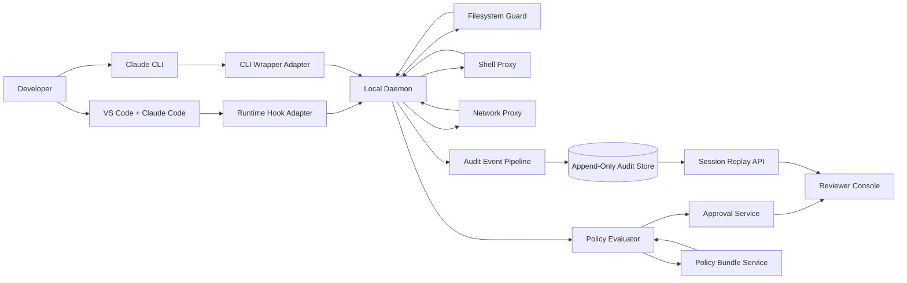
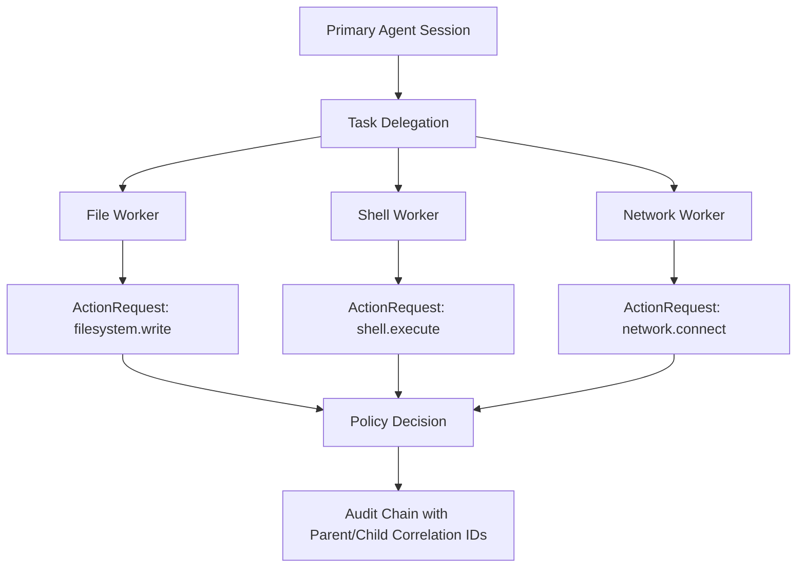
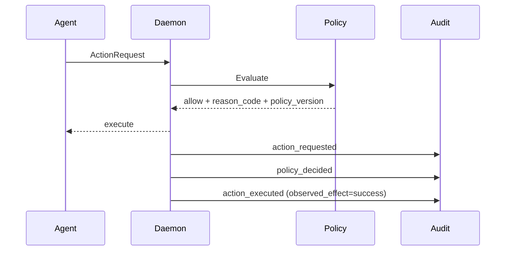
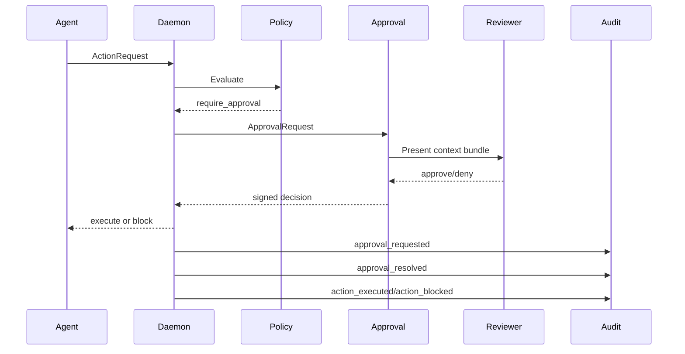
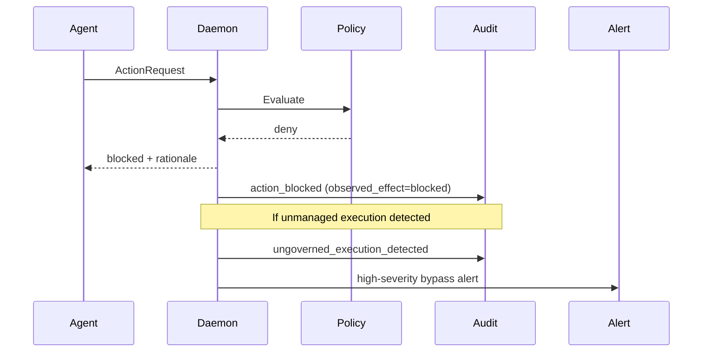

> Author: Deepankar Das

# AA Firewall Technical Design Document (Peer Draft, Appendix C Aligned)

## Document Metadata

- Document: `AA_Firewall_TDD_Peer.md`
- Product: AA Firewall
- Version: 2.0 (rewritten to align with ratified Appendix C)
- Date: April 27, 2026
- Source of truth: `docs/AA_Firewall_PRD.md` Appendix C (Section 27)
- Related final requirements: `docs/AA_Firewall_PRD.md#27` (ratified)

---

## 0. Alignment to Appendix C

This TDD is a direct implementation design for the ratified requirements in Appendix C.

| Appendix C Requirement | TDD Coverage |
|---|---|
| C.2 R-1: three-surface interception with pre-execution enforcement and `attempted_action`/`observed_effect` | Sections 4, 6, 7, 9 |
| C.2 R-2: hierarchical policy, reason codes, policy version stamping | Sections 8, 9 |
| C.2 R-3: reviewer-grade audit schema, minimum schema gate, append-only | Section 9 |
| C.2 R-4: approval UX depth area with latency targets and timeout policy | Sections 6, 7, 10 |
| C.2 R-5: depth over breadth with readiness gates | Sections 12, 14 |
| C.4: phased roadmap (Phase 0 to Phase 3) | Section 12 |
| C.6: integration targets (Phase 1 P0 = Claude Code extension + CLI only) | Section 13 |
| C.7: final success metrics and windows | Sections 10, 14 |

---

## 1. Purpose

Define a build-ready technical architecture for AA Firewall that can:

- enforce policy before execution for file, shell, and network surfaces
- support hierarchical policy with deterministic decisions and explainable outcomes
- provide real-time approval workflows as the primary depth area
- produce forensic-grade audit trails and replay-ready action chains
- deliver the exact Phase 1 and Phase 2 sequencing ratified in Appendix C

---

## 2. Scope and Non-Goals

## 2.1 In Scope (Phase 1 and Phase 2)

- Phase 1:
- Claude Code VS Code extension + Claude CLI (`claude`) integration
- file, shell, network interception with mandatory enforcement
- hierarchical policy engine with reason codes and policy versioning
- approval workflow and reviewer context bundles
- append-only audit pipeline with schema validation
- secure-container mode

- Phase 2:
- Cursor integration via MCP gateway
- Codex VS Code extension local support
- method-level MCP governance
- package and secrets governance
- prompt/context redaction and SIEM integration

## 2.2 Non-Goals (for initial wedge)

- full endpoint security platform replacement
- universal cross-agent support in Phase 1
- full anomaly detection platform in Phase 1
- governance guarantees for cloud-delegated actions outside local interception boundary

---

## 3. Architecture Decisions

| Decision | Selected Option | Rationale |
|---|---|---|
| Enforcement topology | Hybrid: runtime hook + daemon + proxies + optional MCP gateway | No single interception point provides both semantic context and strong enforcement |
| Primary depth area | Real-time approval UX | Highest enterprise adoption impact and strongest demo value |
| Phase 1 primary agent path | Claude Code (VS Code extension + CLI) | Local execution with practical pre-execution interception |
| Policy evaluation model | Hierarchical policy with local evaluation cache | Low latency while preserving central governance intent |
| Audit model | Append-only normalized events with schema gate | Reviewer usability, forensic traceability, and compliance fit |
| Expansion order | Protocol-aware expansion in Phase 2 | Follows depth-over-breadth and reduces integration risk |

---

## 4. System Design

AA Firewall is implemented as coordinated control-plane and enforcement-plane services.

- Enforcement plane: intercept and gate actions before effect.
- Decision plane: evaluate policy and return deterministic decisions.
- Approval plane: route human approvals for high-risk actions.
- Evidence plane: store append-only event chain and replay artifacts.

### 4.1 Logical Architecture



### 4.2 Component Responsibilities

| Component | Responsibility | Phase |
|---|---|---|
| Runtime Hook Adapter | Convert IDE agent actions into normalized ActionRequests | 1 |
| CLI Wrapper Adapter | Intercept CLI tool invocation path | 1 |
| Local Daemon | Policy orchestration, approval hold/resume, audit emission | 1 |
| Filesystem Guard | Path-boundary enforcement and file event normalization | 1 |
| Shell Proxy | Command mediation and process-tree aware enforcement | 1 |
| Network Proxy | Host allowlist enforcement and egress audit metadata | 1 |
| Policy Evaluator | Deterministic policy decision with reason code and policy version | 1 |
| Approval Service | Reviewer routing, timeout handling, decision signing | 1 |
| Audit Pipeline + Store | Append-only event ingestion, schema validation, replay queries | 1 |
| MCP Gateway | Method-level tool governance for MCP traffic | 2 |
| Secrets Mediation | Govern sensitive credential retrieval paths | 2 |
| Context Redaction | Govern prompt/context leakage pathways | 2 |

### 4.3 Deployment Modes

| Mode | Use | Enforcement Confidence | Phase |
|---|---|---|---|
| Host mode | Fast pilot rollout | Medium (higher bypass surface) | 1 |
| Secure container mode | Stronger isolation and deterministic execution paths | High | 1 |
| Remote workspace mode | Centralized control and reduced host variance | High | 3 |

---

## 5. Agentic AI Patterns

This design uses explicit agentic patterns so governance remains reliable as agent complexity grows.

| Pattern | Description | Governance Strategy |
|---|---|---|
| Orchestrator-worker | Primary agent delegates to task-specific workers/tools | Preserve actor lineage and delegated action IDs in every event |
| Tool mediation | Agent invokes filesystem/shell/network/MCP tools | Every tool action must pass policy gate before effect |
| Human-supervised branch | High-risk action branches into approval workflow | Pause execution until signed reviewer decision |
| Policy-as-code loop | Governance behavior controlled by versioned policy bundles | Log policy version on every decision for exact replay |
| Exception with expiry | Controlled temporary override | Time-bound approval scopes, full audit of grants and expiration |
| Progressive rollout | Strict mode and lower-friction mode coexist | Per-environment mode flags with explicit audit visibility |

### 5.1 Agent Delegation Model



---

## 6. Agent Communication Model

## 6.1 Communication Channels

| Channel | Direction | Payload | Requirement |
|---|---|---|---|
| Agent adapter -> daemon | synchronous | `ActionRequest` | Pre-execution gating |
| Daemon -> policy evaluator | synchronous | `PolicyInput` | Deterministic decision |
| Daemon -> approval service | async/sync callback | `ApprovalRequest` | Human-in-loop path |
| Approval service -> daemon | synchronous callback | `ApprovalDecision` | Resume/block action |
| Daemon -> audit pipeline | async durable | `AuditEvent` | Append-only evidence |
| Policy bundle service -> evaluator | pull/versioned | `PolicyBundle` | Configurable governance |

## 6.2 Core Message Contracts

### ActionRequest

```json
{
  "request_id": "req_01",
  "timestamp": "2026-04-27T18:10:00Z",
  "actor": {
    "user_id": "u_001",
    "agent_type": "claude_code",
    "agent_instance": "ide_session_17",
    "session_id": "ses_abc"
  },
  "environment": {
    "workspace": "/workspace/repo",
    "repo": "aa-firewall",
    "branch": "feature/x",
    "mode": "container"
  },
  "action": {
    "type": "shell.execute",
    "target": "npm install lodash",
    "attempted_action": "execute_command"
  }
}
```

### PolicyDecision

```json
{
  "request_id": "req_01",
  "policy_id": "pol_pkg_approval",
  "policy_version": "2026-04-27.1",
  "decision": "require_approval",
  "reason_code": "PKG_INSTALL_APPROVAL_REQUIRED",
  "explanation": "Package installation requires reviewer approval in this environment"
}
```

### ApprovalRequest

```json
{
  "approval_id": "apr_01",
  "request_id": "req_01",
  "context_bundle": {
    "actor": "u_001 / claude_code",
    "resource": "npm install lodash",
    "risk_rationale": "Dependency mutation",
    "policy_rule": "pol_pkg_approval"
  },
  "timeout_seconds": 300
}
```

### AuditEvent (minimum schema gate fields included)

```json
{
  "event_id": "evt_01",
  "who": "u_001|claude_code|ses_abc",
  "what": "shell.execute:npm install lodash",
  "when": "2026-04-27T18:10:00Z",
  "policy": "pol_pkg_approval@2026-04-27.1",
  "decision": "require_approval",
  "result": "pending",
  "attempted_action": "execute_command",
  "observed_effect": "pending"
}
```

### 6.3 Interaction Sequences

#### Allow Flow



#### Approval Flow



#### Deny Flow and Bypass Signal



---

## 7. Security Enforcement Scenarios

## Scenario S-1: Write Outside Project Root

- Trigger: agent attempts write to `/etc/hosts` or `../secrets/.env`.
- Enforcement path: filesystem guard -> policy evaluator (`deny`) -> block.
- Required audit chain:
- `action_requested`
- `policy_decided` (`reason_code=WRITE_OUTSIDE_PROJECT_ROOT`)
- `action_blocked` (`attempted_action=filesystem.write`, `observed_effect=blocked`)

## Scenario S-2: High-Risk Shell Command with Approval

- Trigger: agent requests `git push --force`.
- Enforcement path: shell proxy -> policy evaluator (`require_approval`) -> reviewer decision.
- System targets:
- approval request visible in <= 2 seconds
- enforce reviewer decision in <= 1 second
- Required audit chain includes reviewer identity, rationale, scope, and expiry.

## Scenario S-3: Network Egress to Non-Allowlisted Host

- Trigger: agent attempts `curl https://unknown.example.com`.
- Enforcement path: network proxy -> policy evaluator (`deny`) -> block.
- Required audit chain includes destination host classification and deny reason code.

## Scenario S-4: MCP Method Restriction (Phase 2)

- Trigger: Cursor MCP call to restricted method on non-approved server.
- Enforcement path: MCP gateway -> policy evaluator (`deny` or `require_approval`).
- Required audit chain includes `server_id`, `tool`, `method`, payload class, decision.

## Scenario S-5: Bypass Attempt Detection

- Trigger: unmanaged direct shell path detected outside governed wrapper.
- Enforcement path: bypass detector emits `ungoverned_execution_detected`.
- Required response:
- alert raised to security channel
- session marked degraded trust state
- investigation replay includes bypass event link

---

## 8. Policy Model

## 8.1 Hierarchy and Inheritance

Policy levels:

1. Organization
2. Team
3. Repository
4. Developer-local

Constraint: lower levels may tighten but never weaken inherited baselines.

## 8.2 Policy Object Fields

- subject
- action
- resource
- conditions
- effect (`allow`, `deny`, `require_approval`, `redact`, `quarantine`, `simulate`)
- logging mode
- approval mode
- reason code catalog entry
- policy version

## 8.3 Evaluation Rules

- Deny rules evaluated before allow rules at same precedence.
- Highest precedence policy layer takes priority where conflict rules are explicit.
- Every decision returns:
- `decision`
- `reason_code`
- `policy_id`
- `policy_version`

## 8.4 Appendix C Default Policies (Phase 1)

- deny writes outside project root
- deny network destinations not in allowlist
- require approval for high-risk shell commands

---

## 9. Audit Schema, Validation, and Replay

## 9.1 Required Fields (C.2 R-3 + minimum schema gate)

- who
- what
- when
- policy
- decision
- result
- attempted_action
- observed_effect
- correlation IDs (session and delegation)

## 9.2 Validation Gate

No event is accepted into the audit store unless minimum schema fields are present and valid.

- Gate failure behavior: reject event, emit internal error metric, trigger alert.
- Pass-rate target: 100%.

## 9.3 Replay Model

Replay should support:

- session chronology
- actor/resource/policy filters
- causal link between request -> decision -> approval -> effect
- export as JSON evidence package

## 9.4 Immutability

- append-only event storage
- no UPDATE/DELETE operations for event records
- retention and archival policies applied outside mutable event path

---

## 10. Performance and Operational Targets

Aligned to Appendix C metrics.

| Metric | Target | Notes |
|---|---|---|
| Policy decision latency (system) | p50 < 10ms, p95 < 50ms | Excludes human approval time |
| Approval delivery latency (system) | < 2 seconds | From `require_approval` to reviewer-visible request |
| Approval enforcement latency (system) | < 1 second | From reviewer action to action resume/block |
| End-to-end approval time (operational) | median < 60 seconds | Operational benchmark, not pure product SLA |
| Audit completeness | >99% | Full chain present |
| Schema validation pass rate | 100% | Any failure is incident-worthy |

---

## 11. Reliability and Failure Handling

## 11.1 Policy Evaluator Unavailable

- fallback to last valid signed local bundle
- if no valid bundle: deny for governed high-risk actions

## 11.2 Approval Service Unavailable

- deny-on-timeout for high-risk actions by default
- allow-on-timeout only where explicitly configured

## 11.3 Audit Pipeline Degradation

- local durable buffer with bounded queue
- backpressure and alerting when threshold exceeded
- fail-safe mode escalation for high-risk actions if audit write path remains unavailable

## 11.4 Bypass Detection

- detect execution paths not mediated by managed adapters/proxies
- emit explicit `ungoverned_execution_detected` events
- route high-severity alerts to reviewer/admin console

---

## 12. Phase Implementation Plan (Ratified)

## Phase 0: Foundations

Deliver:

- canonical action schema
- policy decision interface
- audit event contract
- minimum schema validation gate

Exit criteria:

- simulated action flows interception -> decision -> audit end-to-end
- contracts versioned and approved

## Phase 1: Controlled Enforcement Wedge

Deliver:

- three-surface enforcement (file, shell, network)
- hierarchical policy engine with reason codes and version stamping
- approval UX (in-IDE + fallback)
- audit console and session replay
- Claude Code VS Code extension + CLI integrations
- secure container mode

Exit criteria:

- demonstrable allow/deny/approval across all three surfaces
- reviewer can act in flow with context bundles
- readiness gates met (>95% coverage, <5% false-positive rate, <60s operational approval median, >99% audit completeness)

## Phase 2: Protocol-Aware Expansion

Deliver:

- Cursor via MCP gateway
- Codex VS Code extension local path
- MCP method-level governance
- package and secrets governance
- context redaction, SIEM integration, policy simulation

Exit criteria:

- MCP calls policy-evaluable at server/method level
- secrets and package paths governed and audited
- Phase 1 gates remain satisfied

## Phase 3: Enterprise Control Plane

Deliver:

- multi-agent delegation governance
- graph-native replay and anomaly baselines
- remote workspace and CI/CD governance
- enterprise governance packs

Exit criteria:

- multi-team deployment readiness and stable governance operations

---

## 13. Integration Targets (Appendix C Aligned)

## 13.1 Phase 1 (P0)

- Claude Code VS Code extension
- Claude CLI (`claude`)

## 13.2 Phase 2 (P1)

- Cursor VS Code agent mode via MCP gateway
- Codex VS Code extension local mode

## 13.3 Deferred (P2)

- Codex cloud-delegated tasks (visibility-only marker)
- Claude desktop app (pending surface analysis)
- Copilot agents (pending surface analysis)

---

## 14. Verification Plan

## 14.1 Scenario-Based Enforcement Tests

- S-1 file boundary deny test
- S-2 high-risk shell approval flow test
- S-3 network allowlist deny test
- S-4 MCP method governance test (Phase 2)
- S-5 bypass detection and alert test

## 14.2 Contract and Schema Tests

- ActionRequest contract validation
- PolicyDecision reason code and version presence
- Audit minimum schema gate rejection/acceptance behavior
- Replay query integrity tests

## 14.3 Performance and Metrics Validation

- policy latency (p50/p95) under representative load
- approval delivery and enforcement latency instrumentation
- operational median approval benchmark reporting
- audit completeness and schema pass-rate dashboards

## 14.4 Readiness Gate Reviews

Before promoting scope from one phase to the next, run formal gate review using Appendix C targets with traceable evidence.

---

## 15. Open Technical Items (Intentionally Deferred)

- hardened sandbox runtime selection (gVisor vs Kata vs Firecracker track)
- full governance posture for cloud-delegated execution paths
- anomaly model type and baseline training strategy
- remote workspace reference implementation details

---

## 16. Conclusion

This TDD is fully aligned with the ratified Appendix C baseline and is implementation-oriented. It defines the required system design, agentic architecture patterns, communication contracts, enforcement scenarios, and phase-gated delivery model needed to build and demonstrate AA Firewall with a coding agent.

Phase 1 is intentionally narrow and high-confidence: mandatory enforcement on file/shell/network with Claude Code integrations, real-time approval UX, and reviewer-grade audit evidence. Phase 2 expands protocol governance and additional agent channels without weakening the Phase 1 trust guarantees.
