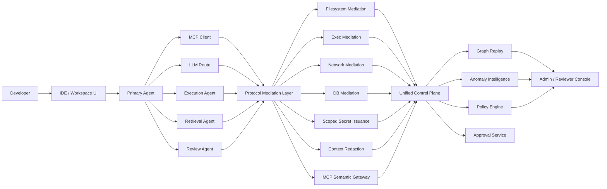
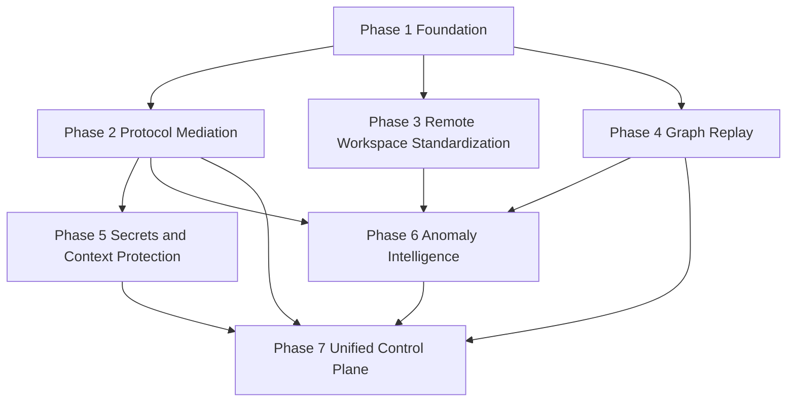

> Author: Deepankar Das

# Enforcer TDD Addendum: Future Architecture and Engineering Roadmap

## Purpose

This addendum extends the Enforcer TDD with deeper detail on future architectural improvements that follow directly from the venture brief’s requirements around interception, policy enforcement, auditability, anomaly detection, secrets and context protection, multi-agent isolation, and org-level policy distribution.[cite:1] The goal is to translate those future-state ideas into a practical engineering roadmap with priorities, dependencies, and clear ownership domains for implementation planning.[cite:1]

The main architectural direction remains unchanged: Enforcer should be built as a multi-agent governance and security platform that unifies policy, execution mediation, replay, and anomaly detection into a coherent enterprise control plane for AI coding-agent adoption.[cite:1]

## Why this addendum matters

The current TDD establishes the foundational hybrid architecture: runtime interception, local or workspace daemon, filesystem and execution mediation, network policy, MCP governance, auditability, approvals, and an extensible multi-agent model.[cite:1] This addendum elaborates the next layer of technical depth required to make the platform meaningfully differentiated and enterprise-ready over time.[cite:1]

These improvements are not feature drift. They are direct extensions of the original design brief, which explicitly calls for deeper work in anomaly detection, secrets and PII redaction, multi-agent policy isolation, and architecture choices such as sandboxing, proxying, runtime hooks, and MCP wrapping.[cite:1]

## Future Architecture Themes

### 1. Protocol mediation

Protocol mediation should evolve from coarse interception into semantic mediation across all important agent communication channels.[cite:1] The platform should no longer treat MCP, LLM calls, database requests, secret retrieval, package fetches, and agent-to-agent messages as unrelated transport events; instead, it should normalize them into a common protocol governance model.[cite:1]

#### Target state

- Canonical protocol abstraction across MCP, model APIs, DB operations, secret exchanges, package pulls, and delegation messages.[cite:1]
- Schema-aware request and response inspection with field-level classification.[cite:1]
- Policy decisions informed by method, tool capability, payload class, actor role, and expected side effects.[cite:1]
- Request and response transformation, including truncation, masking, summarization, or denial.[cite:1]
- Side-effect contracts that let the system compare expected resource impacts with observed downstream impacts.[cite:1]

#### Why it matters

This is how Enforcer becomes more than an endpoint wrapper. Deep protocol mediation makes the product aware of what the agent is trying to do at the semantic layer, which is especially important for MCP-driven workflows and multi-agent orchestration.[cite:1]

### 2. Increased remote-workspace standardization

Remote workspaces should become a standardized operating model rather than an optional deployment path.[cite:1] They improve tamper resistance, centralize enforcement, and make it easier to guarantee that traffic, tools, storage, and identities all pass through controlled paths.[cite:1]

#### Target state

- Certified remote-workspace reference architecture.[cite:1]
- Common bootstrap process for daemon, proxies, policy bundles, secret broker, and trace pipeline.[cite:1]
- Workspace attestation and integrity reporting.[cite:1]
- Standard egress routing for network, model, MCP, and secrets traffic.[cite:1]
- Workspace mode-specific policy baselines and enforcement guarantees.[cite:1]

#### Why it matters

Remote-workspace standardization is the cleanest route to stronger mandatory enforcement in larger enterprises, especially regulated organizations that will be skeptical of unmanaged local-host deployment modes.[cite:1]

### 3. Stronger graph-native replay and export

Replay should mature into a graph-native incident and governance system.[cite:1] Instead of forcing analysts to reconstruct causal chains from flat logs, the platform should store sessions as graphs of actors, agents, actions, resources, approvals, and effects.[cite:1]

#### Target state

- Graph-native replay storage with first-class support for delegation and causality.[cite:1]
- Timeline, causal graph, impact-diff, approval-path, and exfiltration-path views.[cite:1]
- Replay-safe masked artifacts for sensitive payloads.[cite:1]
- Exportable incident bundles that can be handed to security, compliance, legal, or customers.[cite:1]
- Cross-session and cross-agent investigation linking.[cite:1]

#### Why it matters

This is what turns audit logs into a defensible enterprise evidence system. It also creates the substrate needed for anomaly analysis, policy simulation, and post-incident understanding of agent behavior.[cite:1]

### 4. Expanded scoped-secret issuance

Secret management should evolve from “check whether a secret was accessed” into “control exactly what secret can be issued, to whom, for what purpose, for how long, and under what destination constraints.”[cite:1]

#### Target state

- Action-scoped or task-scoped short-lived credentials.[cite:1]
- Agent-role-scoped and workspace-mode-scoped secret issuance.[cite:1]
- Destination-bound tokens limited to specific services or routes.[cite:1]
- One-time-use credentials for sensitive operations where supported.[cite:1]
- Derived-secret lineage tagging for downstream redaction and replay control.[cite:1]

#### Why it matters

This shifts Enforcer from reactive monitoring toward active risk reduction. If the system can issue only narrowly scoped credentials after policy checks, many classes of misuse become impossible or far less damaging.[cite:1]

### 5. Refined context-sensitive redaction

Context protection should become more precise and policy-aware, rather than relying on blunt scanning or regex-only approaches.[cite:1] The attached brief specifically identifies secrets and PII redaction in agent context as a high-value depth area.[cite:1]

#### Target state

- Structured classification of code, files, fields, schema objects, and retrieved records.[cite:1]
- Redaction modes such as mask, summarize, tokenize, replace with metadata, or deny entirely.[cite:1]
- Route-aware policy so internal models and external models can receive different levels of detail.[cite:1]
- Context provenance tracking to show which file, tool result, or DB output fed a prompt.[cite:1]
- Replay-safe masked diffs and semantic summaries rather than raw sensitive payload retention.[cite:1]

#### Why it matters

Precision is essential. Over-redaction destroys workflow utility, while under-redaction destroys trust. Context-sensitive redaction is one of the strongest long-term enterprise differentiators in the product architecture.[cite:1]

### 6. Anomaly models tuned by environment tier and agent role

Anomaly detection should become more adaptive and environment-aware.[cite:1] The brief explicitly calls out anomaly detection over agent action sequences, which implies the platform should evolve beyond static alerts into sequence- and graph-based behavior modeling.[cite:1]

#### Target state

- Baselines segmented by organization, team, repo, environment tier, workspace mode, and agent role.[cite:1]
- Different expected behavior models for orchestrators, execution agents, retrieval agents, review agents, and MCP tool agents.[cite:1]
- Sequence models for command, network, and tool-order anomalies.[cite:1]
- Graph models for abnormal delegation depth, fan-out, cycles, and cross-resource relationships.[cite:1]
- Hybrid policy + anomaly escalation where medium-confidence findings raise approval requirements and high-confidence plus deterministic findings trigger blocks.[cite:1]

#### Why it matters

This reduces false positives and makes anomaly detection operationally credible. The same action can be normal in a sandbox pilot and suspicious in a regulated remote workspace, or normal for a retrieval agent and anomalous for an execution agent.[cite:1]

### 7. Unified multi-agent governance and security control plane

The long-term platform should unify four planes into one coherent system: policy, execution mediation, replay, and intelligence.[cite:1] This is the most important architectural theme because it turns Enforcer from a collection of controls into the enterprise operating layer for agentic software execution.[cite:1]

#### Target state

- Unified policy graph spanning agents, tools, environments, secrets, models, and data resources.[cite:1]
- Consistent execution mediation across filesystem, shell, network, MCP, DB, secrets, and context surfaces.[cite:1]
- Replay graph shared by reviewers, policy authors, and anomaly systems.[cite:1]
- Intelligence layer that uses the same action graph to drive anomaly detection, policy tuning, and incident prioritization.[cite:1]
- Multi-agent lineage and policy isolation so each delegated actor is governed according to its role and trust envelope.[cite:1]

#### Why it matters

This is the architecture that can support enterprise-scale AI coding-agent adoption. Buyers do not ultimately want six loosely connected controls; they want one trustworthy governance plane that gives them confidence that AI agents can be used safely, visibly, and accountably.[cite:1]

## Target Architecture Evolution

This target architecture shows how the future improvements reinforce one another rather than appearing as separate product modules.[cite:1]

## Prioritized Engineering Roadmap

The roadmap below is designed to sequence work in a way that supports early customer value while building toward the longer-term control-plane architecture implied by the TDD and the venture brief.[cite:1]

### Owner model

The following ownership labels are used in the roadmap:

- **Agent Runtime Team**: runtime hooks, agent integrations, SDKs, delegation metadata.[cite:1]
- **Enforcement Team**: shell, filesystem, network, MCP, DB mediation.[cite:1]
- **Platform Team**: daemon, policy distribution, control-plane services, remote-workspace standardization.[cite:1]
- **Security Systems Team**: secret broker, context redaction, posture validation, trust boundaries.[cite:1]
- **Data / Intelligence Team**: replay graph, anomaly models, feature pipelines, exports.[cite:1]
- **Product / UX Engineering**: approval UX, reviewer console, trace visualization, operational workflows.[cite:1]

## Phase 1: Foundation hardening

**Priority:** P0  
**Objective:** Strengthen the current foundation so later protocol, replay, and anomaly work has a stable substrate.[cite:1]

### Workstreams

| Workstream | Description | Primary owner | Dependencies | Priority |
|---|---|---|---|---|
| Canonical event model v2 | Expand event schema to include lineage, protocol metadata, environment mode, and agent role. [cite:1] | Platform Team | Existing audit pipeline [cite:1] | P0 |
| Daemon session graph cache | Track parent/child agent relationships and active trace state locally. [cite:1] | Platform Team | Canonical event model v2 [cite:1] | P0 |
| Runtime delegation metadata | Add explicit sub-agent and task-delegation instrumentation. [cite:1] | Agent Runtime Team | Canonical event model v2 [cite:1] | P0 |
| Reviewer console baseline | Add session view, approval linkage, and richer rationale display. [cite:1] | Product / UX Engineering | Canonical event model v2 [cite:1] | P1 |

### Exit criteria

- Every event includes actor role, session lineage, and workspace mode.[cite:1]
- Local daemon can reconstruct active session trees.[cite:1]
- Reviewer can see which agent or sub-agent performed each action.[cite:1]

## Phase 2: Protocol-aware mediation

**Priority:** P0  
**Objective:** Move beyond coarse system-event mediation into semantic governance of protocols and tool interactions.[cite:1]

### Workstreams

| Workstream | Description | Primary owner | Dependencies | Priority |
|---|---|---|---|---|
| MCP semantic gateway v1 | Server allowlists, method allow/deny, request/response metadata capture. [cite:1] | Enforcement Team | Canonical event model v2 [cite:1] | P0 |
| Protocol normalization layer | Common abstraction for MCP, model calls, DB tool calls, and package fetches. [cite:1] | Platform Team | Canonical event model v2 [cite:1] | P0 |
| Side-effect contract framework | Represent expected downstream effects for tool or protocol calls. [cite:1] | Enforcement Team | Protocol normalization layer [cite:1] | P1 |
| Response transformation hooks | Support masking, truncation, and schema-based response filtering. [cite:1] | Security Systems Team | MCP semantic gateway v1 [cite:1] | P1 |

### Exit criteria

- MCP traffic is policy-evaluable at server and method level.[cite:1]
- Protocol events share a common schema across major mediation points.[cite:1]
- High-risk tool responses can be transformed before reuse.[cite:1]

## Phase 3: Secure-container and remote-workspace standardization

**Priority:** P0  
**Objective:** Standardize high-assurance deployment modes and reduce environmental drift.[cite:1]

### Workstreams

| Workstream | Description | Primary owner | Dependencies | Priority |
|---|---|---|---|---|
| Secure-container reference profile | Define supported container bootstrap, mounts, proxy path, and daemon injection. [cite:1] | Platform Team | Current secure-container mode [cite:1] | P0 |
| Workspace attestation service | Validate runtime integrity, daemon health, proxy presence, and image version. [cite:1] | Security Systems Team | Secure-container reference profile [cite:1] | P0 |
| Remote-workspace bootstrap kit | Standard startup pattern for daemon, proxies, policy sync, and trace pipeline. [cite:1] | Platform Team | Workspace attestation service [cite:1] | P0 |
| Environment-specific policy baselines | Ship different default policy postures for host, container, and remote modes. [cite:1] | Platform Team | Remote-workspace bootstrap kit [cite:1] | P1 |

### Exit criteria

- Secure-container deployments follow a documented supported profile.[cite:1]
- Remote workspaces can attest posture before receiving higher-assurance policies.[cite:1]
- Policy engine understands deployment mode as a first-class variable.[cite:1]

## Phase 4: Graph-native replay and export

**Priority:** P0  
**Objective:** Convert audit trails into a graph-native investigation and evidence system.[cite:1]

### Workstreams

| Workstream | Description | Primary owner | Dependencies | Priority |
|---|---|---|---|---|
| Graph replay schema | Define nodes, edges, and versioned graph contracts for sessions and effects. [cite:1] | Data / Intelligence Team | Canonical event model v2 [cite:1] | P0 |
| Trace-to-graph builder | Materialize session graphs from normalized events. [cite:1] | Data / Intelligence Team | Graph replay schema [cite:1] | P0 |
| Replay UI views | Timeline, graph, impact, approval, and exfiltration views. [cite:1] | Product / UX Engineering | Trace-to-graph builder [cite:1] | P1 |
| Incident export bundles | Export replay-safe packages for IR, compliance, or customer review. [cite:1] | Data / Intelligence Team | Replay UI views [cite:1] | P1 |

### Exit criteria

- Reviewers can inspect sessions as graphs instead of flat event lists.[cite:1]
- Approval, exfiltration, and delegation chains are visually reconstructable.[cite:1]
- Exported incident bundles preserve masked but useful evidence.[cite:1]

## Phase 5: Secrets and context protection depth

**Priority:** P0  
**Objective:** Move from monitoring secrets/context exposure to actively controlling and minimizing it.[cite:1]

### Workstreams

| Workstream | Description | Primary owner | Dependencies | Priority |
|---|---|---|---|---|
| Secret broker v2 | Add action-scoped, time-bounded, and destination-bound secret issuance. [cite:1] | Security Systems Team | Existing secret mediation [cite:1] | P0 |
| Derived-secret lineage tagging | Tag outputs that were influenced by secret-bearing actions. [cite:1] | Security Systems Team | Secret broker v2 [cite:1] | P1 |
| Structured context classifier | Classify prompt inputs by source type, sensitivity, and provenance. [cite:1] | Security Systems Team | Protocol normalization layer [cite:1] | P0 |
| Context-sensitive redaction engine | Add summarize, mask, tokenize, replace-with-reference, and route-aware policies. [cite:1] | Security Systems Team | Structured context classifier [cite:1] | P0 |
| Masked replay artifacts | Preserve replay-safe summaries instead of raw sensitive payloads. [cite:1] | Data / Intelligence Team | Context-sensitive redaction engine [cite:1] | P1 |

### Exit criteria

- Agents receive scoped credentials instead of broad ambient secrets where supported.[cite:1]
- Prompt payloads can be transformed differently based on route and policy.[cite:1]
- Replay remains useful without storing raw sensitive content by default.[cite:1]

## Phase 6: Anomaly intelligence by environment and role

**Priority:** P1  
**Objective:** Make anomaly detection operationally credible through adaptive baselines and multi-signal analysis.[cite:1]

### Workstreams

| Workstream | Description | Primary owner | Dependencies | Priority |
|---|---|---|---|---|
| Feature pipeline v1 | Build sequence and graph features from normalized events and replay graph. [cite:1] | Data / Intelligence Team | Graph replay schema [cite:1] | P1 |
| Environment-tier baselines | Separate baselines for pilot, standard, and regulated environments. [cite:1] | Data / Intelligence Team | Feature pipeline v1 [cite:1] | P1 |
| Agent-role baselines | Separate profiles for orchestrator, execution, retrieval, review, and tool agents. [cite:1] | Data / Intelligence Team | Feature pipeline v1 [cite:1] | P1 |
| Policy-integrated anomaly routing | Map anomaly scores to log-only, approval, severity-boost, or block outcomes. [cite:1] | Platform Team | Environment-tier baselines, Agent-role baselines [cite:1] | P1 |
| Reviewer explainability layer | Show why an anomaly was triggered in human terms. [cite:1] | Product / UX Engineering | Policy-integrated anomaly routing [cite:1] | P2 |

### Exit criteria

- Anomaly scoring differs by environment mode and agent role.[cite:1]
- Reviewers can see both anomaly evidence and causal replay context.[cite:1]
- Medium-confidence anomalies can escalate approval requirements safely.[cite:1]

## Phase 7: Unified multi-agent governance control plane

**Priority:** P1  
**Objective:** Unify policy, mediation, replay, and intelligence into a single coherent control architecture.[cite:1]

### Workstreams

| Workstream | Description | Primary owner | Dependencies | Priority |
|---|---|---|---|---|
| Unified policy graph | Represent agents, roles, tools, protocols, and resources in one policy model. [cite:1] | Platform Team | Protocol normalization layer, Graph replay schema [cite:1] | P1 |
| Cross-plane reasoning APIs | Shared APIs so replay, anomaly, and policy can query the same graph and trace objects. [cite:1] | Platform Team | Unified policy graph [cite:1] | P1 |
| Multi-agent isolation policies | Different trust envelopes and guardrails per sub-agent role and delegation depth. [cite:1] | Platform Team | Runtime delegation metadata [cite:1] | P1 |
| Policy simulation and preflight planning | Evaluate agent plans before execution and show expected policy outcomes. [cite:1] | Product / UX Engineering | Unified policy graph, Cross-plane reasoning APIs [cite:1] | P2 |
| Enterprise governance packs | Prebuilt controls and reporting bundles for regulated and security-conscious customers. [cite:1] | Product / UX Engineering | Unified policy graph [cite:1] | P2 |

### Exit criteria

- Policy, replay, and anomaly systems all operate on shared graph objects.[cite:1]
- Delegated agents can have distinct policy envelopes and trust boundaries.[cite:1]
- Reviewers can move from policy decision to replay to anomaly context without leaving a unified control-plane model.[cite:1]

## Recommended sequencing summary

| Phase | Theme | Priority | Why now |
|---|---|---|---|
| 1 | Foundation hardening | P0 | Required substrate for all future work. [cite:1] |
| 2 | Protocol-aware mediation | P0 | Core differentiation and critical for MCP-heavy environments. [cite:1] |
| 3 | Secure-container and remote-workspace standardization | P0 | Strongest path to enterprise-grade enforcement. [cite:1] |
| 4 | Graph-native replay and export | P0 | Converts logging into real enterprise evidence and investigation capability. [cite:1] |
| 5 | Secrets and context protection depth | P0 | Directly addresses high-risk data leakage surfaces. [cite:1] |
| 6 | Anomaly intelligence by environment and role | P1 | Important for depth and trust, but benefits from the replay/data substrate first. [cite:1] |
| 7 | Unified multi-agent governance control plane | P1 | Strategic end-state that depends on prior layers maturing. [cite:1] |

## Dependency map

This dependency structure reflects the practical reality that richer intelligence and unification only become reliable once canonical event modeling, protocol normalization, replay structure, and environment standardization are in place.[cite:1]

## Suggested staffing emphasis

A reasonable implementation pattern is to initially over-invest in Platform, Enforcement, and Security Systems because those teams create the control substrate on which replay and anomaly intelligence depend.[cite:1] Data / Intelligence should ramp strongly once graph replay is underway, while Product / UX Engineering should become more central as approvals, replay review, and unified control-plane workflows mature.[cite:1]

## Risks to roadmap execution

- Attempting anomaly sophistication before event, protocol, and graph schemas stabilize can create noisy systems and rework.[cite:1]
- Building replay after shipping many ad hoc event formats will create expensive backfill and migration problems.[cite:1]
- Supporting remote workspaces without posture validation can create false confidence in enforcement guarantees.[cite:1]
- Expanding secrets and context controls without clear developer UX can generate workflow backlash.[cite:1]
- Attempting unified policy graph too early can overcomplicate the MVP unless the canonical data model is already stable.[cite:1]

## Recommended next artifacts

The most useful follow-on technical artifacts after this addendum are:

- OpenAPI specifications for decisioning, replay, approvals, anomaly, secret issuance, and context evaluation services.[cite:1]
- A formal policy language and policy compilation specification.[cite:1]
- A canonical event schema document with versioning and compatibility rules.[cite:1]
- An environment certification guide for host, secure-container, and remote-workspace modes.[cite:1]

## Final note

This addendum expands the future-state architecture without changing the core thesis from the TDD or the venture brief: Enforcer should become the enterprise governance plane for AI coding agents by combining mandatory execution mediation, policy evaluation, security-grade replay, and adaptive anomaly intelligence in one platform.[cite:1]
