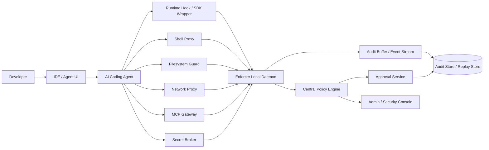
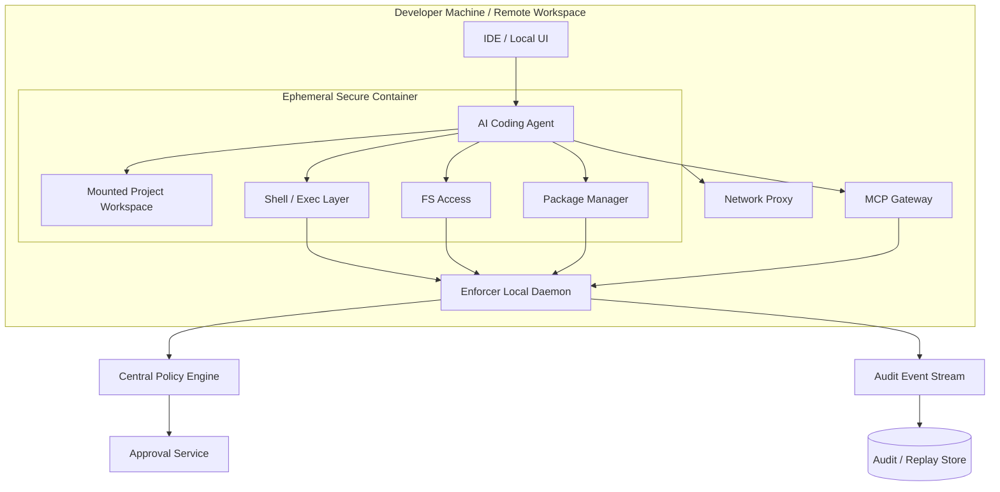
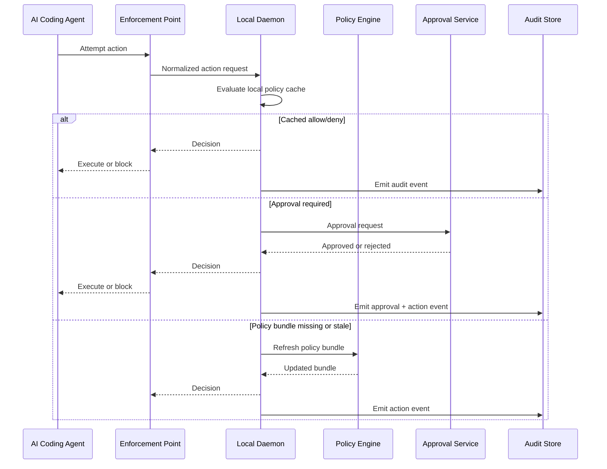

> Author: Deepankar Das

# Enforcer Technical Design Document

## Overview

Enforcer is a security and policy layer that sits between an AI coding agent and the systems it touches, with the purpose of intercepting, inspecting, and governing agent actions in a developer environment.[cite:1] The implementation goal is to provide mandatory controls, structured auditability, and enough architectural coverage to make enterprise rollout of coding agents safe and governable.[cite:1]

This TDD is intended to guide a development team building the MVP and near-term production architecture. It focuses on where the interception layer sits, how policies are evaluated, how approvals and audit logs work, how secure containers fit into the design, and what technical trade-offs should be made for an implementable first version.[cite:1]

## Goals

- Intercept agent actions across at least two high-risk surfaces such as file operations, shell execution, network calls, package installation, or secret access.[cite:1]
- Enforce configurable policy decisions of allow, deny, or require approval with at least one non-trivial enterprise rule.[cite:1]
- Produce structured audit logs that a security reviewer can understand and query.[cite:1]
- Implement one depth area that materially improves the product, such as approval UX, anomaly detection, secrets redaction, multi-agent isolation, or org-level policy distribution.[cite:1]
- Support an architecture that can evolve from MVP to enterprise-grade hybrid enforcement.[cite:1]

## Non-Goals

- Full endpoint security across all non-agent activity.[cite:1]
- Complete coverage of every IDE, agent framework, MCP implementation, and operating system in the initial version.[cite:1]
- Full CNAPP, DLP, or SIEM replacement.[cite:1]

## Architecture Decisions

The core design decision is that Enforcer must be a hybrid enforcement system rather than a single control point. The attached requirements explicitly call out multiple possible locations for interception, including sandbox, proxy, runtime hook, and MCP wrapper, which implies that the product must combine context-rich interception with mandatory system-level enforcement.[cite:1]

### Recommended MVP enforcement points

1. **Agent runtime hook / SDK wrapper** for intent-aware interception before the action executes.[cite:1]
2. **Local daemon** for policy lookup, decision caching, audit buffering, and communication with central services.[cite:1]
3. **Shell proxy / exec wrapper** for command mediation.[cite:1]
4. **Filesystem guard** for project-path enforcement and write policy.[cite:1]
5. **Network proxy** for egress allowlists and exfiltration controls.[cite:1]
6. **MCP gateway / wrapper** for tool-call governance and payload inspection.[cite:1]
7. **Secure container mode** for controlled workspace isolation where higher assurance is needed.[cite:1]

### Why hybrid

A runtime hook alone sees intent but cannot guarantee enforcement if the agent bypasses the SDK or uses unmanaged tools.[cite:1] A container or proxy alone can constrain execution but may not understand agent-level context, approval semantics, or MCP-specific payloads.[cite:1] A hybrid design allows Enforcer to tie together agent intent, system effect, policy evaluation, and audit evidence in one control plane.[cite:1]

### MVP Implementation Target Matrix

To keep the MVP implementable while still demonstrating real governance value with a coding agent, the following targets are selected for build and demo.

| Area | MVP Technical Target | Why selected | Deferred / Alternative Path |
|---|---|---|---|
| Primary agent channel | VS Code + one first-class coding-agent integration (Codex or Claude Code, one chosen as reference implementation) | Lowest integration ambiguity for demo workflows and highest reviewer visibility during live walkthroughs | Dual first-class vendor support in MVP is deferred; second vendor path is compatibility-only |
| Secondary execution channel | CLI/terminal agent workflow mediated by same daemon/proxies | Ensures policy and audit behavior is consistent outside the IDE UI | Dedicated custom CLI UX is deferred |
| Desktop agent apps | Claude Code desktop app / Codex desktop app via wrapper-proxy compatibility mode | Validates portability of policy model across channels without multiplying MVP build scope | Full native desktop integrations are post-MVP |
| Core runtime stack | TypeScript + Node.js for daemon, wrappers, policy evaluator, and approval API | Fast iteration speed, strong ecosystem for proxy/wrapper tooling, and shared types across components | Polyglot split (for example Go/Rust sidecars) is post-MVP hardening |
| Policy format | Versioned YAML/JSON policy bundles with deterministic rule evaluation | Human-reviewable policy definitions with machine-evaluable semantics | Full policy authoring UI and simulation studio are post-MVP |
| Local state | Lightweight local store (SQLite) for policy cache, pending approvals, and resilient event buffering | Supports disconnected resilience and predictable local behavior during demo | Distributed local cache layers are not needed in MVP |
| Central audit store | Structured append-only event ingestion to PostgreSQL (JSONB/event tables) | Enables immediate queryability and reviewer-friendly filtering/export | Stream-first lake architecture can be introduced after MVP |
| Container technology | Docker-based secure workspace mode with rootless runtime, restricted mounts, read-only root filesystem where possible, and controlled egress | Practical path to show isolation benefits in MVP without requiring custom sandbox kernel work | gVisor/Firecracker-class sandboxing is a P1 hardening track |

**MVP demonstration profile**
- Run at least one end-to-end scenario in VS Code with the reference coding-agent integration.
- Run the same policy set through a CLI-driven agent flow to prove channel consistency.
- Run at least one secure-container scenario to demonstrate controlled execution posture.

## High-Level Architecture



This architecture is intentionally split between local enforcement components and central control services. Local components must make fast decisions in-path, while central services manage policy distribution, approvals, long-term storage, and administrative workflows.[cite:1]

## Component Design

### 1. Runtime Hook / SDK Wrapper

The runtime hook is the first interception point for managed agent integrations. It captures the semantic action before execution, such as “write file,” “run command,” “install package,” “call MCP tool,” or “submit prompt with context.”[cite:1]

**Responsibilities**
- Normalize agent actions into a common internal schema.[cite:1]
- Attach session, actor, project, and tool metadata.[cite:1]
- Send action requests to the local daemon for policy evaluation.[cite:1]
- Block until a decision is returned for in-path enforcement.[cite:1]

**Trade-off**
- Best context, but incomplete coverage if the agent is not integrated or if the environment allows direct unmanaged execution.[cite:1]

### 2. Local Daemon

The local daemon is the primary local control-plane component. It handles policy evaluation requests, maintains local policy cache, forwards decisions to the caller, buffers audit logs, and remains operational during short central-service interruptions.[cite:1]

**Responsibilities**
- Accept action requests from runtime hook and enforcement proxies.[cite:1]
- Perform local policy evaluation using the latest synced policy bundle.[cite:1]
- Escalate to central approval service when a rule requires human approval.[cite:1]
- Emit structured audit events to the central event pipeline.[cite:1]
- Enforce fail-open or fail-closed behavior based on deployment policy.[cite:1]

**Deployment**
- Runs as a local service on the host or inside the controlled workspace environment.[cite:1]

### 3. Shell Proxy / Exec Wrapper

The shell proxy enforces rules around command execution, such as blocking destructive commands, requiring approval for package installs, or denying shell access outside controlled contexts.[cite:1]

**Responsibilities**
- Capture command string, cwd, user, environment classification, and requested execution context.[cite:1]
- Evaluate policy before process launch.[cite:1]
- Attach execution result, exit code, and output metadata to the audit stream.[cite:1]

**Implementation options**
- Wrapper executable inserted into agent toolchain.[cite:1]
- PTY interception for supported environments.[cite:1]
- Container-level command runner for secure-container mode.[cite:1]

### 4. Filesystem Guard

The filesystem guard enforces project-root boundaries and sensitive-path restrictions. For the MVP, the strongest first rule is to block writes outside the project directory and to optionally restrict reads of specified sensitive paths.[cite:1]

**Responsibilities**
- Normalize read/write/create/delete/move operations into policy events.[cite:1]
- Evaluate path rules and optional content-based checks.[cite:1]
- Record target path, path classification, and resulting system effect.[cite:1]

**Implementation options**
- Agent-managed file API wrapper for managed integrations.[cite:1]
- FUSE or virtual FS approach for deeper enforcement in controlled environments.[cite:1]
- Bind-mount or namespace-restricted container workspace in secure mode.[cite:1]

### 5. Network Proxy

The network proxy mediates outbound HTTP(S) and other supported egress requests so the product can block unknown hosts, restrict package registries, and flag suspicious data movement.[cite:1]

**Responsibilities**
- Enforce allowlists and deny lists.[cite:1]
- Apply destination and protocol policy.[cite:1]
- Log request metadata including host, route, headers classification, payload classification summary, and response code.[cite:1]
- Support package-registry governance and MCP-over-network mediation when applicable.[cite:1]

**Implementation options**
- Local HTTP CONNECT proxy.[cite:1]
- Transparent egress proxy in containerized or remote-workspace deployments.[cite:1]

### 6. MCP Gateway / Wrapper

The MCP gateway is a key differentiator because it allows Enforcer to govern tool invocation at the protocol layer rather than only observing downstream OS effects.[cite:1]

**Responsibilities**
- Intercept MCP client-server requests and responses.[cite:1]
- Normalize tool, method, server identity, and payload metadata.[cite:1]
- Apply policy rules at tool, method, and payload-classification level.[cite:1]
- Support server allowlists, method allowlists, and approval workflows for high-risk tools.[cite:1]
- Emit audit logs linking MCP actions to agent session and downstream effects.[cite:1]

### 7. Secret Broker

The secret broker controls access to secrets by mediating token retrieval instead of exposing broad ambient credentials to the agent runtime.[cite:1]

**Responsibilities**
- Return only scoped secrets needed for an approved action.[cite:1]
- Redact secrets in logs and prompt-context evaluation.[cite:1]
- Support deny or approval requirements for protected classes such as production credentials.[cite:1]

### 8. Approval Service

The approval service handles human-in-the-loop decisioning for actions that cannot be safely auto-allowed or auto-denied.[cite:1]

**Responsibilities**
- Present rich context to approvers.[cite:1]
- Support time-bounded approvals and reusable approval scopes.[cite:1]
- Record approver identity, rationale, duration, and final outcome in the audit trail.[cite:1]

### 9. Central Policy Engine

The central policy engine is the source of truth for organization-wide governance and policy distribution. The local daemon should evaluate policies locally for performance, but the policy engine owns authoring, versioning, simulation, and distribution.[cite:1]

**Responsibilities**
- Store and version org, team, project, and developer-local policy layers.[cite:1]
- Compile distributable policy bundles for local evaluation.[cite:1]
- Support simulation mode and dry-run testing.[cite:1]
- Provide policy explanations and rule metadata for audit and UI workflows.[cite:1]

### 10. Audit Pipeline and Replay Store

The audit system must capture not just security events but the semantic action chain: what the agent intended, what policy applied, what was approved or denied, and what system effect actually occurred.[cite:1]

**Responsibilities**
- Ingest structured events from daemons and proxies.[cite:1]
- Maintain append-only event history.[cite:1]
- Support replay views grouped by session, repo, developer, agent, or incident.[cite:1]
- Feed downstream SIEM or forensic systems.[cite:1]

## Secure Container Architecture

Secure containers are not the entire product, but they are an important deployment mode for high-assurance environments because they help contain the blast radius of agent actions and simplify enforcement around filesystem scope, process execution, and egress paths.[cite:1]



### Container mode assumptions

- The workspace mount is limited to the project directory or a deliberately scoped set of mounts.[cite:1]
- The root filesystem should be ephemeral wherever possible.[cite:1]
- Network egress should flow through a policy-aware proxy.[cite:1]
- High-risk secret access should be brokered rather than exposed through broad environment variables.[cite:1]

## Data Flow Design

Enforcer should model every agent action as a normalized event flowing through the same decision pipeline regardless of source.



## Policy Model

The policy model should be expressive enough to govern files, commands, network, MCP, secrets, and future surfaces with a single evaluation engine.[cite:1]

### Policy object

```yaml
policy_id: org.block_non_project_writes
scope:
  level: organization
subject:
  agent_types: [coding_agent]
  users: ["*"]
action:
  types: [file.write, file.delete, file.move]
resource:
  path_prefixes:
    - /workspace/project
conditions:
  invert_path_match: true
effect:
  decision: deny
  rationale: Writes outside approved project directory are blocked.
logging:
  mode: full
approval:
  required: false
```

### Evaluation order

1. Load organization baseline rules.[cite:1]
2. Overlay team and project rules.[cite:1]
3. Overlay developer-local rules that can only tighten policy.[cite:1]
4. Evaluate deny rules first, then approval rules, then allow rules, then default deny or default log-only based on deployment posture.[cite:1]

### Core MVP rule types

- Block writes outside approved workspace.[cite:1]
- Deny network requests to non-allowlisted hosts.[cite:1]
- Require approval for package installs.[cite:1]
- Deny access to production credentials unless session is explicitly elevated.[cite:1]
- Deny high-risk MCP tools unless tool, server, and method are approved.[cite:1]

## Audit Log Schema

The audit log schema must be structured enough for automated analysis and human review.[cite:1]

### Event schema

```json
{
  "event_id": "uuid",
  "timestamp": "2026-04-26T16:00:00Z",
  "session_id": "sess_123",
  "org_id": "org_abc",
  "project_id": "proj_xyz",
  "developer_id": "dev_001",
  "agent_id": "agent_cursor_01",
  "agent_type": "coding_agent",
  "action_type": "shell.exec",
  "resource": {
    "kind": "command",
    "value": "npm install express"
  },
  "context": {
    "cwd": "/workspace/project",
    "host": null,
    "mcp_server": null,
    "tool": null,
    "classification": ["package_install"]
  },
  "policy": {
    "matched_rule_id": "team.require_approval.pkg_install",
    "decision": "require_approval",
    "reason": "Package installs require approval"
  },
  "approval": {
    "status": "approved",
    "approver_id": "sec_01",
    "approved_at": "2026-04-26T16:00:05Z"
  },
  "result": {
    "status": "executed",
    "exit_code": 0
  }
}
```

### Storage guidance

- Append-only event stream for raw ingestion.[cite:1]
- Query-optimized store for operational review and dashboards.[cite:1]
- Session-centric replay materialization for incident response.[cite:1]

## APIs and Internal Contracts

### Local decision API

```http
POST /v1/decision/evaluate
Content-Type: application/json
```

Request:

```json
{
  "session_id": "sess_123",
  "actor": {"developer_id": "dev_001", "agent_id": "agent_01"},
  "action": {"type": "network.request", "method": "POST"},
  "resource": {"host": "api.example.com", "path": "/upload"},
  "context": {"project_id": "proj_01", "classification": ["source_code"]}
}
```

Response:

```json
{
  "decision": "deny",
  "policy_id": "org.network.allowlist",
  "reason": "Destination host is not allowlisted",
  "approval_required": false,
  "decision_ttl_ms": 0
}
```

### Audit ingest API

```http
POST /v1/audit/events
Content-Type: application/json
```

### Approval API

```http
POST /v1/approvals/request
POST /v1/approvals/{id}/resolve
GET /v1/approvals/{id}
```

## Security Model

### Trust boundaries

- The agent runtime is untrusted by default, even if locally initiated by a developer.[cite:1]
- The local daemon is trusted to enforce local decisions but must be hardened against tampering.[cite:1]
- Central policy and approval services are trusted sources of truth.[cite:1]
- MCP servers, external APIs, and package registries are external trust domains.[cite:1]

### Security controls

- Mutual authentication between local daemon and central services.[cite:1]
- Signed policy bundles with version pinning.[cite:1]
- Append-only audit ingestion with integrity validation.[cite:1]
- Secret redaction in logs and prompt-context inspection paths.[cite:1]
- Environment posture checks for secure-container mode and unsupported runtime configurations.[cite:1]

## Performance and Reliability Trade-Offs

### Decision latency

Policy decisions for common actions must be local-first and cacheable to avoid degrading agent workflows.[cite:1] Central round trips should be limited to approvals, policy refresh, and exceptional conditions.[cite:1]

### Coverage vs complexity

Deep OS-level coverage increases enforcement confidence but also raises engineering complexity and platform variance.[cite:1] The MVP should therefore prioritize controlled environments and high-value surfaces rather than attempting full operating-system mediation from day one.[cite:1]

### Fail-open vs fail-closed

- **Fail-closed** is safer for regulated or high-risk environments but may interrupt developer workflows during outages.[cite:1]
- **Fail-open with aggressive logging** may be appropriate for early pilots or low-risk teams.[cite:1]
- The posture should be configurable per org, environment, or action class.[cite:1]

### Container mode vs host mode

Container mode simplifies workspace isolation and enforcement boundaries but may introduce developer friction and compatibility issues.[cite:1] Host mode supports gradual rollout but offers weaker containment and may depend more heavily on wrappers and proxies.[cite:1]

## Implementation Plan

### Phase 1: Prototype / MVP

- Build runtime hook for one coding-agent integration.[cite:1]
- Implement local daemon with local policy bundle evaluation.[cite:1]
- Implement shell proxy and network proxy.[cite:1]
- Implement one filesystem rule: deny writes outside project root.[cite:1]
- Implement one network rule: deny non-allowlisted hosts.[cite:1]
- Implement one approval rule: require approval before package install.[cite:1]
- Emit structured JSON audit events.[cite:1]
- Build minimal admin and approval console.[cite:1]

### Phase 2: Depth and hardening

- Add MCP gateway and tool/method policy.[cite:1]
- Add secure secret broker.[cite:1]
- Add secure-container execution mode.[cite:1]
- Add replay views and session graphs in the audit console.[cite:1]
- Add SIEM integration and policy simulation mode.[cite:1]

### Phase 3: Enterprise expansion

- Add multi-agent lineage and isolation.[cite:1]
- Add database-aware controls.[cite:1]
- Add advanced anomaly detection over action sequences.[cite:1]
- Expand platform support and high-availability central services.[cite:1]

## Open Technical Questions

- What is the best first managed integration target: Claude Code-style CLI, IDE-integrated agent, or MCP-native workflow?[cite:1]
- How much filesystem enforcement should rely on wrappers versus deeper OS or container controls?[cite:1]
- Which logs need full payload retention versus metadata-only retention for privacy and cost reasons?[cite:1]
- How should local developer guardrails be authored, merged, and validated against org baselines?[cite:1]
- What is the minimum viable replay model that still helps security teams investigate incidents effectively?[cite:1]

## What to Change With More Time

With more time, the design should move toward deeper protocol-aware coverage, stronger secure-container and remote-workspace support, richer session replay, better secrets/context protection, and more comprehensive anomaly detection across action sequences.[cite:1] The initial architecture intentionally favors deployability and clarity over exhaustive coverage, but the long-term platform should unify endpoint, protocol, data-flow, and approval governance into a consistent enterprise control plane.[cite:1]
